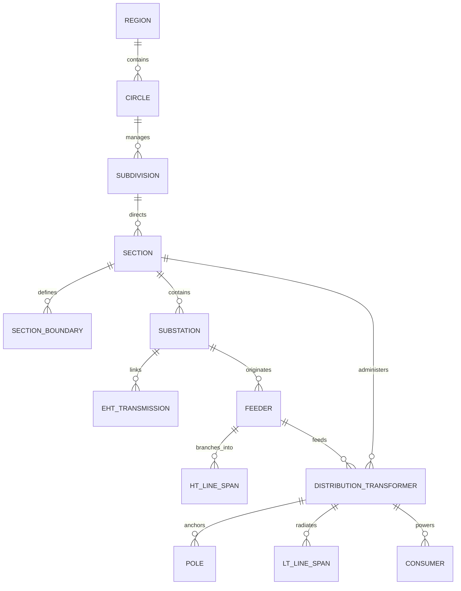

# Chennai Grid Intelligence & Climate Risk Data Inventory (Track 5)

This document provides an exhaustive technical inventory of all multi-hazard climate risk layers and the complete **TNEB / TANGEDCO Raw GIS Spatial Database** (located at `C:\projects\nammamap-v2\tneb-outage\nammamap-outage-aggregator\data-source\tneb_gis_raw`).

Every single file (all 206 raw files across 45 circles, including every `.geojson`, `.geojson.gz`, and `.json`) has been audited, schema-inspected, and mapped into the physical and administrative grid hierarchy.

---

## ⚡ The Physical Grid Topology: How Every Asset Relates Downstream

Power flows through an **8-stage physical transformation chain** before reaching consumers. Every point in the GIS database connects to the next via strict primary and foreign keys:

```
[1. TANTRANSCO EHT Transmission Grid] (400kV / 230kV / 110kV)
    │  Layer: `grid_infrastructure/eht_feeder_load_2026-09-27.geojson` (95,404 segments, 254 corridors)
    │  Keys: `from_tid` ➔ `to_tid`, `legacy_sscode`, `fdr_code`
    ▼
[2. Primary Grid Substations (SS)] (400/230kV, 230/110kV, 110/33kV, 33/11kV)
    │  Layers: `substations_points.geojson` (1,957 pts) & `substations_polygons.geojson` (1,956 parcels)
    │  Primary Key: `ss_code` (e.g. "2117" for Sembium SS)
    │  Foreign Keys: `cir_code`, `region_id`
    ▼
[3. 11kV / 22kV Distribution Feeders] (Macro Radial Arterial Corridors)
    │  Layers: `feeder_lines.geojson.gz` (12,837 MultiLineStrings) & `feeders_master_metadata.json` (17,507 records)
    │  Primary Key: `fdr_code` (e.g. "211709" for PERAMBUR III)
    │  Foreign Key: `ss_code` ("2117" ➔ Parent Substation)
    ▼
[4. 11kV High-Tension (HT) Line Spans] (Pole-to-Pole 11,000V Overhead/Underground Cables)
    │  Layer: `distribution_network/ht_lines/ht_<circle_code>.geojson.gz` (138,470 spans in Chennai)
    │  Primary Key: `htl_id`
    │  Foreign Keys: `fdr_code`, `ss_code`, `sec_code`, `from_pole` ➔ `to_pole`
    ▼
[5. Distribution Transformers (DT / DTR)] (11kV / 22kV ➔ 415V 3-Phase / 230V Single-Phase)
    │  Layer: `distribution_network/transformers/dt_<circle_code>.geojson.gz` (42,280 DTs in Chennai)
    │  Primary Key: `dt_code` (9-digit unique asset ID)
    │  Foreign Keys: `fdr_code`, `ss_code`, `sec_code`, `cir_code`
    │  Attributes: `dt_cap_kva`, `dtconcount` (metered live consumers), `dtsanction`
    ▼
[6. Concrete Street Distribution Poles] (PSC/RCC Overhead Street Infrastructure)
    │  Layer: `distribution_network/poles/pole_<circle_code>.geojson.gz` (479,547 poles in Chennai)
    │  Primary Key: `pole_id`
    │  Foreign Keys: `dt_code`, `fdr_code_1`, `ss_code`, `sec_code`
    ▼
[7. Low-Tension (LT) Service Lines] (415V / 230V Street-by-Street Neighborhood Cables)
    │  Layer: `distribution_network/lt_lines/lt_line_<circle_code>.geojson.gz` (415,981 spans in Chennai)
    │  Primary Key: `ltl_id`
    │  Foreign Keys: `dt_code`, `fdr_code`, `ss_code`, `sec_code`, `from_pole` ➔ `to_pole`
    ▼
[8. Metered End Consumers] (Domestic, Commercial, Industrial, Lifelines)
       Count Attributes: `dtconcount` (per DT) and `conscount` (per Feeder)
```

---

## 🏛️ The Administrative Jurisdictional Hierarchy

The physical grid is operated and maintained across a strict 4-level administrative hierarchy:

```
[Region (Chief Engineer)] ────► Primary Key: `region_id` (e.g. "01" North, "09" South)
      │
      ▼
[Circle (Superintending Engineer)] ──► Primary Key: `cir_code` (e.g. "0400" South 1, "0404" North)
      │
      ▼
[Sub-Division (Asst. Exec. Engineer)] ──► Primary Key: `sd_code` (684 sub-divisions statewide)
      │
      ▼
[Section Office (Assistant Engineer)] ──► Primary Key: `sec_code` / `combineseccode` (2,866 statewide)
      │                                    Attributes: AE Mobile Phone (`mobile_no`), Physical Address
      ▼
[Section Service Boundary] ──► MultiPolygon territory (`section_boundaries.geojson` - 2,856 boundaries)
```

---

## 📁 Complete Inventory of Raw GIS Files (206 Files Audited)

### 1. Grid Infrastructure (`grid_infrastructure/` - 9 Files)

| File Name | Format | Size | Total Records | Geometry Type | Primary / Foreign Keys & Role |
| :--- | :--- | :--- | :--- | :--- | :--- |
| **`eht_feeder_load_2026-09-27.geojson`** | GeoJSON | 92.07 MB | 95,404 segments (254 corridors) | `LineString` | **Bulk Transmission**: 400kV, 230kV, 110kV EHT lines connecting substations. Keys: `from_tid`, `to_tid`, `legacy_sscode`, `fdr_code`, `fdr_volt`. |
| **`feeder_lines.geojson.gz`** | GeoJSON.gz | 65.65 MB | 12,837 feeders | `MultiLineString` | **Ground-Truth 11kV/22kV Feeder Cables**: Surveyed street-by-street multi-segment route geometry. Keys: `fdr_code` (PK), `ss_code` (FK), `cir_code`, `volt_kv`, `no_of_dt`, `conscount`, `lt_length`. |
| **`feeders_master_metadata.json`** | JSON | 8.65 MB | 17,507 feeders | Tabular | **Technical Feeder Master**: Comprehensive metadata container. Keys: `fdr_code` (PK), `ss_code` (FK), `fdr_length`, `no_of_dt`, `conscount`, `fdrconfig`, `feedarea`, `feedown`. |
| **`substations_points.geojson`** | GeoJSON | 1.03 MB | 1,957 substations (286 in Chennai) | `Point` | **Substation Coordinate Nodes**: Switchyard center points. Keys: `ss_code` (PK), `cir_code`, `volt_ratio`, `tot_ca_mva`, `no_in_fdr`, `no_out_fdr`, `in_fdr_n_1/2/3`. |
| **`substations_polygons.geojson`** | GeoJSON | 1.83 MB | 1,956 substations | `MultiPolygon` | **Substation Cadastral Footprints**: Physical parcel boundaries for flood containment and perimeter security. Keys: `ss_code` (PK), `cir_code`, `commissioning_dt`. |
| **`ring_fencing_meter.geojson`** | GeoJSON | 1.1 KB | 2 boundary meters | `MultiPoint` | **Boundary / Ring-Fencing Meters**: Energy accounting interface points between circles. Keys: `rfm_sl_no`, `ss_code`, `fdr_code`. |
| **`deep_specifications/substations_spec_gobi_0436.geojson`** | GeoJSON | 0.93 MB | 240 substations | `MultiPolygon` | **Deep Electrical Specs**: 70 technical attributes (Circuit breakers, Current transformers, Busbars, Relays, Fault levels). |
| **`deep_specifications/substations_spec_sample_34circles.geojson`** | GeoJSON | 0.59 MB | 240 substations | `MultiPolygon` | **34-Circle Validation Sample**: Cross-regional technical verification baseline. |
| **`deep_specifications/transformers_spec_gobi_25k.geojson.gz`** | GeoJSON.gz | 2.20 MB | 25,962 DTs | `Point` | **Deep Transformer Specs**: 53 attributes per DT (RMU status, coil type, make, tap settings, APFC panel). |

---

### 2. Distribution Network (`distribution_network/` - 182 Files across 45 Circles)

The distribution network is partitioned into 4 asset classes across all 45 operational circles of Tamil Nadu:

#### A. Distribution Transformers (`distribution_network/transformers/` - 45 Files)
* **File Pattern**: `dt_<cir_code>_<CircleName>.geojson.gz`
* **Format**: Gzipped GeoJSON (`Point` geometry)
* **Attributes**: `dt_code` (PK), `dt_name`, `dt_cap_kva`, `dt_volt_kv`, `dtconcount` (connected live consumers), `dtsanction`, `dtltlen`, `fdr_code` (FK), `ss_code` (FK), `sec_code` (FK), `cir_code` (FK).
* **Chennai Circle Counts**:
  * `dt_0400_Chennai-South1.geojson.gz`: **8,067 DTs**
  * `dt_0401_Chennai-South2.geojson.gz`: **9,832 DTs**
  * `dt_0402_Chennai-Central.geojson.gz`: **6,016 DTs**
  * `dt_0404_Chennai-North.geojson.gz`: **7,705 DTs**
  * `dt_0406_Chennai-West.geojson.gz`: **10,660 DTs**
  * **Chennai Total**: **42,280 Surveyed Transformers**

#### B. High Tension Lines (`distribution_network/ht_lines/` - 45 Files)
* **File Pattern**: `ht_<cir_code>_<CircleName>.geojson.gz`
* **Format**: Gzipped GeoJSON (`LineString` geometry)
* **Role**: 11,000V pole-to-pole street branches connecting feeder trunks to distribution transformer bushings.
* **Attributes**: `htl_id` (PK), `fdr_code` (FK), `ss_code` (FK), `sec_code` (FK), `from_pole` ➔ `to_pole`, `htl_c_size`, `length_m`.
* **Chennai Circle Counts**:
  * `ht_0400_Chennai-South1.geojson.gz`: **31,019 spans**
  * `ht_0401_Chennai-South2.geojson.gz`: **39,759 spans**
  * `ht_0402_Chennai-Central.geojson.gz`: **0 spans** (100% Underground cable network)
  * `ht_0404_Chennai-North.geojson.gz`: **27,100 spans**
  * `ht_0406_Chennai-West.geojson.gz`: **40,592 spans**
  * **Chennai Total**: **138,470 High-Tension Spans**

#### C. Street Distribution Poles (`distribution_network/poles/` - 45 Files)
* **File Pattern**: `pole_<cir_code>_<CircleName>.geojson.gz`
* **Format**: Gzipped GeoJSON (`Point` geometry)
* **Role**: Physical concrete poles (RCC/PSC) carrying overhead 11kV lines, streetlights, and 230V service drops.
* **Attributes**: `pole_id` (PK), `dt_code` (FK), `fdr_code_1` (FK), `ss_code` (FK), `sec_code` (FK), `p_height`, `p_support`, `p_st_light`.
* **Chennai Circle Counts**:
  * `pole_0400_Chennai-South1.geojson.gz`: **95,705 poles**
  * `pole_0401_Chennai-South2.geojson.gz`: **109,840 poles**
  * `pole_0402_Chennai-Central.geojson.gz`: **29 poles** (Urban underground core)
  * `pole_0404_Chennai-North.geojson.gz`: **130,508 poles**
  * `pole_0406_Chennai-West.geojson.gz`: **143,465 poles**
  * **Chennai Total**: **479,547 Street Poles**

#### D. Low Tension Lines (`distribution_network/lt_lines/` - 45 Files)
* **File Pattern**: `lt_line_<cir_code>_<CircleName>.geojson.gz`
* **Format**: Gzipped GeoJSON (`LineString` geometry)
* **Role**: 415V 3-phase and 230V single-phase neighborhood lines radiating from DTs to individual homes.
* **Attributes**: `ltl_id` (PK), `dt_code` (FK), `fdr_code` (FK), `ss_code` (FK), `sec_code` (FK), `from_pole` ➔ `to_pole`, `length_m`.
* **Chennai Circle Counts**:
  * `lt_line_0400_Chennai-South1.geojson.gz`: **77,275 spans**
  * `lt_line_0401_Chennai-South2.geojson.gz`: **88,823 spans**
  * `lt_line_0402_Chennai-Central.geojson.gz`: **0 spans** (Direct underground service cables)
  * `lt_line_0404_Chennai-North.geojson.gz`: **133,781 spans**
  * `lt_line_0406_Chennai-West.geojson.gz`: **116,102 spans**
  * **Chennai Total**: **415,981 Low-Tension Spans**

#### E. Extraction Manifests (2 Files)
* **`extraction_manifest.json`**: Audit logs for DT and HT line extractions across all 45 circles.
* **`lt_extraction_manifest.json`**: Audit logs for Pole and LT line extractions across all 45 circles.

---

### 3. Administrative Boundaries (`administrative_boundaries/` - 7 Files)

| File Name | Format | Size | Records | Geometry | Keys & Administrative Role |
| :--- | :--- | :--- | :--- | :--- | :--- |
| **`region_boundary.geojson`** | GeoJSON | 2.03 MB | 9 regions | `MultiPolygon` | **Regional Chief Engineer Jurisdictions**: Keys: `region_id` ("01" to "09"), `reg_name`. |
| **`circle_boundary.geojson`** | GeoJSON | 4.39 MB | 45 circles | `MultiPolygon` | **Superintending Engineer Circles**: Keys: `cir_code`, `cir_name`, `region_id`. |
| **`section_boundaries.geojson`** | GeoJSON | 49.19 MB | 2,856 sections | `MultiPolygon` | **Assistant Engineer (AE) Service Territories**: Ground-truth polygon coverage. Keys: `combineseccode` (e.g. "0400227"), `cir_code`, `sec_name`. |
| **`municipality.geojson`** | GeoJSON | 2.09 MB | 258 municipalities | `MultiPolygon` | Urban local body boundaries. Keys: `d_name`, `p_name`, `pancha_id`. |
| **`townpanchayat.geojson`** | GeoJSON | 7.33 MB | 1,058 town panchayats | `MultiPolygon` | Semi-urban local body boundaries. Keys: `p_name`, `d_name`. |
| **`town_boundary.geojson`** | GeoJSON | 0.65 MB | 119 towns | `MultiPolygon` | Municipal electrical town boundaries. Keys: `tn_name`, `tn_id`. |
| **`villagepanchayat.geojson.gz`** | GeoJSON.gz | 20.16 MB | 14,576 panchayats | `MultiPolygon` | Rural grassroots panchayat boundaries across all 38 districts of Tamil Nadu. |

---

### 4. Administrative Offices (`offices/` - 4 Files)

| File Name | Format | Size | Records | Geometry | Keys & Operational Role |
| :--- | :--- | :--- | :--- | :--- | :--- |
| **`region_offices.geojson`** | GeoJSON | 2.1 KB | 9 HQs | `MultiPoint` | Chief Engineer Regional Headquarters. Keys: `region_id`, `name`. |
| **`circle_offices.geojson`** | GeoJSON | 11.1 KB | 44 HQs | `MultiPoint` | Superintending Engineer Circle HQs. Keys: `cir_code`, `cirname`. |
| **`subdivision_offices.geojson`**| GeoJSON | 348.5 KB | 684 offices | Tabular/Pts | Asst. Executive Engineer Sub-Divisions. Keys: `sd_code`, `div_code`, `cir_code`. |
| **`section_offices.geojson`** | GeoJSON | 1.65 MB | 2,866 offices | `Point` | **AE Field Section Offices**: Ground-truth coordinates and direct contact details. Keys: `sec_code`, `cir_code`, `mobile_no` (**AE direct mobile number**), `postal_add`. |

---

### 5. System Catalogs & Documentation (4 Files)

| File Name | Format | Size | Description |
| :--- | :--- | :--- | :--- |
| **`catalogs/geoserver_full_catalog.json`** | JSON | 447 KB | Complete schema catalog of all **1,801 GeoServer layers** hosted on TNEB's spatial GIS server. |
| **`ELECTRICAL_GRID_ARCHITECTURE.md`** | Markdown | 12 KB | Engineering manual detailing the 8-stage transformation chain, voltage thresholds, and case studies. |
| **`manifest.json`** | JSON | 2.5 KB | Top-level catalog manifest listing feature counts, source endpoints, and byte sizes. |
| **`README.md`** | Markdown | 8 KB | Quick-start GIS overview and directory navigation guide. |

---

## 🔗 The Entity Relationship Blueprint



### Relational Key Join Table

| Parent Entity | Parent Key | Child Entity | Foreign Key | Join Verification Method |
| :--- | :--- | :--- | :--- | :--- |
| **Substation** | `ss_code` ("2117") | **Feeder** | `ss_code` ("2117") | **Exact Key Match**: First 4 digits of `fdr_code` match `ss_code`. |
| **Feeder** | `fdr_code` ("211709") | **DT** | `fdr_code` ("211709") | **Exact Key Match**: 100% of DTs in Chennai have `fdr_code`. |
| **Feeder** | `fdr_code` ("211709") | **HT Span** | `fdr_code` ("211709") | **Exact Key Match**: Pole-to-pole spans tied directly to feeder. |
| **DT** | `dt_code` ("211709012") | **Pole** | `dt_code` ("211709012") | **Exact Key Match**: Street poles referenced to upstream DT. |
| **DT** | `dt_code` ("211709012") | **LT Span** | `dt_code` ("211709012") | **Exact Key Match**: 230V cables radiating from DT kiosk. |
| **Section Office** | `sec_code` ("051") | **DT** | `sec_code` ("051") | **Exact Key Match**: DT maintenance assigned to specific AE. |
| **Section Office** | `combineseccode` | **Boundary** | `combineseccode` | **Exact Key Match**: Circle + Section code joins boundary polygon. |
| **Substation** | `ss_code` | **Boundary** | Spatial Point-in-Poly | **Geometric Containment**: 99.7% of Chennai SS reside in Section polygon. |

---

## 🌊 Climate Risk & Civic Resilience Data Assets (`data-archive/data/`)

| Filename | Size | Data Source | Primary Role in SurgeGrid-AI Platform |
| :--- | :--- | :--- | :--- |
| **`gee_chennai_substations_risk.json`** | 190 KB | Google Earth Engine (SRTM DEM + Dynamic World 10m + Sentinel-2 MNDWI) | 242 Chennai Substations with exact elevations, slope, modern 2024–2026 water recurrence, and automated pre-landfall de-energization SOPs. |
| **`gee_chennai_wards_vulnerability.json`** | 60 KB | Google Earth Engine (SRTM DEM Zonal Stats) | Topographic profiles, mean/min elevation, and flood risk categorization across all 200 GCC Wards. |
| **`gee_cyclone_surge_grid_simulation.json`** | 15 KB | GEE Multi-tier Storm Surge Model | Simulated Category 2/3 cyclone storm surge (1.5m – 3.0m) inundation matrix. |
| **`chennai_shelter_grid_drain_fusion.json`** | 256 KB | Spatial Multi-Layer Fusion Engine | 162 GCC Emergency Relief Shelters mapped with primary vs. backup safe tie-line substations, officer contacts, and evacuation access routes. |
| **`chennai_drains.json`** | 3.26 MB | GCC Stormwater Management | 5,513 individual stormwater drain lines with gradients, uphill/backflow flags, dimensions, and outfalls. |
| **`chennai_drains_ward_summary.json`** | 184 KB | Hydrological Fusion Model | Aggregated drainage metrics per ward (total network km, % uphill backflow choke risk, minimum road elevation). |
| **`chennai_rivers.json`** | 646 KB | Chennai River Waterways | Vector lines for Adyar River, Cooum River, Kosasthalaiyar River, and Buckingham Canal. |
| **`gcc_wards_polygons.json`** | 432 KB | GCC Geographic Information System | Exact GeoJSON polygon boundaries for all 200 Greater Chennai Corporation Wards. |
| **`gcc_zones.json`** | 873 KB | GCC Geographic Information System | GeoJSON polygon boundaries for the 15 GCC Administrative Zones. |
| **`gcc_relief_centers.json`** | 25 KB | GCC Disaster Management | Designated flood evacuation centers with zone, ward, address, and nodal officer phone numbers. |
| **`chennai_shelters.json`** | 2.5 KB | Civic High-Ground Network | Designated elevated vehicle parking and pedestrian high-ground ramps (e.g., G.N. Chetty Flyover ramp at +9.4m MSL). |
| **`gcc_flood_hotspots.json`** | 23 KB | GCC Historical Flooding Archives | Historical pluvial flood depth hotspots across Chennai for ground-truth model calibration. |
| **`chennai_flood_depth_inches.json`**| 63 KB | Historical Inundation Benchmarks | Street-level flood depth benchmarks (in inches) from past major monsoon events. |
| **`chennai_resolved_outages.json`** | 911 KB | TNEB Super Index V2 + Outage Engine | 1,252 historical Q3 2026 Chennai outage notices mapped to exact substations, 11kV feeders, and sections. |
| **`chennai_substations_vulnerability.json`** | 239 KB | Outage Intelligence Engine | Historical breakdown vulnerability rankings across all Chennai substations. |
| **`chennai_feeders_vulnerability.json`** | 112 KB | Outage Intelligence Engine | Vulnerability rankings for 11kV distribution feeders. |
| **`chennai_sections_vulnerability.json`**| 67 KB | Outage Intelligence Engine | Vulnerability rankings for TANGEDCO AE Section Offices. |
| **`circle_boundary.geojson`** | 4.39 MB | TNEB Official GIS Records | 45 Official TNEB Operational Circle boundary polygons. |
