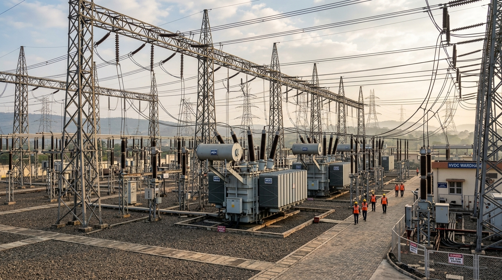
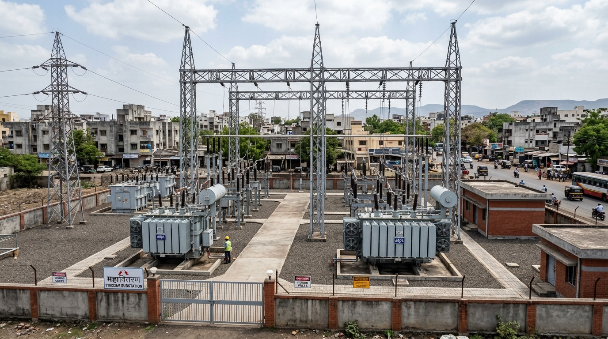
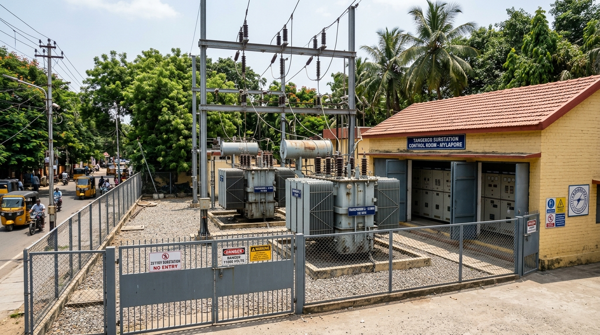
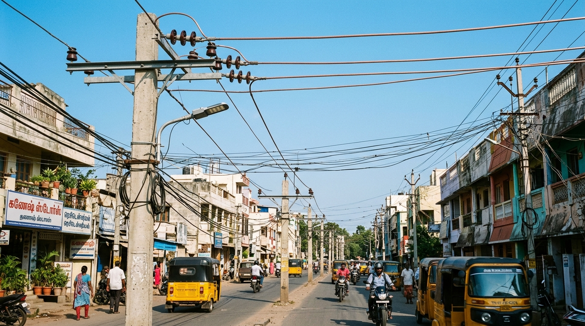
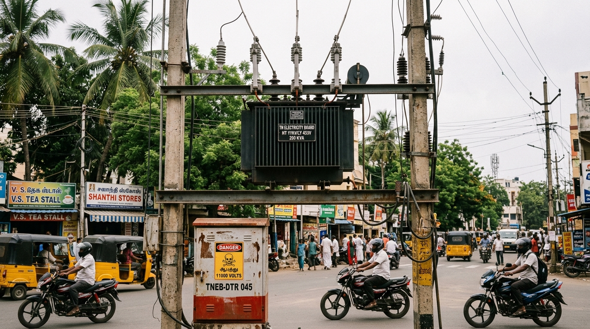
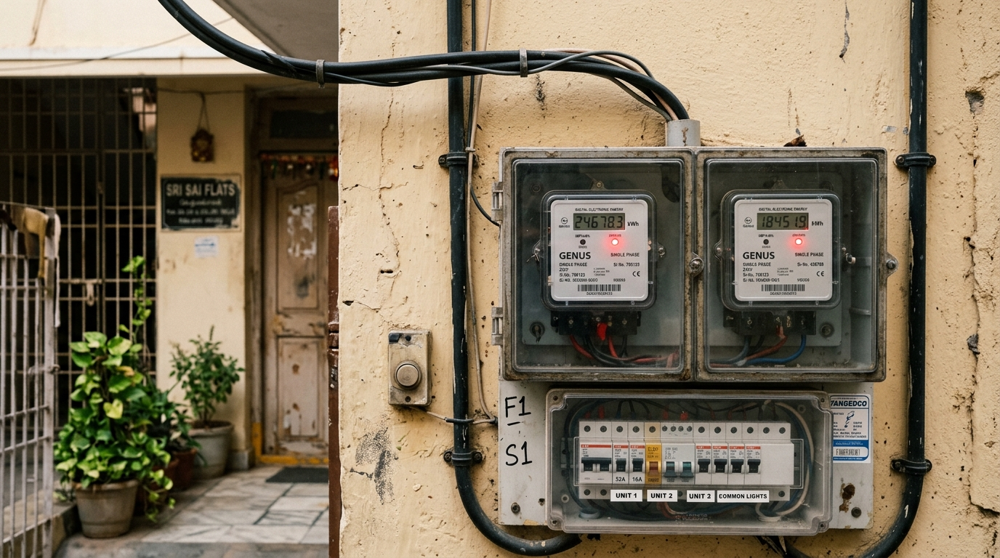

# 03 - Chennai TNEB Power Grid Topology & Visual Field Guide

This document explains the physical electrical architecture, transmission hierarchy, and maintenance workflow of the Chennai power grid (TANGEDCO / TANTRANSCO) as represented in the **SurgeGrid AI** cockpit.

---

## 1. The Electrical Hierarchy (From Generation to Consumer Tap)

Electricity behaves like a high-pressure water system. Power generated at distant thermal, nuclear, and renewable plants travels at ultra-high voltages to minimize transmission losses across hundreds of kilometers. It is then stepped down in sequential stages before safely entering homes and businesses:

```
 [ Long-Distance Power Plants / State Grid ]
                     │
                     ▼
 🟢 1. BULK EHV SUBSTATIONS (400 kV / 230 kV)        ← The Super-Highways
                     │  (High-voltage trunk lines)
                     ▼
 🟡 2. SUB-TRANSMISSION STATIONS (110 kV)           ← The City Ring Roads
                     │  (33 kV sub-arterial cables)
                     ▼
 🔵 3. DISTRIBUTION SUBSTATIONS (33 / 11 kV)        ← The Neighborhood Hubs
                     │
    ┌────────────────┴────────────────┐
    ▼                                 ▼
 ⚡ 4. 11 kV FEEDERS               ⚡ 11 kV FEEDERS  ← The Main Street Delivery Vans
    │                                 │
    ▼                                 ▼
 🛢️ 5. DTRs (Street Transformers)  🛢️ DTRs          ← The Street-Corner Reducers
    │ (Steps 11,000V down to 240V)    │
    ▼                                 ▼
 🏠 6. CONSUMERS (Your Home)       🏢 Shops & Flats  ← The Kitchen Tap
```

---

## 2. Real-Life Infrastructure Breakdown

### Stage 1: Bulk Extra High Voltage (EHV) Substations (400 kV & 230 kV)
*Represented in SurgeGrid AI by Pink Markers (e.g. Korattur, Alamathy, Sriperumbudur, Manali)*



- **Physical Characteristics**: Sprawling outdoor switchyards situated on the periphery of the Chennai metropolitan area. They feature massive lattice steel gantry towers, heavy aluminium busbars, SF6 gas circuit breakers, and enormous oil-cooled step-down transformers.
- **Key Engineering Components**:
  - **Tall Ribbed Porcelain Bushings**: High-creepage insulators standing atop transformers that prevent 400,000-volt arcs from jumping to grounded metal.
  - **Lightning Arresters**: Tall surge arresters placed at incoming gantry towers to divert lightning strikes directly to ground.
- **Function**: Bulk transmission injection gateways that receive massive blocks of power (hundreds of megawatts) from the National and State grids, stepping it down to 110 kV and 33 kV.

---

### Stage 2: Sub-Transmission Hubs (110 kV)
*Represented in SurgeGrid AI by Amber Markers (e.g. Guindy, Koyambedu, Anna Nagar, Mylapore)*



- **Physical Characteristics**: Medium-sized switchyards located inside Chennai's arterial traffic corridors and ring roads.
- **Key Engineering Components**:
  - **110/33 kV and 110/11 kV Power Transformers**: Mounted over deep gravel soak pits designed to contain transformer oil in the event of a fire or leak.
  - **Capacitor Banks**: Rack-mounted capacitor units that provide reactive power compensation and stabilize voltage across city districts during peak AC usage.
- **Function**: Takes 110,000-volt power from bulk stations and routes it into regional city hubs, stepping it down to 33 kV or directly to 11 kV.

---

### Stage 3: Distribution Substations (33 / 11 kV)
*Represented in SurgeGrid AI by Cyan Markers (e.g. Kilpauk 33kV, T. Nagar 33kV, Triplicane 33kV)*



- **Physical Characteristics**: The neighborhood substations located right inside residential and commercial zones, featuring a gated perimeter wall, outdoor transformer bays, and an indoor control room building.
- **Key Engineering Components**:
  - **Outdoor 33/11 kV Step-Down Transformers**: Convert incoming 33,000 Volts to 11,000 Volts (11 kV).
  - **Control Room Switchgear**: Houses indoor vacuum circuit breaker (VCB) panels. Each breaker controls one outgoing 11 kV feeder line.
- **Function**: The primary stepping stone into streets and wards. When a substation is de-energized during flooding or cyclone landfall, power cuts cascade across all feeders originating from this yard.

---

### Stage 4: 11 kV Feeder Lines
*Surfaced in the SurgeGrid AI Substation Inspector Drawer*



- **Physical Characteristics**: Overhead 3-phase conductors on tall reinforced concrete utility poles, or underground cross-linked polyethylene (XLPE) power cables running beneath city sidewalks.
- **Key Engineering Components**:
  - **Top Cross-Arm**: Holds the three primary medium-voltage phase lines (R, Y, B) mounted on brown or grey porcelain pin/disc insulators.
  - **Middle/Lower Cables**: Carry the low-tension (240V/415V) domestic distribution lines and street lighting cables.
- **Function**: Each feeder has a dedicated geographical name (e.g. *"TVS Feeder"*, *"Thirumangalam Feeder"*). A single feeder typically delivers power to 20 to 80 street-level distribution transformers.

---

### Stage 5: Street DTRs (Distribution Transformers / DTS)
*Displayed as "DTRs (DTS)" telemetry in the SurgeGrid AI Inspector Drawer*



- **Physical Characteristics**: Cylindrical or rectangular oil-cooled transformers mounted on an H-frame between two concrete poles at street intersections, or mounted on street-side concrete plinths.
- **Key Engineering Components**:
  - **Drop-Out (DO) Fuses**: Angle-mounted fuse carriers at the top of the pole. When a short circuit or overload occurs, the internal fuse wire vaporizes with a loud pop, allowing the carrier to drop open and physically disconnect the transformer.
  - **Feeder Pillar Box**: A ground-level sheet-metal enclosure with a "Danger 11000V" warning sign containing low-voltage busbars and fuse units feeding separate streets.
- **Function**: Converts dangerous **11,000 Volts down to safe domestic 240 Volts (single-phase) and 415 Volts (three-phase)** for 50 to 250 consumer meters on that block.

---

### Stage 6: Consumer Service Connection (Home Meter Board)
*Displayed as "Consumers" telemetry in the SurgeGrid AI Inspector Drawer*



- **Physical Characteristics**: An external wall or ground-floor meter board in residential houses and apartments.
- **Key Engineering Components**:
  - **Service Drop Cable**: Weatherproof insulated cable running from the nearest street pole into the building.
  - **Digital Electronic kWh Energy Meters**: Measure cumulative energy usage in kilowatt-hours, equipped with pulse LEDs and tamper seals.
  - **Miniature Circuit Breakers (MCB / RCCB)**: Protect individual home circuits against short circuits and earth leakage before power reaches wall outlets.

---

## 3. Human Operations: AE Section Offices & Fuse of Call (FOC) Depots

### Assistant Engineer (AE) Section Offices
- **Administrative Headquarters**: Chennai's electrical grid is partitioned into **352 official jurisdictional sections**. Each section is headed by an Assistant Engineer (AE) from TANGEDCO.
- **Responsibilities**: New electricity connections, tariff adjustments, revenue collection, preventive line maintenance, and coordinating substation shut-downs.

### Fuse of Call (FOC) Depots
- **Field Operations Muster Room**: The 24x7 emergency response depot where linemen, wiremen, and inspectors report in rotating shifts.
- **Name Origin**: Named after the drop-out fuses on street transformers—when a resident calls to report a blown transformer fuse, it is a *"Fuse Call"*.
- **Co-location**: In over 90% of Chennai sections, the **Fuse Call Office is located in the exact same building/compound as the AE Section Office**. Linemen dispatch directly from here on service vehicles and two-wheelers carrying replacement fuse wire, bamboo ladders, and testing gear.

---

## 4. Cockpit Map Architecture & Performance Features

1. **Topological Precomputation**: All 1,493 bi-directional electrical and jurisdictional relationships are pre-indexed into `public/data/chennai_tneb_grid.json`, enabling $O(1)$ instantaneous lookups on click with zero backend network latency.
2. **On-Demand Section Office Jurisdictional Boundaries**: GeoJSON boundary polygons extracted from official TNEB district boundaries are embedded directly into section records, rendering a warm translucent amber polygon with auto-framing bounds when an AE Section is selected.
3. **Pure Zero-POI Vector Canvas**: Custom light and dark styles strip out all commercial, retail, transit, and landmark points of interest, presenting a distraction-free electrical grid canvas.
4. **Targeting Beacon Halo Ring**: An animated high-contrast dual-stroke halo ring (`selectionHaloRef`) projects around selected nodes for instant visual clarity across both light and dark backgrounds.
5. **Unified Left-Hand Control Column**: Search and the collapsible **TNEB Grid Layers** control are co-located in the top-left stack, leaving the entire right side clear for the comprehensive Substation & Section Inspector Drawer without visual overlap.
6. **Hardware-Accelerated Fluidity**: Removed heavy GPU `backdrop-blur` filters and artificial drag bounds, reducing CPU frame-budget overhead and ensuring silky smooth 60fps panning and zooming.
