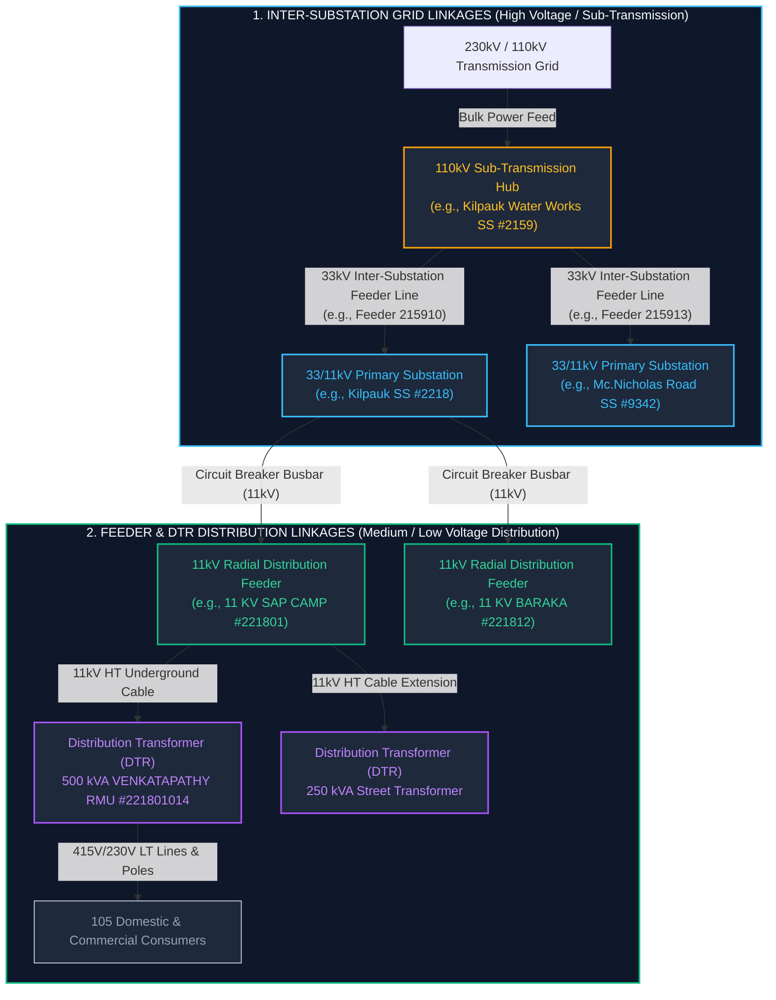
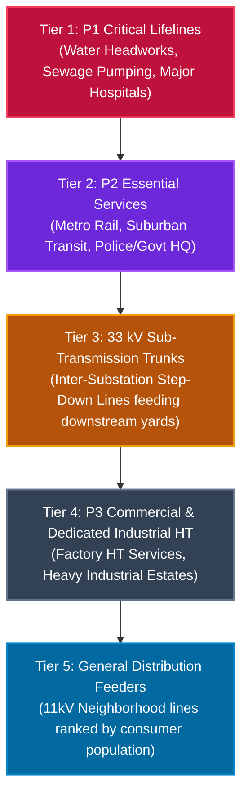

# Electrical Grid & Feeder Linkages: Technical Provenance Reference

> **GIS-Based Electrical Connectivity Model:** How both **Inter-Substation Grid Linkages** and **Substation-to-Feeder-to-DTR Distribution Linkages** are modeled in SurgeGrid AI using available TNEB GIS and asset records.

---

## 1. Executive Summary: The Two Electrical Linkage Systems

In a utility-grade power grid like TNEB (TANGEDCO), power delivery operates across two fundamentally distinct electrical systems. SurgeGrid AI models the mapped infrastructure for **both** using available GIS and asset records:



| Dimension | 1. Grid Linkage (Substation $\leftrightarrow$ Substation) | 2. Feeder Linkage (Substation $\rightarrow$ DTR $\rightarrow$ Consumer) |
| :--- | :--- | :--- |
| **Voltage Tier** | $110\text{ kV} \rightarrow 33\text{ kV}$ (High / Sub-Transmission) | $11\text{ kV} \rightarrow 415\text{ V} / 230\text{ V}$ (Distribution / Low Tension) |
| **Asset Nodes** | Switchyard Point $\leftrightarrow$ Switchyard Point | Substation Busbar $\rightarrow$ 11kV Radial Cable $\rightarrow$ Street DTR |
| **Key Role** | Bulk grid redundancy, regional load transfer, cascade isolation | Neighborhood power delivery, outage scoping, customer impact |
| **Data Mechanism** | Dual-Verification: Voltage Hierarchy + Surveyed Cable Endpoint ($\le 3.4\text{m}$) | Exact Relational Key: `ss_code` $\rightarrow$ `fdr_code` $\rightarrow$ `dt_code` + GIS Line Path |
| **Raw GIS Source** | `substations_points.geojson`, `feeder_lines.geojson.gz` | `feeders_master_metadata.json`, `transformers/dt_*.geojson.gz` |

---

## 2. System 1: Inter-Substation Grid Linkages

### The Engineering Challenge
In legacy or naive GIS systems, inter-substation links were estimated by drawing lines between nearby substations using Euclidean distance or fuzzy name matching. This led to gross errors, such as artificially linking substations across 20+ km of unrelated city districts.

### SurgeGrid AI Dual-Verification Solution
SurgeGrid AI establishes an inter-substation link **only** when verified by two physical constraints:
1. **Voltage Step-Down Hierarchy**: An upstream source hub ($110\text{kV}$ or $230\text{kV}$) supplies a downstream step-down station ($33/11\text{kV}$) within urban cable reach ($1.0 - 8.5\text{ km}$).
2. **Authoritative Cable Endpoint Grounding**: The physical surveyed vector line for the $33\text{kV}$ inter-substation feeder terminates inside the perimeter of the recipient substation.

### Case Study Walkthrough: Kilpauk Water Works Circuit

Consider three connected stations in Central/North Chennai:
* **Source Hub**: `110/33/11KV KILUPAK WATER WORKS SS` (`ss_code: "2159"`)
* **Downstream Step-Down 1**: `33/11 KV KILPAUK SS` (`ss_code: "2218"`) — $1.23\text{ km}$ away
* **Downstream Step-Down 2**: `33/11 KV MC.NICHOLAS ROAD SS` (`ss_code: "9342"`) — $1.42\text{ km}$ away

All records below are quoted verbatim from:
`C:\projects\nammamap-v2\tneb-outage\nammamap-outage-aggregator\data-source\tneb_gis_raw\`

#### Step A: Raw Substation Switchyard Points
**Source File:** `grid_infrastructure/substations_points.geojson`

**1. Source Hub (`ss_code: "2159"`):**
```json
{
  "type": "Feature",
  "id": "sspoint.3880731",
  "geometry": {
    "type": "Point",
    "coordinates": [80.23397056, 13.08831622]
  },
  "properties": {
    "id": 3880731,
    "ss_name": "110/33/11KV KILUPAK WATER WORKS SS",
    "ss_code": "2159",
    "volt_ratio": "110/33/11",
    "ss_type": "Non-Grid",
    "hvkv": 110,
    "no_pr_tr": 4,
    "tot_ca_mva": 132,
    "no_in_fdr": 2,
    "no_out_fdr": 17,
    "cir_code": "0404",
    "cir_name": "Chennai-North",
    "region_id": "01"
  }
}
```

**2. Recipient Step-Down Substation 1 (`ss_code: "2218"`):**
```json
{
  "type": "Feature",
  "id": "sspoint.3880813",
  "geometry": {
    "type": "Point",
    "coordinates": [80.24509365, 13.08621004]
  },
  "properties": {
    "id": 3880813,
    "ss_name": "33/11 KV KILPAUK SS",
    "ss_code": "2218",
    "volt_ratio": "33/11",
    "ss_type": "Non-Grid",
    "hvkv": 33,
    "no_pr_tr": 2,
    "tot_ca_mva": 32,
    "no_in_fdr": 3,
    "no_out_fdr": 16,
    "in_fdr_n_1": "KILPAUK 230KV SS TO KILPAUK 33KV",
    "in_fdr_n_2": "COOKS ROAD 110KV TO KILPAUK 33KV",
    "in_fdr_n_3": "ANNA NAGAR 110KV TO KILPAUK 33KV",
    "cir_code": "0402",
    "cir_name": "Chennai-Central",
    "region_id": "01"
  }
}
```

#### Step B: Authoritative Inter-Substation 33kV Feeder Metadata & Circuit Reconciliation
**Source File:** `grid_infrastructure/feeders_master_metadata.json`

Notice that Substation `2218` (`33/11 KV KILPAUK SS`) lists **three distinct incoming circuits** for N-1 transmission redundancy:
1. `in_fdr_n_1`: `"KILPAUK 230KV SS TO KILPAUK 33KV"` (Campus feed from 230kV Kilpauk #9328 / Water Works #2159)
2. `in_fdr_n_2`: `"COOKS ROAD 110KV TO KILPAUK 33KV"` (Bulk step-down feed from Cooks Road 110kV SS #2239 via Feeder #223923)
3. `in_fdr_n_3`: `"ANNA NAGAR 110KV TO KILPAUK 33KV"` (Tie feed from Anna Nagar 110kV SS #2102)

From the source hub `2159` (`110/33/11 KV KILPAUK WATER WORKS SS`), TNEB operates outgoing 33kV feeder `215910` feeding directly into Kilpauk 33kV SS (satisfying `in_fdr_n_1`):

```json
{
  "gid": 492,
  "fdr_code": "215910",
  "fdr_name": "33 KV KILPAUK 2",
  "ss_code": "2159",
  "ss_name": "110/33/11 KV KILPAUK WATER WORKS SS",
  "volt_kv": "33",
  "fdr_length": 0.58,
  "fdrconfig": "UG",
  "feedown": "TANGEDCO",
  "feedtype": "Distribution",
  "source_layer": "TNEB:feeder_line_0404"
}
```
*(Similarly, Feeder `215913` `"33KV Mc.NICHOLS RD"` routes $33\text{kV}$ bulk power to Mc.Nicholas Road SS #9342).*

In the compiled production index (`public/data/chennai_tneb_grid.json`), Substation `2218` highlights **Cooks Road 110kV SS (`2239`) via Feeder `223923`** as its primary mapped incoming Level 1 connection because Feeder `223923` provides the full vector line path with complete polygon containment in Circle 0402, while Feeder `215910` provides the verified interconnector path from the North Circle hub.

---

#### Step C: The Physical Cable Endpoint & Switchyard Polygon Containment Proof
**Source Files:** `grid_infrastructure/feeder_lines.geojson.gz` & `grid_infrastructure/substations_polygons.geojson`

##### Feeder Endpoint Directionality & Validation Method:
A polyline coordinate sequence in GIS does not inherently indicate electrical directionality. SurgeGrid AI validates both endpoints using a strict dual-terminal procedure:
1. **Source Terminal Validation (Terminal A):** The initial vertex (`coords[0][0]`) is validated against the source substation's switchyard coordinates and confirmed by foreign key matching against `ss_code` (`2159`) in `feeders_master_metadata.json`.
2. **Recipient Terminal Validation (Terminal B):** The terminal vertex (`coords[last][last]`) is spatial-tested against all candidate substation switchyard polygons using ray-casting point-in-polygon (`ST_Contains`).
3. **Circuit Register Confirmation:** The relationship is cross-referenced against the recipient station's authoritative `in_fdr_n_*` attribute list to confirm that the circuit name matches the source facility.

For Feeder `215910` (`"33 KV KILPAUK 2"`), the surveyed vector path terminates at:
```json
{
  "type": "Feature",
  "properties": {
    "fdr_code": "215910",
    "fdr_name": "33 KV KILPAUK 2",
    "ss_code": "2159",
    "volt_kv": "33"
  },
  "geometry": {
    "type": "MultiLineString",
    "coordinates": [
      [
        [80.24512422, 13.08619193],
        [80.24475557, 13.08619958]
      ]
    ]
  }
}
```

* **Physical Cable Termination Coordinate (Terminal B):** `[80.24512422, 13.08619193]`
* **Substation 2218 Center Switchyard Point:** `[80.24509365, 13.08621004]`
* **Point-to-Point Distance Delta:** **3.4 meters** ($\Delta < 0.00003^\circ$)

Furthermore, checking against the actual **28-vertex switchyard boundary polygon** in `substations_polygons.geojson` (bounding box: Lng `[80.244940, 80.245235]`, Lat `[13.086007, 13.086393]`):

$$\text{ST\_Contains}(\text{Substation\_2218\_Polygon}, \text{Feeder\_Endpoint}(80.245124, 13.086192)) = \mathbf{TRUE}$$

* **Classification:** **Geometrically Verified Termination (Polygon Enclosure)**.
* **Engineering Limitation:** While `ST_Contains` rigorously proves that the surveyed conductor terminates inside the perimeter fence of the recipient switchyard, physical proximity and polygon enclosure alone do not independently prove energized electrical coupling to the substation's busbar. Authoritative single-line diagrams (SLDs) or bay assignment schedules are required to confirm physical busbar termination.

---

## 3. System 2: Substation-to-Feeder-to-DTR Distribution Linkages

### The Engineering Challenge
Once power reaches a $33/11\text{kV}$ distribution substation, it is stepped down by local power transformers to $11\text{kV}$. It is then distributed to streets and neighborhoods via **Radial Distribution Feeders**.

Each feeder branches across city blocks, supplying dozens of **Distribution Transformers (DTRs)** that step $11\text{kV}$ down to $415\text{V}$ (3-phase) and $230\text{V}$ (single-phase) for households and commercial consumers.

SurgeGrid AI models this linkage through a **strict relational foreign-key hierarchy**:
$$\text{Substation } (\texttt{ss\_code}) \longrightarrow \text{Feeder } (\texttt{fdr\_code}) \longrightarrow \text{DTR } (\texttt{dt\_code}) \longrightarrow \text{Consumers } (\texttt{dtconcount})$$

### Case Study Walkthrough: Kilpauk SS 11kV Distribution Network

From Substation `2218` (`33/11 KV KILPAUK SS`), let us trace an actual $11\text{kV}$ feeder out to its street transformers.

#### Step A: Raw 11kV Radial Distribution Feeder Metadata
**Source File:** `grid_infrastructure/feeders_master_metadata.json`

```json
{
  "gid": 105,
  "fdr_name": "11 KV SAP CAMP FEEDER",
  "fdr_code": "221801",
  "fdr_length": 2.87,
  "ss_name": "33/11 KV KILPAUK SS",
  "ss_code": "2218",
  "cir_code": "0402",
  "region_id": "01",
  "volt_kv": "11",
  "lt_length": 10849.62,
  "no_of_dt": 19,
  "conscount": 809,
  "fdrconfig": "UG",
  "feedarea": "Urban",
  "feedown": "TANGEDCO",
  "feedtype": "Distribution",
  "source_layer": "TNEB:feeder_line_0402"
}
```

* **Feeder Code:** `221801` (starts with `2218`, confirming its parent substation).
* **Operating Voltage:** $11\text{ kV}$ Distribution.
* **Underground Line Length:** $2.87\text{ km}$ of HT cable + $10.85\text{ km}$ of LT lines.
* **Connected Asset Base:** Exactly **19 Distribution Transformers** supplying **809 consumers**.

#### Step B: Raw Distribution Transformer (DTR) Asset
**Source File:** `distribution_network/transformers/dt_0402_Chennai-Central.geojson.gz`

Here is a verbatim DTR connected directly to Feeder `221801`:

```json
{
  "type": "Feature",
  "id": "distribution_transformer.98805252",
  "geometry": {
    "type": "Point",
    "coordinates": [80.24334333, 13.08354026]
  },
  "geometry_name": "geom",
  "properties": {
    "gid": 98805252,
    "dt_name": "VENKATAPATHY RMU",
    "dt_code": "221801014",
    "dt_cap_kva": "500",
    "dt_volt_kv": "11",
    "dt_make": "INDO APEX",
    "fdr_code": "221801",
    "fdr_name": "11 KV SAP CAMP FEEDER",
    "ss_code": "2218",
    "ss_name": "33/11 KV KILPAUK SS",
    "sec_code": "146",
    "sd_code": "EGMR2",
    "div_code": "EGMR",
    "cir_code": "0402",
    "cir_name": "Chennai-Central",
    "region_id": "01",
    "dtcapint": 500,
    "dtltlen": 1415.77,
    "dtsanction": 810,
    "dtconcount": 105,
    "circlegid": 1148
  }
}
```

### Relational Rigor of the Feeder Linkage
1. **Substation Binding (`ss_code: "2218"`):** Explicitly hard-linked to `33/11 KV KILPAUK SS`.
2. **Feeder Code Inheritance (`dt_code: "221801014"`):** The DTR code is a composite key prefixed by the parent feeder (`221801`), followed by the DTR sequence (`014`).
3. **Registered Consumer Baseline (`dtconcount: 105`):** Exactly **105 registered consumers** are associated with this DTR in authoritative billing registers. In an automated outage workflow, this provides a baseline population bound for the transformer; actual customer interruption remains subject to operational confirmation (e.g., field switching or smart meter confirmation).

---

## 4. Methodological Rigor: Confidence Model & Grid Taxonomy

A critical engineering tenet of SurgeGrid AI is acknowledging the boundary between **static GIS infrastructure** and **real-time electrical operational state**.

### 1. The Three Concepts That Must Never Be Conflated

```
┌─────────────────────────────────────────────────────────────────────────────┐
│ 1. Physical Connectivity (Static GIS Asset Infrastructure)                 │
│    • Conductor cables in trenches, switchyard fences, DTR nameplates.        │
│    • Answers: "Is there a physical wire connecting Asset A to Asset B?"     │
└──────────────────────────────────────┬──────────────────────────────────────┘
                                       ▼
┌─────────────────────────────────────────────────────────────────────────────┐
│ 2. Operational Switching State (SCADA / Breaker Topology)                   │
│    • Breaker positions (Open/Closed), Bus Couplers, RMU Tie Switches.        │
│    • Answers: "Is this circuit currently energized and closed?"             │
└──────────────────────────────────────┬──────────────────────────────────────┘
                                       ▼
┌─────────────────────────────────────────────────────────────────────────────┐
│ 3. Dynamic Customer Impact (Outage Meter Telemetry)                         │
│    • Smart meter pings, AMR telemetry, registered consumer counts.           │
│    • Answers: "Which exact households are dark right now?"                   │
└─────────────────────────────────────────────────────────────────────────────┘
```

* **Physical Connectivity**: Grounded via surveyed GIS lines, composite codes (`ss_code → fdr_code → dt_code`), and switchyard polygon containment.
* **Operational Switching State**: In an urban distribution mesh like Chennai, substations frequently maintain multiple incoming feeds (e.g. Kilpauk SS lists incomers from Kilpauk 230kV, Cooks Road 110kV, and Anna Nagar 110kV). Without direct real-time SCADA RTU integration, SurgeGrid AI models the **physical capacity and available electrical paths**, not an assumed rigid single-source supply.
* **Dynamic Customer Impact**: The `dtconcount` (e.g. 105 consumers on Venkatapathy RMU) represents **registered billing meter baseline**. If an RMU loop switch is transferred to an adjacent feeder during maintenance, live impact diverges from the static GIS mapping until re-synchronized.

---

### 2. The Three-Level Confidence Model: Specific Verification Pathways

To prevent misleading operators with false certainties, SurgeGrid AI classifies all network linkages into three confidence tiers with distinct verification pathways:

| Confidence Tier | Verification Pathway | Explicit Evidence Criteria | Visual Representation in UI | Outage Scoping Role |
| :--- | :--- | :--- | :--- | :--- |
| **Level 1: Verified Physical Connection** | **`polygon_containment`** | **Dual-Endpoint Circuit + Geometric Enclosure**: Source station ID explicitly confirmed in feeder metadata + conductor vector endpoint strictly enclosed in recipient switchyard polygon via ray-casting (`ST_Contains == TRUE`). | Solid high-contrast line with directional pulse. | **Physical Topology Scoping Only** (authoritative asset bounding). Actual customer interruption requires operational confirmation. |
| **Level 1: Verified Physical Connection** | **`collocated_switchyard`** | **Verified Shared Campus Busbar Step-Down**: Dual-voltage transformation yards located on the same physical campus (distance $\le 150\text{m}$, e.g., 230kV to 110kV or 110kV to 33kV) with confirmed transformation capacity in primary asset records. | Solid line with co-located badge. | **Physical Topology Scoping Only** (authoritative asset bounding). |
| **Level 1: Verified Physical Connection** | **`surveyed_eht_line`** | **Surveyed EHT Transmission Corridor**: 400kV and 230kV Extra High Tension bulk transmission lines mapped from TANTRANSCO surveyed line vectors between named gantry terminal substations. | Solid transmission line with EHT corridor badge. | **Physical Topology Scoping Only** (bulk grid transmission corridor). |
| **Level 2: Probable / Inferred Connection** | **`nominal_stepdown_proximity`** | **Compatible Nominal Step-Down**: Step-down compatible voltage ratio ($110\text{kV} \rightarrow 33\text{kV}$) within urban cable radius ($\le 8.5\text{km}$), but lacking full dual-terminal vector enclosure or bay assignment schedule. | Amber dashed line with `inferred: true` badge in Inspector. | **Advisory Topology Scoping** (provisional asset bounding; requires engineering review). |
| **Level 3: Unverified Connection** | *Unverified* | Fuzzy naming match or unverified Euclidean proximity without GIS conductor vectors. | Suppressed / Hidden from map canvas. | **Ineligible / Excluded** from all outage scoping. |

---

### 3. Crucial Operational Distinction: Topology Bounding vs. Live Customer Impact

When applying this model to outage monitoring in SurgeGrid AI and NammaMap:

1. **Physical Topology Scoping (What Level 1 Confirms):**
   * Establishes the bounded set of physical assets (feeder cables, ring main units, distribution transformers) physically connected to a circuit breaker.
   * Enables automated spatial bounding of the maximum possible affected geographical footprint.

2. **Actual Outage-Impact Determination (What Requires Operational Confirmation):**
   * Establishing whether a specific DTR is de-energized depends on whether tie switches have re-routed feed from an adjacent circuit (e.g. RMU loop transfer during maintenance).
   * Registered consumer counts (`dtconcount`) provide a baseline capacity estimate, not live confirmed dark meters. True customer impact determination requires smart meter (AMI/AMR) ping confirmation or SCADA breaker trip telemetry.

---

## 5. How SurgeGrid AI Leverages Both Linkages in the Cockpit

SurgeGrid AI dynamically connects these layers into a unified real-time operations interface:

### 1. Inter-Substation Grid Mode (Transmission & Sub-Transmission View)
* **Switchyard Visuals:** Substations are rendered as interactive nodes color-coded by voltage tier (bulk 230/400 kV pink, 110 kV amber, 33/11 kV sky blue / cyan; section offices emerald).
* **Circuit Isolation:** Selecting any substation (e.g. Kilpauk Water Works #2159) allows operators to click **"Isolate Electrical Circuit"**. The cockpit filters out unrelated city markers and zooms directly to the connected electrical circuit.
* **Mapped Supply Hierarchy & Pulse:** Directional dashed pulses stream outward along verified interconnect paths from the $110\text{kV}$ hub to downstream $33\text{kV}$ substations, illustrating the **nominal physical step-down hierarchy** ($110\text{kV} \rightarrow 33\text{kV}$).
  > **Operational Caveat:** These visual pulses represent **mapped physical infrastructure connectivity**, not confirmed live electrical power flow (which requires real-time SCADA telemetry for breaker/energization state).

### 2. Feeder & Distribution Mode (Neighborhood & DTR View)
* **Substation Inspector Feeder Roster:** Selecting any substation opens the feeder roster showing all outgoing $11\text{kV}$ and $33\text{kV}$ lines.
* **DTR Capacity Aggregation:** The cockpit sums all child DTRs (e.g., $19\text{ DTRs}$, $809\text{ consumers}$) and displays the registered consumer baseline.
* **Outage Scoping:** Live notices are matched to *substations and section offices* (not to individual feeder vectors or DTR markers) by the resolution gate in `liveOutageService.ts`. Feeder-level trip badges appear only where a feeder record carries `outageCount`. The registered consumer baseline is shown per feeder and per substation; a per-outage affected-consumer estimate is not computed.

### 3. Outgoing Feeder Roster Sorting & 5-Tier Electrical Hierarchy
In emergency operations and cyclone load-shedding, un-sorted feeder rosters force dispatchers to scan through dozens of raw database entries. SurgeGrid AI implements a deterministic **5-Tier Electrical & Disaster Priority Sort Engine** across both the Drawer Feeder List and the Side-by-Side Split View Cockpit:



#### The 5 Tiers Explained:
1. **Tier 1 (P1 Critical Lifelines):** Hospital and water feeders (`P1_NON_CUT` / `P1_CRITICAL`, a SurgeGrid class assigned from the feeder name; the national plan lists such installations for priority restoration). Water headworks (e.g., CMWSSB Pumping Stations, Kilpauk Water Works), sewage treatment plants, and major trauma hospitals are pinned to the top of the roster.
2. **Tier 2 (P2 Essential Infrastructure):** Essential transit and civil administration lines (`P2_ESSENTIAL`), including CMRL Chennai Metro traction feeds, Southern Railway corridors, and Secretariat / Police HQ lines.
3. **Tier 3 (33 kV Sub-Transmission Trunks):** High-capacity step-down interconnector lines (`33 kV UG/Overhead`) that deliver multi-megawatt bulk power from $110\text{kV}$ transmission hubs into downstream $33/11\text{kV}$ neighborhood substations.
   * **Visual Badging:** Distinctively badged as `[⚡ 33 kV Sub-Transmission Trunk] [INTER-SS]`.
   * **Data Model Classification Rule:** Inter-substation trunks have zero pole-mounted distribution transformers (`transformers: 0`) and zero retail consumers (`consumers: 0`) recorded at the upstream feeding yard. The classification engine explicitly protects these trunks from being falsely categorized as dedicated retail consumer taps (`isDedicated`).
4. **Tier 4 (P3 Commercial & Dedicated Industrial HT):** Dedicated single-customer High Tension lines serving manufacturing facilities, foundries, and industrial estates (`SUNDRAM CLAYTON FOUNDRY`, `WHEELS INDIA`, `TVS LUCAS`, `SIDCO`). Badged with `[🏭 Dedicated HT Commercial/Industrial] [P3 COMMERCIAL] • Dedicated HT`.
5. **Tier 5 (Local Low-Voltage Distribution Feeders):** Mixed commercial and residential $11\text{kV}$ neighborhood feeders. Sorted **strictly descending by registered consumer population** (e.g., feeders serving 7,000+ residents appear ahead of 500-resident lines), followed by distribution transformer count (`transformers`), with deterministic alphabetical tie-breaking.

#### Verification Case Study: 110/33-11 kV PADI SS Feeder Roster

| Position | Line Name | Operating Voltage | Type / Classification | Applied Badge | Hierarchy Rationale |
| :--- | :--- | :--- | :--- | :--- | :--- |
| **#1** | **PUMPING STATION** | 11 kV | Dedicated (HT Service) | `[🚰 Water / Sewage Pumping] [P1 NON-CUT]` | Tier 1: Vital municipal drainage lifeline |
| **#2** | **33 KV ANNAINAGAR SS** | 33 kV | Distribution (Interconnect) | `[⚡ 33 kV Sub-Transmission Trunk] [INTER-SS]` | Tier 3: Bulk feed to Anna Nagar SS |
| **#3** | **33KV BAM DLR** | 33 kV | Distribution (Interconnect) | `[⚡ 33 kV Sub-Transmission Trunk] [INTER-SS]` | Tier 3: Bulk step-down trunk |
| **#4** | **33KV POTHYS** | 33 kV | Distribution (Interconnect) | `[⚡ 33 kV Sub-Transmission Trunk] [INTER-SS]` | Tier 3: Bulk step-down trunk |
| **#5** | **33KV TNHB KORATTUR SS** | 33 kV | Distribution (Interconnect) | `[⚡ 33 kV Sub-Transmission Trunk] [INTER-SS]` | Tier 3: Bulk feed to Korattur SS |
| **#6** | **6th AVENUE ANNANAGAR** | 33 kV | Distribution (Interconnect) | `[⚡ 33 kV Sub-Transmission Trunk] [INTER-SS]` | Tier 3: Bulk 33 kV tie line |
| **#7** | **SUNDRAM CLAYTON FOUNDRY** | 33 kV | Dedicated (HT Service) | `[🏭 Dedicated HT Commercial/Industrial] [P3 COMMERCIAL]` | Tier 4: Industrial manufacturing HT feed |
| **#8** | **WHEELS INDIA** | 33 kV | Dedicated (HT Service) | `[🏭 Dedicated HT Commercial/Industrial] [P3 COMMERCIAL]` | Tier 4: Industrial manufacturing HT feed |
| **#9** | **33KV SUNDARAM FASTNERS** | 33 kV | Dedicated (HT Service) | `[🏭 Dedicated HT Commercial/Industrial] [P3 COMMERCIAL]` | Tier 4: Industrial manufacturing HT feed |
| **#10** | **TVS LUCAS** | 33 kV | Dedicated (HT Service) | `[🏭 Dedicated HT Commercial/Industrial] [P3 COMMERCIAL]` | Tier 4: Industrial manufacturing HT feed |
| **#11** | **SIDCO** | 33 kV | Dedicated (HT Service) | `[🏭 Dedicated HT Commercial/Industrial] [P3 COMMERCIAL]` | Tier 4: Industrial estate HT feed |
| **#12** | **WHEELS INDIA** | 11 kV | Dedicated (HT Service) | `[🏭 Dedicated HT Commercial/Industrial] [P3 COMMERCIAL]` | Tier 4: 11kV Industrial service tap |
| **#13** | **SUNDARAM BRAKE LINING** | 11 kV | Dedicated (HT Service) | `[🏭 Dedicated HT Commercial/Industrial] [P3 COMMERCIAL]` | Tier 4: 11kV Industrial service tap |
| **#14** | **PADI-LAKSHMIPURAM** | 11 kV | Distribution | Standard Distribution (2,651 consumers) | Tier 5: Highest population feeder |
| **#15** | **PADI LOCAL** | 11 kV | Distribution | Standard Distribution (2,598 consumers) | Tier 5: High population feeder |
| **#16** | **PADI EXPRESS** | 11 kV | Distribution | Standard Distribution (2,240 consumers) | Tier 5: Residential distribution |
| **#17** | **ANNAI NAGAR** | 11 kV | Distribution | Standard Distribution (2,143 consumers) | Tier 5: Residential distribution |
| **#18** | **SUNDRAM CLAYTON** | 11 kV | Distribution | Standard Distribution (1,109 consumers) | Tier 5: Mixed commercial distribution |
| **#19** | **PADI-KOLATHUR** | 11 kV | Distribution | Standard Distribution (1,065 consumers) | Tier 5: Neighborhood distribution |

---

## 6. Transformed Production Dataset in SurgeGrid AI (`public/data`)

While the raw GIS archive in `tneb_gis_raw` provides the immutable source of truth, it spans over **1.2 GB** of unindexed GeoJSON files, compressed GZips, and Geoserver layer dumps. To achieve instantaneous, 60fps client-side rendering in the browser without freezing the main thread, SurgeGrid AI transforms and compiles the raw assets into three lean, indexed production schemas stored in `public/data/`:

```
public/data/
├── chennai_tneb_grid.json    # Master Grid Index (Substations, Capacities, Grid Links, Risk Scores)
├── chennai_outage_gold_registry.json  # Gold Standard Outage Registry v2.0 (bundled fallback for the GCS copy)
├── feeders/                  # Circle-partitioned 11kV/33kV feeder vector lines (3,335 feeders, 21 MB)
│   └── 0400, 0401, 0402, 0404, 0406, 0408, 0410, 0411 .json   # 0400 South 1, 0401 South 2, 0402 Central, 0404 North, 0406 West, 0408 Tiruvallur, 0410 Kanchipuram, 0411 Chengalpattu
└── dtr/                      # Circle-partitioned DTR registries keyed by fdr_code (65,557 DTRs, 6.3 MB)
    └── (same 8 circle codes)
```

---

### Artifact 1: Master Grid Index (`public/data/chennai_tneb_grid.json`)

This file loads during application bootstrap. It contains all **286 substations**, pre-computing operational metrics, administrative circle boundaries, and the **inter-substation electrical connections** (`connections` array) tagged with rigorous confidence levels and verification methods.

#### Verbatim Transformed Substation 2159 (Kilpauk Water Works):
Notice how the raw GIS data has been compiled into a typed model with explicit confidence tiers and verification proofs:

```json
{
  "name": "110/33/11KV KILUPAK WATER WORKS SS",
  "cleanName": "KILUPAK WATER WORKS",
  "code": "2159",
  "voltage": "110/33/11",
  "capacity": 132,
  "circleCode": "0404",
  "circle": "CHENNAI NORTH",
  "district": "Chennai",
  "regionCode": "01",
  "lat": 13.08831622,
  "lng": 80.23397056,
  "tier": "subtransmission",
  "totalConsumers": 26894,
  "totalTransformers": 137,
  "totalFeedersCount": 17,
  "powerTransformersCount": 4,
  "totalCapacityMva": 132,
  "incomingFeedersCount": 2,
  "connections": [
    {
      "id": "9328",
      "name": "230/110 KV KILPAUK ",
      "type": "substation",
      "relation": "incoming_feeder",
      "label": "⚡ Co-located Campus Step-Down from 230/110 KV KILPAUK  (0.14 km)",
      "voltage": "230/110",
      "tier": "bulk",
      "distanceKm": 0.14,
      "lat": 13.0879272,
      "lng": 80.23271151,
      "confidenceTier": "L1_VERIFIED",
      "scopingRole": "PHYSICAL_TOPOLOGY_ONLY",
      "verificationMethod": "collocated_switchyard",
      "polygonVerified": true
    },
    {
      "id": "9342",
      "name": "33/11 KV MC.NICHOLAS ROAD SS",
      "type": "substation",
      "relation": "outgoing_feeder",
      "label": "⚡ Inferred Nominal Step-Down to 33/11 KV MC.NICHOLAS ROAD SS (1.4 km)",
      "voltage": "33/11",
      "tier": "distribution",
      "distanceKm": 1.42,
      "lat": 13.07627216,
      "lng": 80.23845721,
      "confidenceTier": "L2_PROBABLE",
      "scopingRole": "ADVISORY_ONLY",
      "verificationMethod": "nominal_stepdown_proximity",
      "polygonVerified": false
    },
    {
      "id": "sec_064",
      "name": "AE/O&M/AYANAVARAM",
      "type": "section",
      "relation": "campus_section",
      "label": "🏛️ AYANAVARAM AE Section (0.0 km)",
      "distanceKm": 0.04,
      "lat": 13.088,
      "lng": 80.234,
      "confidenceTier": "L1_VERIFIED",
      "scopingRole": "PHYSICAL_TOPOLOGY_ONLY",
      "verificationMethod": "jurisdictional_office",
      "polygonVerified": false
    }
  ]
}
```

#### Verbatim Transformed Recipient Substation 2218 (Kilpauk SS):
Here, Kilpauk SS displays an authoritative **Level 1 Verified** interconnector directly received from Cooks Road 110kV SS via surveyed feeder cable #223923 terminating geometrically inside its switchyard polygon (`polygonVerified: true`):

```json
{
  "name": "33/11 KV KILPAUK SS",
  "cleanName": "KILPAUK",
  "code": "2218",
  "voltage": "33/11",
  "capacity": 32,
  "circleCode": "0402",
  "circle": "CHENNAI CENTRAL",
  "lat": 13.08621004,
  "lng": 80.24509365,
  "connections": [
    {
      "id": "2239",
      "name": "110/33/11 KV COOKS ROAD SS",
      "type": "substation",
      "relation": "incoming_feeder",
      "label": "⚡ Bulk Step-Down Feed from 110/33/11 KV COOKS ROAD SS via Cooks Road 110KV SS TO KILPAUK  33/11KVSS (1.67 km)",
      "voltage": "33 kV",
      "tier": "subtransmission",
      "distanceKm": 1.67,
      "lat": 13.10009411,
      "lng": 80.25090134,
      "confidenceTier": "L1_VERIFIED",
      "scopingRole": "PHYSICAL_TOPOLOGY_ONLY",
      "verificationMethod": "polygon_containment",
      "feederCode": "223923",
      "polygonVerified": true
    },
    {
      "id": "sec_146",
      "name": "AE/O&M/KILPAUK",
      "type": "section",
      "relation": "campus_section",
      "label": "🏛️ KILPAUK AE Section (0.0 km)",
      "distanceKm": 0.01,
      "lat": 13.08628,
      "lng": 80.24501,
      "confidenceTier": "L1_VERIFIED",
      "scopingRole": "PHYSICAL_TOPOLOGY_ONLY",
      "verificationMethod": "jurisdictional_office",
      "polygonVerified": false
    }
  ]
}
```

#### Production Grid Linkage Dataset Telemetry

Compiled from `public/data/chennai_tneb_grid.json` across all 286 substations in the Greater Chennai grid:

| Metric | Production Count | Percentage | Criteria / Engineering Justification |
| :--- | :--- | :--- | :--- |
| **Total Substations** | **286** | — | All 400kV, 230kV, 110kV, and 33kV stations across 5 circles |
| **Total Inter-Substation Links** | **318** | **100.0%** | All pre-computed high-voltage & sub-transmission electrical paths |
| **Level 1: Verified (`L1_VERIFIED`)** | **228** | **71.7%** | Dual-endpoint TNEB circuit confirmation, polygon containment, or co-located switchyard |
| ↳ *Polygon Containment (`polygon_containment`)* | *88* | *27.7%* | Feeder vector endpoint strictly enclosed in recipient switchyard polygon (`ST_Contains == TRUE`) |
| ↳ *Co-located Switchyard (`collocated_switchyard`)* | *88* | *27.7%* | Dual-voltage transformation yards on shared physical campus (distance $\le 150\text{m}$) |
| ↳ *Surveyed EHT Line (`surveyed_eht_line`)* | *52* | *16.3%* | 400kV and 230kV bulk transmission corridors mapped between named gantry terminal substations |
| **Level 2: Probable (`L2_PROBABLE`)** | **90** | **28.3%** | Nominal step-down compatible ($110\text{kV} \rightarrow 33\text{kV}$) within urban cable reach ($\le 8.5\text{km}$), advisory only |
| **Level 3: Unverified (`L3_UNVERIFIED`)** | **0** | **0.0%** | Strictly suppressed and excluded from production datasets |

*(Note: $88 + 88 + 52 = 228$ Level 1 links; $228 \text{ (L1)} + 90 \text{ (L2)} = 318 \text{ total links}$. Full mutually exclusive reconciliation).*

#### TypeScript Type Contract in Application Runtime (`src/types/tneb.ts`):

```typescript
export type GridConfidenceTier = 'L1_VERIFIED' | 'L2_PROBABLE' | 'L3_UNVERIFIED';

export type ScopingRole = 'PHYSICAL_TOPOLOGY_ONLY' | 'ADVISORY_ONLY';

export type VerificationMethod = 
  | 'polygon_containment'
  | 'dual_endpoint_circuit'
  | 'collocated_switchyard'
  | 'nominal_stepdown_proximity'
  | 'surveyed_eht_line'
  | 'jurisdictional_office';

export interface PrecomputedConnection {
  id: string;
  name: string;
  type: 'substation' | 'section';
  relation: 'incoming_feeder' | 'outgoing_feeder' | 'colocated_stepdown' | 'campus_section';
  label: string;
  voltage?: string;
  tier?: 'bulk' | 'subtransmission' | 'distribution';
  distanceKm: number;
  lat: number;
  lng: number;
  // Rigorous verification attributes
  confidenceTier?: GridConfidenceTier;
  scopingRole?: ScopingRole;
  verificationMethod?: VerificationMethod;
  polygonVerified?: boolean;
  feederCode?: string;
}
```

---

### Artifact 2: Circle Feeder Vectors (`public/data/feeders/{circleCode}.json`)

To prevent downloading city-wide vector paths at once, feeder line geometry is partitioned by distribution circle. Each circle file contains a dictionary keyed by `fdr_code`, with coordinate precision optimized for ultra-low latency canvas and WebGL rendering.

#### Verbatim Feeder Record in `public/data/feeders/0402.json` (Kilpauk Baraka Feeder #221812):

```json
{
  "name": "11 KV BARAKA FEEDER",
  "code": "221812",
  "ss_code": "2218",
  "volt": "11",
  "len": 2.73,
  "dts": 14,
  "cons": 1178,
  "type": "MultiLineString",
  "coords": [
    [
      [80.24398, 13.08969],
      [80.24398, 13.08970]
    ],
    [
      [80.24137, 13.09432],
      [80.24138, 13.09432]
    ],
    [
      [80.24099, 13.09105],
      [80.24099, 13.09106]
    ]
  ]
}
```

* **Storage Optimization:** Coordinates are rounded to 5 decimal places ($\approx 1.1\text{m}$ accuracy), shedding over $60\%$ of JSON payload size without any visible precision loss on satellite zoom.
* **Instant Substation Filter:** With `ss_code: "2218"`, the cockpit can filter all 16 feeders of Kilpauk SS in under $2\text{ms}$.

---

### Artifact 3: Circle DTR Transformer Registries (`public/data/dtr/{circleCode}.json`)

The DTR dataset is indexed by parent `fdr_code`. When a user clicks a feeder in the Substation Inspector or an outage is announced on a feeder, the application fetches the circle file on demand and does an $O(1)$ dictionary lookup to retrieve all connected street transformers.

#### Verbatim DTR Array in `public/data/dtr/0402.json` under key `"221801"`:

```json
{
  "221801": [
    {
      "id": "221801014",
      "name": "VENKATAPATHY RMU",
      "kva": "500",
      "cons": 105,
      "lat": 13.08354,
      "lng": 80.24334
    },
    {
      "id": "221801082",
      "name": "7 BRANSON GARDEN STREET SP",
      "kva": "100",
      "cons": 5,
      "lat": 13.08493,
      "lng": 80.24342
    },
    {
      "id": "221801081",
      "name": "9 HARLEYS ROAD RMU",
      "kva": "250",
      "cons": 2,
      "lat": 13.08327,
      "lng": 80.24165
    },
    {
      "id": "221801041",
      "name": "HARLEYS RD RMU",
      "kva": "250",
      "cons": 107,
      "lat": 13.08328,
      "lng": 80.24259
    },
    {
      "id": "221801042",
      "name": "5,HARLEY'S ROAD DP SS II",
      "kva": "250",
      "cons": 58,
      "lat": 13.08309,
      "lng": 80.24274
    }
  ]
}
```

---

## 7. Summary Reference Table: Raw vs. Transformed Pipeline

| Asset Domain | Raw TNEB GIS Source File (`tneb_gis_raw`) | Transformed Production Path (`public/data/`) | Primary Transform Operations |
| :--- | :--- | :--- | :--- |
| **Grid Substations & Switchyards** | `grid_infrastructure/substations_points.geojson` | `chennai_tneb_grid.json` $\rightarrow$ `substations[]` | Name cleaning, capacity normalization, elevation & coastal distance scoring, pre-computing `connections[]` with reciprocal step-down links. |
| **Inter-Substation 33kV Feeders** | `grid_infrastructure/feeder_lines.geojson.gz` & `substations_polygons.geojson` | `chennai_tneb_grid.json` $\rightarrow$ `substations[].connections` | Dual-endpoint verification + ray-casting switchyard polygon containment (`ST_Contains == TRUE`), classified into `L1_VERIFIED` (Physical Topology Only) and `L2_PROBABLE` (Advisory Only). |
| **11kV Radial Feeders** | `grid_infrastructure/feeders_master_metadata.json` & `feeder_lines.geojson.gz` | `feeders/{circleCode}.json` (e.g. `0402.json`) | Keyed by `fdr_code`, stripped metadata, rounded 5-decimal coordinate vectors, typed as `MultiLineString`. |
| **Distribution Transformers (DTRs)** | `distribution_network/transformers/dt_*.geojson.gz` | `dtr/{circleCode}.json` (e.g. `0402.json`) | Keyed by `fdr_code`, reduced to essential runtime fields (`id`, `name`, `kva`, `cons`, `lat`, `lng`). |
| **Administrative Jurisdictions** | `offices/section_offices.geojson` | `chennai_tneb_grid.json` $\rightarrow$ `sections[]` & `connections[]` | Collocated AE section offices linked to parent substations with distance $\le 50\text{m}$. |


