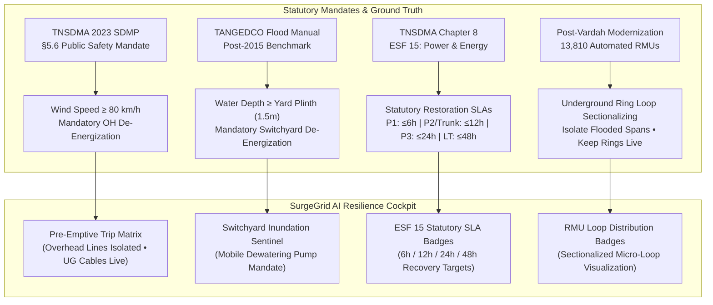
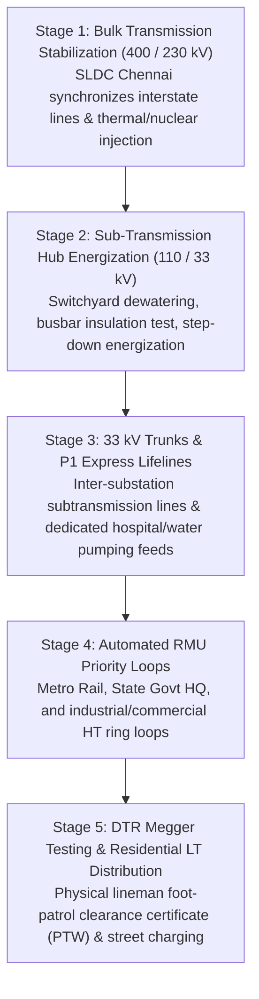

# 05 - Disaster Management & Statutory SOP Linkage

**Document Version:** 1.0.0  
**Effective Date:** September 2026  
**Statutory Grounding:** 
1. Tamil Nadu State Disaster Management Plan 2023 (TNSDMA SDMP 2023 — Chapters 5 & 8: ESF 14 & ESF 15)
2. TANGEDCO Disaster Management Manual & Standing Operating Procedures (Post-Vardah & Post-2015 Floods Edition)

---

## 1. Executive Context & Regulatory Provenance

During catastrophic coastal cyclones (**Cyclone Vardah 2016**, **Cyclone Michaung 2023**) and extreme pluvial floods (**Chennai Floods 2015**), electrical grid de-energization in Chennai did **not** occur predominantly due to spontaneous conductor snapping. Instead, TANGEDCO grid operators executed **statutory pre-emptive de-energizations** to preserve human life and protect critical substation assets from catastrophic insulation flashover.

SurgeGrid AI incorporates these statutory operating mandates directly into the grid simulation engine, bridging the gap between theoretical electrical topology and real-world TANGEDCO control room operations.

---

## 2. Statutory Pre-Emptive De-Energization Matrix

Under the **TNSDMA 2023 State Plan (Section 5.6)** and **TANGEDCO Cyclone SOPs**, the grid de-energization decision tree is enforced as follows:

| Trigger Condition | Threshold | Statutory Action | Affected Infrastructure | Rationale |
| :--- | :--- | :--- | :--- | :--- |
| **Cyclone Watch Alert** | Wind $\ge 65\text{ km/h}$ | Pre-Disaster Standby | Overhead Radial Lines & Tree Corridors | Lineman field foot patrol activated; tree-trimming gangs stationed at GCC Ripon Control Room. |
| **Severe Cyclonic Landfall** | Wind $\ge 80\text{ km/h}$ | **Statutory Pre-Emptive Trip** | **All Overhead (OH) & Mixed Feeders** | **Public Electrocution Prevention:** High winds rip tree limbs and snap overhead conductors. Charging standing water on roads causes mass fatalities. |
| **Underground Network Exemption** | Wind $\ge 80\text{ km/h}$ | **Continuously Energized** | **Pure Underground (UG) HT Cables** | Subsurface cables are immune to aerodynamic gust tearing, maintaining lifeline hospital and pumping station supply. |
| **TNSDMA Coastal Surge Breach** | Storm Surge $\ge 3.0\text{ m MSL}$ | **Substation Yard Isolation** | **Coastal / River Basin Substations** | Substation equipment plinth ($1.5\text{ m}$) submerged. De-energized to prevent transformer terminal flashovers. Mobile high-capacity diesel pumps required before restart. |

---

## 3. The TANGEDCO 5-Stage Sequential Restoration Protocol

Restoring an urban electrical grid after cyclonic blackout cannot occur arbitrarily without causing cold-load pick-up surges and secondary switchgear explosions. TANGEDCO enforces a strict 5-stage sequential restoration sequence:

### Stage SLA & Classification Reference

1. **Stage 1 (EHT Grid Stabilization)**: Target $\le 2\text{ hours}$. Re-establishes 400kV Alamathy, Sriperumbudur, and 230kV Tondiarpet/Mylapore/Guindy bulk nodes.
2. **Stage 2 (Substation Switchyard Recovery)**: Target $\le 4\text{ hours}$. Mobile de-watering pumps drain inundated yards (1.8m historical 2015 flood benchmark).
3. **Stage 3 (Sub-Transmission Trunks & Critical Lifelines)**:
   - **ESF 15 Statutory SLA: $\le 6\text{ hours}$** for P1 Critical Lifelines (e.g., Kilpauk Water Works, Rajiv Gandhi GH, Stanley Hospital).
   - **ESF 15 Statutory SLA: $\le 12\text{ hours}$** for 33 kV sub-transmission interconnect trunks feeding downstream distribution yards.
4. **Stage 4 (Automated RMU Priority Loops)**:
   - **ESF 15 Statutory SLA: $\le 12\text{ hours}$** for P2 Essential (Chennai Metro Rail CMRL, Southern Railway, Secretariat).
   - **ESF 15 Statutory SLA: $\le 24\text{ hours}$** for P3 Commercial / Industrial HT services.
5. **Stage 5 (Last-Mile LT Distribution & DTRs)**:
   - **ESF 15 Statutory SLA: $\le 48\text{ hours}$** for general residential low-tension consumers. Requires Lineman foot-patrol clearance (Permit-To-Work / PTW) before re-closing circuit breakers.

---

## 4. Post-Disaster Grid Modernization: The 13,810 RMU Network

Following **Cyclone Vardah (2016)**, which collapsed Chennai's grid demand from $2,500\text{ MW}$ to $0\text{ MW}$ in four hours, TANGEDCO converted over $2,000\text{ km}$ of HT lines into underground cables and installed **13,810 automated 11 kV Ring Main Units (RMUs)** across the GCC metropolitan area.

### Operational Benefit of RMU Sectionalizing in SurgeGrid AI:
- Traditional radial overhead lines trip end-to-end if a single tree branch contacts the wire.
- With automated RMUs on UG/Mixed feeders, operators isolate **only** the waterlogged ring segment while keeping the remainder of the loop energized.
- SurgeGrid AI displays an **estimated** RMU count on feeder cards (e.g. `🔄 6 RMU`). The count is not surveyed: `classifyFeeder()` derives it from the feeder's `config` and DTR count (UG: `max(2, min(DTRs/3.2, km/1.5, 12))`; Mixed: `DTRs/4.5`; Overhead: 0), and cards show it only when > 0.
- Feeder-level restoration stages are assigned only as 3 (P1 lifelines, 33 kV trunks), 4 (P2 essential, commercial HT) or 5 (everything else); stages 1–2 (bulk and substation recovery) are documented here but not modelled per feeder.
- Feeder `circuitState` is always initialised to `LIVE` in data; the scenario-dependent status shown in the cockpit is computed on the fly by `getFeederDisasterStatus()` in `disasterUtils.ts`.

---

## 5. UI/UX Cockpit Implementation

The SurgeGrid AI application reflects these operational realities across three synchronized cockpit surfaces:

1. **Top Center Disaster Protocol Cockpit Bar:**
   - Scenario selector (`DisasterCockpitBar.tsx`) designed for instant access:
     - `🟢 Live` (internal scenario `NORMAL`): pulsing beacon plus the current temperature from the Weather API; no simulated trips.
     - `🌀 Cyclone Michaung` and `🌊 2015 Megaflood` (updated 2026-09-29): hour-by-hour simulations driven by scenario files, with a timeline scrubber, and the *AI Directive* (Gemini SOP) button. At each hour, feeders trip under the rules below: yard flood when elevation ≤ surge; pre-emptive trip of overhead and mixed lines above $80\text{ km/h}$ (TNSDMA §5.6); watch above $60\text{ km/h}$; underground cables remain live. See [DISASTER_SIMULATION_AND_GEMINI_ARCHITECTURE.md](./DISASTER_SIMULATION_AND_GEMINI_ARCHITECTURE.md).
     - The earlier fixed `Alert`, `Severe` and `Surge 3.2m` buttons were removed from the UI; their logic still exists in `disasterUtils.ts`.
   - **Layout:** Buttons use `whitespace-nowrap`; on narrow screens the bar scrolls horizontally (`overflow-x-auto`). A second row holds the triage filters: `⚠️ Poor Stability (<75)`, `🌊 Waterlogging Risk` and `⚡ Live Outages`, each with a count.
   - **Unified Statutory Readout Banner:** Dynamic centered pill banner displaying regulatory mandates without ragged multi-line breaking (e.g. `⚠️ TNSDMA 3.0m Surge Mandate: Substation Inundation & Mobile Dewatering Active`).

2. **Substation Info Card & Emergency Sentinel:**
   - **Inundation banner:** During a simulation scenario, substations with elevation ≤ 3.2 m MSL show a `CRITICAL: Switchyard Inundation Event` banner near the top of the `Plant & Specs` tab (below the live-outage banner and switchyard identity card).
   - **Consolidated Switchyard Specs:** Unifies administrative circle, region code, MVA capacity, transformer units, incoming feeders, and Google Maps GPS navigation into a compact, single-card header.
   - **Climate & Flood Risk Matrix:** Displays terrain elevation (m MSL), distance to coast, composite risk score, the 2015 flood benchmark, switchgear plinth clearance (1.5 m GL, a fixed constant) and the dewatering requirement. The 2015 depth and dewatering flag are derived from elevation, not surveyed per yard (see doc 02).
   - **Jurisdictional AE Depot:** Compact single-row contact strip with direct phone dialer and map locator.

3. **Feeder Inspection Cards:**
   - **Statutory ESF 15 SLA Badge:** `⏱️ {N}h SLA`: 6 h (P1), 12 h (P2 / 33 kV trunk), 24 h (commercial HT), 48 h (LT).
   - **RMU Badge:** `🔄 {N} RMU` (estimated, shown only when N > 0).
   - **Restoration Stage Badge:** `📋 Stage {3|4|5}`.
   - **Disaster Status Callout:** Displays clear statutory justification (e.g., `⚠️ PRE-EMPTIVE TRIP (WIND) • TNSDMA Mandate §5.6: Wind > 80 km/h • Public Electrocution Prevention`).
