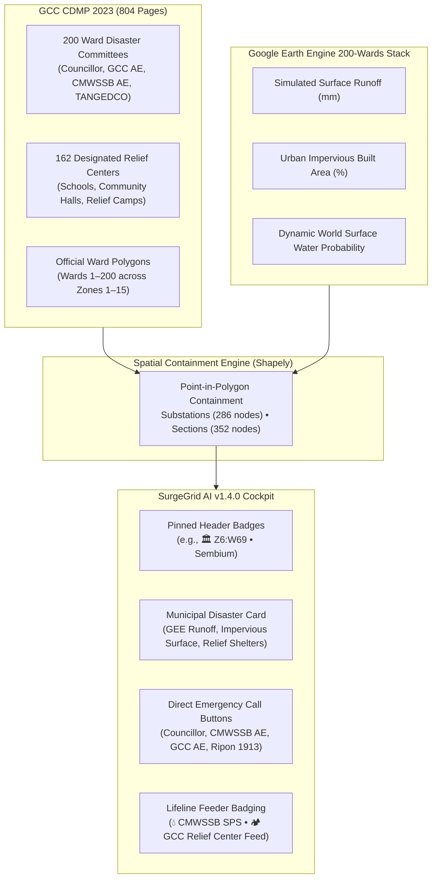

# 06 - GCC Municipal & Satellite Vulnerability Integration

**Document Version:** 1.4.0  
**Effective Date:** September 2026  
**Primary Ground Truth Sources:**
1. Greater Chennai Corporation City Disaster Management Perspective Plan 2023 (GCC CDMP 2023, 804 pages)
2. Google Earth Engine (GEE) Chennai 200 Wards Satellite Vulnerability Stack (`gee_chennai_wards_vulnerability.json`)
3. GCC Official Ward Boundaries GeoJSON (`gcc_wards_polygons.json`)
4. GCC Official Designated Relief Centers & Shelters Directory (`gcc_relief_centers.json`)

---

## 1. Executive Context & Operational Motivation

During catastrophic tropical cyclones (e.g. Cyclone Michaung 2023, Cyclone Vardah 2016) and severe pluvial inundation events (Chennai Floods 2015), electrical power grid restoration cannot occur in institutional isolation. 

Field power engineers from TANGEDCO must coordinate in real-time with:
- **Greater Chennai Corporation (GCC)**: Assistant Engineers, Conservancy Inspectors, and Ripon Central Control (1913) for tree clearing, road debris removal, and community shelter power.
- **Chennai Metropolitan Water Supply and Sewerage Board (CMWSSB)**: Area Engineers and Sewage Pumping Station (SPS) operators to ensure wastewater lifelines remain energized to prevent public health catastrophes and municipal sewage backflow.
- **Ward Councillors**: Elected local representatives holding official closed user group (CUG) mobile numbers for hyper-local ground verification of inundated streets before LT lines are re-energized.

SurgeGrid AI v1.4.0 bridges this vital inter-agency gap by fusing GCC's statutory 200-Ward disaster administrative structure and Google Earth Engine (GEE) satellite inundation analytics directly into the electrical grid cockpit.



---

> **Runtime data note (audited 2026-09-29).** The ward, GEE and shelter values are joined into `public/data/chennai_tneb_grid.json` by `scripts/enrich_grid_with_gcc.py` (178 of 286 substations and 211 of 352 sections carry `gccZone` / `gccWard` / `geeRunoffMm` / `wardCouncillorMobile` etc.). The app reads only those embedded fields; the ward polygons, drain, river and shelter files listed above are in `data-archive/data/` and are not loaded at runtime. The ward-hotline numbers follow the CUG series pattern in the table below and should be verified against the current GCC directory before operational use.

---

## 2. GCC 200-Ward Administrative Architecture & CUG Phone Series

The Greater Chennai Corporation is partitioned into 15 administrative zones and 200 electoral wards. Under the statutory GCC City Disaster Management Plan 2023, each ward possesses a designated **Ward Disaster Management Committee** with standardized CUG phone series:

| Agency | Officer Role | CUG Mobile Architecture | Example (Ward 69 - Thiru-Vi-Ka Nagar) |
| :--- | :--- | :--- | :--- |
| **GCC** | Ward Councillor | `9445467000 + Ward` (Official CUG) | `9445467069` |
| **GCC** | Assistant Engineer (Civil/Engg) | `9445190xxx` | `9445190369` |
| **GCC** | Assistant Engineer (Electrical) | `9445190xxx` / `9445477xxx` | `9445190901` |
| **CMWSSB** | Area Assistant Engineer | `8144930xxx` | `8144930069` |
| **TANGEDCO** | Ward AE / JE O&M | `9445850xxx` | `9445850903` |
| **GCC Central** | Ripon 24x7 Control Room | `1913` (Toll-Free Emergency) | `1913` |

### Zone Mapping Reference

| Zone Number | Zone Name | Wards Encompassed |
| :---: | :--- | :--- |
| **Zone 1** | Thiruvottiyur | Wards 1 – 14 |
| **Zone 2** | Manali | Wards 15 – 21 |
| **Zone 3** | Madhavaram | Wards 22 – 33 |
| **Zone 4** | Tondiarpet | Wards 34 – 48 |
| **Zone 5** | Royapuram | Wards 49 – 63 |
| **Zone 6** | Thiru-Vi-Ka Nagar | Wards 64 – 78 |
| **Zone 7** | Ambattur | Wards 79 – 93 |
| **Zone 8** | Anna Nagar | Wards 94 – 108 |
| **Zone 9** | Teynampet | Wards 109 – 126 |
| **Zone 10** | Kodambakkam | Wards 127 – 142 |
| **Zone 11** | Valasaravakkam | Wards 143 – 155 |
| **Zone 12** | Alandur | Wards 156 – 167 |
| **Zone 13** | Adyar | Wards 168 – 180 |
| **Zone 14** | Perungudi | Wards 181 – 191 |
| **Zone 15** | Sholinganallur | Wards 192 – 200 |

---

## 3. Spatial Containment Results & CMA Boundary Distinction

Using high-precision polygon containment algorithms via `shapely`, every physical substation coordinate and section office was tested against the 200 GCC ward boundaries:

- **Substations Inside GCC Urban Wards:** **178 of 286 nodes** (62.2%)
- **Substations in Peri-Urban CMA Corridors:** **108 of 286 nodes** (37.8%) — EHT bulk transmission nodes (400kV / 230kV) located in Kanchipuram, Tiruvallur, and Chengalpattu circles (e.g., Sriperumbudur, Alamathy, Sunguvarchatram).
- **Section Offices Inside GCC Urban Wards:** **211 of 352 nodes** (59.9%)
- **Section Offices in Peri-Urban CMA Corridors:** **141 of 352 nodes** (40.1%)

Nodes located outside the 200 municipal wards are explicitly tagged with `Peri-Urban CMA Grid Hub • EHT Transmission Corridor` badging, maintaining accurate administrative clarity.

---

## 4. Google Earth Engine (GEE) Satellite Runoff & Impervious Metrics

Each urban ward is enriched with empirical satellite observations from Google Earth Engine:
- **Simulated Surface Runoff (`geeRunoffMm`):** Calculated based on precipitation accumulation and watershed flow vectors during cyclonic downpours.
- **Urban Impervious Built Area (`geeImperviousPct`):** Derived from ESA WorldCover and Sentinel-2 surface reflectance, quantifying pavement coverage that impedes natural infiltration and causes rapid plinth submergence.
- **Relief Shelters Count (`wardReliefSheltersCount`):** Count of designated GCC disaster shelters (schools, community centers) within the ward requiring uninterrupted electrical feeds.

---

## 5. UI Ergonomics & 3-Tab Balanced Architecture

To eliminate visual redundancy, consolidate electrical topology, and strictly maintain the **zero-scroll standard** across viewports, the substation inspector organizes data into three balanced, semantically distinct tabs:

```
┌──────────────────────────┬─────────────────────────────┬──────────────────────────┐
│   ℹ️ Plant & Specs       │   ⚡ Circuits & Grid (N)    │   🛡️ Civic & Crisis      │
│  (Physical Asset Profile)│ (Upstream Links + Feeders)  │  (GCC & Satellite GEE)   │
└──────────────────────────┴─────────────────────────────┴──────────────────────────┘
```

1. **Pinned Header (Global Reference)**:
   - Displays a single subtle pill `🏛️ Z{Zone}:W{Ward}` (e.g. `🏛️ Z13:W174`) providing global municipal awareness across all tabs without duplicating card titles below.
2. **Tab 1: `ℹ️ Plant & Specs` (Physical Asset & Civil Defense Profile)**:
   - **Card 1 (Asset Identity)**: Dedicated to pure TNEB Circle identity (**`CHENNAI SOUTH 2`** • `Region 01` • `16 MVA` • Switchyard GPS coordinates). Zero municipal text redundancy.
   - **Card 2 (Physical Flood Defense)**: Switchyard terrain elevation MSL, distance to coastline, composite risk score, 2015 Flood benchmark depth ($0.9\text{ m}$ / $1.8\text{ m}$), switchgear plinth clearance ($1.5\text{ m GL}$ standard), and dewatering SOP (Gravity Drainage vs Mobile Diesel Pumps).
   - **Card 3 (Field AE Depot)**: Jurisdictional Assistant Engineer (AE) Section Office and Fuse-Call beat with quick "Locate" map navigation.
   - **Card 4 (SLDC Dispatch Note)**: Operational dispatch guidelines (EHV / Sub-transmission / Distribution).
   - **Zero Scroll Required**: Balanced height (~380px), 100% visible above the fold.
3. **Tab 2: `⚡ Circuits & Grid` (Unified Upstream & Downstream Electrical Topology)**:
   - **Grid Circuit Isolation & Linked Trunks Card**:
     - Upstream transmission links and campus interconnections count with "Isolate Electrical Circuit" toggle switch and animated power flow lines.
     - Expandable linked nodes drawer (`View Links` / `Hide Links`) allowing one-click navigation to linked substations with voltage and distance.
   - **Feeder Management Suite & Decluttered Ergonomics**:
     - Quick Category Filter Pills (`All` vs `Critical Lifelines`) and instant feeder search filter.
     - **Collapsible Grid Jargon Cheat Sheet**:
       - A `Jargon` / `Hide Guide` button toggles an inline reference guide (`GridJargonCheatSheet.tsx`) explaining four terms:
         - **P1 NON-CUT**: Statutory lifeline exempt from rolling load-shedding during grid distress.
         - **ESF 15 SLA**: Emergency Support Function 15 (Energy) statutory restoration mandate (e.g., 6h SLA).
         - **RMU Loops**: Ring Main Unit underground loop switches enabling automated back-feeding.
         - **Stage 3 Restoration**: Sequential post-cyclone grid energization order (Hospital/Water -> Secondary -> LT).
     - **Streamlined Card Layout (~40% Height Reduction)**:
       - Replaced bulky badge avalanche with a compact metadata strip (`⏱️ 6h SLA`, `🔄 2 RMU`, `📋 Stage 3`) with rich, plain-English hover tooltips (`cursor-help`).
       - Unified lifeline & priority pill: `💧 CMWSSB Lifeline • P1 Non-Cut` or `🏕️ GCC Relief Shelter Feed • P1 Critical`.
       - Clean, scannable bottom row: consumer counts, DTR distribution transformer counts, and circuit line length in km with informative tooltips.
       - Synchronized across both Single-Column Tabbed Inspector and Two-Column Split Inspector views.
     - **Feeder Terminology Deduplication & Redundancy Removal**:
       - **HT Redundancy Elimination**: Stripped redundant "HT" mentions across 11kV/33kV distribution lines (which are inherently High Tension). Standardized category pill from `Dedicated HT Commercial/Industrial` to `Commercial & Industrial`.
       - **Dedicated Line Indication**: Replaced `• Dedicated HT` with clean, self-explanatory `• Dedicated Line`.
       - **Bulk Consumer Clarification**: Replaced raw, confusing fallback string `Dedicated (HT Service)` with `👥 1 Bulk Consumer` when consumer count is 0 on dedicated single-consumer feeds.
       - **Clean Lifeline Badging**: Simplified specialized lifeline names (`Hospital Lifeline`, `Metro / Rail / Port`, `Govt / Emergency HQ`).
     - **Strict 3-Tier Typography Standardization**:
       - Enforced a uniform typographic scale (`text-base` for primary card headers/key values, `text-sm` for secondary metadata and subtitles, `text-xs` for micro-badges and tags) to eliminate font size fragmentation and visual clutter.
4. **Tab 3: `🛡️ Civic & Crisis` (Municipal Disaster Command & Satellite Hydrology)**:
   - **GCC Zonal Identity**: `GCC Zone {X} ({ZoneName}) • Ward {Y}` under the statutory CDMP 2023 mandate.
   - **GEE Satellite Stack & Multi-Line Inundation Header**: Simulated Surface Runoff (mm), Urban Impervious Built Area (%), and Inundation Risk Category. Placed the `SEVERE INUNDATION ZONE` / `CRITICAL INUNDATION ZONE` badge on a dedicated second line beneath the card title (`flex-col gap-1.5`) to eliminate horizontal crowding and badge truncation.
   - **Ward Disaster Committee Hotlines (2×2 Grid)**: Clickable direct `tel:` call cards for Ward Councillor (CUG), CMWSSB AE, GCC Civil AE, and Ripon Central Control (1913).
   - **Shelter Feeds & Inter-Agency Protocol**: Multi-agency joint dewatering and foot-patrol clearance guidelines before line re-energization.
   - **Zero Scroll Required**: Balanced height (~390px), perfectly symmetrical with Tab 1.

---

## 6. Verification and Validation

The implementation was validated through end-to-end testing:
- **TypeScript & Vite Production Build:** Succeeded with **0 errors** in `584ms` (`dist/assets/index-CBAdGfhE.js`).
- **Typography Scale Consistency:** Strict 3-tier hierarchy (`text-base`, `text-sm`, `text-xs`) verified across all cards and modal dialogs.
- **Tab Isolation & Routing:** Verified strict separation between Tab 1 (`Plant & Specs`) physical asset profile and Tab 2 (`Circuits & Grid`) feeder management suite.
- **Feeder Deduplication:** Confirmed removal of redundant "HT" prefixes and verified `👥 1 Bulk Consumer` display for zero-consumer dedicated service lines.
- **Multi-Line Inundation Badging:** GEE Satellite card header verified with zero badge clipping or text collision on narrow viewports.
- **Height Symmetry & Zero Scroll:** Both Tab 1 (`Plant & Specs`) and Tab 3 (`Civic & Crisis`) fit entirely above the fold with equal visual weight.
- **Topological Integrity:** Tab 2 seamlessly consolidates upstream transmission incomers/links and downstream 11kV distribution feeders.
- **Statutory Disaster Standards:** Preserves all TNSDMA 2023 3.0m thresholds, TANGEDCO 2017 sequential energization protocols, and GCC CDMP 2023 emergency directory contacts.
