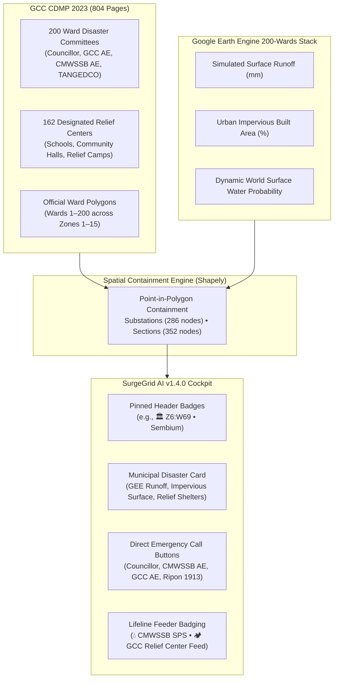

# 06 - GCC Municipal & Satellite Vulnerability Integration

**Document Version:** 1.4.0  
**Effective Date:** September 2026  
**Primary Ground Truth Sources:**
1. Greater Chennai Corporation City Disaster Management Perspective Plan 2023 (GCC CDMP 2023, 804 pages)
2. Google Earth Engine (GEE) Chennai 200 Wards Satellite Vulnerability Stack (`gee_chennai_wards_vulnerability.json`)
3. GCC Official Ward Boundaries GeoJSON (`gcc_wards_polygons.json`)
4. GCC Official Designated Relief Centers & Shelters Directory (`gcc_relief_centers.json`)

---

## 1. Executive Context & Operational Motivation

During catastrophic tropical cyclones (e.g. Cyclone Michaung 2023, Cyclone Vardah 2016) and severe pluvial inundation events (Chennai Floods 2015), electrical power grid restoration cannot occur in institutional isolation. 

Field power engineers from TANGEDCO must coordinate in real-time with:
- **Greater Chennai Corporation (GCC)**: Assistant Engineers, Conservancy Inspectors, and Ripon Central Control (1913) for tree clearing, road debris removal, and community shelter power.
- **Chennai Metropolitan Water Supply and Sewerage Board (CMWSSB)**: Area Engineers and Sewage Pumping Station (SPS) operators to ensure wastewater lifelines remain energized to prevent public health catastrophes and municipal sewage backflow.
- **Ward Councillors**: Elected local representatives holding official closed user group (CUG) mobile numbers for hyper-local ground verification of inundated streets before LT lines are re-energized.

SurgeGrid AI v1.4.0 bridges this vital inter-agency gap by fusing GCC's statutory 200-Ward disaster administrative structure and Google Earth Engine (GEE) satellite inundation analytics directly into the electrical grid cockpit.

---

## 2. GCC 200-Ward Administrative Architecture & CUG Phone Series

The Greater Chennai Corporation is partitioned into 15 administrative zones and 200 electoral wards. Under the statutory GCC City Disaster Management Plan 2023, each ward possesses a designated **Ward Disaster Management Committee** with standardized CUG phone series:

| Agency | Officer Role | CUG Mobile Architecture | Example (Ward 69 - Thiru-Vi-Ka Nagar) |
| :--- | :--- | :--- | :--- |
| **GCC** | Ward Councillor | `9445467000 + Ward` (Official CUG) | `9445467069` |
| **GCC** | Assistant Engineer (Civil/Engg) | `9445190xxx` | `9445190369` |
| **GCC** | Assistant Engineer (Electrical) | `9445190xxx` / `9445477xxx` | `9445190901` |
| **CMWSSB** | Area Assistant Engineer | `8144930xxx` | `8144930069` |
| **TANGEDCO** | Ward AE / JE O&M | `9445850xxx` | `9445850903` |
| **GCC Central** | Ripon 24x7 Control Room | `1913` (Toll-Free Emergency) | `1913` |

### Zone Mapping Reference

| Zone Number | Zone Name | Wards Encompassed |
| :---: | :--- | :--- |
| **Zone 1** | Thiruvottiyur | Wards 1 – 14 |
| **Zone 2** | Manali | Wards 15 – 21 |
| **Zone 3** | Madhavaram | Wards 22 – 33 |
| **Zone 4** | Tondiarpet | Wards 34 – 48 |
| **Zone 5** | Royapuram | Wards 49 – 63 |
| **Zone 6** | Thiru-Vi-Ka Nagar | Wards 64 – 78 |
| **Zone 7** | Ambattur | Wards 79 – 93 |
| **Zone 8** | Anna Nagar | Wards 94 – 108 |
| **Zone 9** | Teynampet | Wards 109 – 126 |
| **Zone 10** | Kodambakkam | Wards 127 – 142 |
| **Zone 11** | Valasaravakkam | Wards 143 – 155 |
| **Zone 12** | Alandur | Wards 156 – 167 |
| **Zone 13** | Adyar | Wards 168 – 180 |
| **Zone 14** | Perungudi | Wards 181 – 191 |
| **Zone 15** | Sholinganallur | Wards 192 – 200 |

---

## 3. Spatial Containment Results & CMA Boundary Distinction

Using high-precision polygon containment algorithms via `shapely`, every physical substation coordinate and section office was tested against the 200 GCC ward boundaries:

- **Substations Inside GCC Urban Wards:** **178 of 286 nodes** (62.2%)
- **Substations in Peri-Urban CMA Corridors:** **108 of 286 nodes** (37.8%) — EHT bulk transmission nodes (400kV / 230kV) located in Kanchipuram, Tiruvallur, and Chengalpattu circles (e.g., Sriperumbudur, Alamathy, Sunguvarchatram).
- **Section Offices Inside GCC Urban Wards:** **211 of 352 nodes** (59.9%)
- **Section Offices in Peri-Urban CMA Corridors:** **141 of 352 nodes** (40.1%)

Nodes located outside the 200 municipal wards are explicitly tagged with `Peri-Urban CMA Grid Hub • EHT Transmission Corridor` badging, maintaining accurate administrative clarity.

---

## 4. Google Earth Engine (GEE) Satellite Runoff & Impervious Metrics

Each urban ward is enriched with empirical satellite observations from Google Earth Engine:
- **Simulated Surface Runoff (`geeRunoffMm`):** Calculated based on precipitation accumulation and watershed flow vectors during cyclonic downpours.
- **Urban Impervious Built Area (`geeImperviousPct`):** Derived from ESA WorldCover and Sentinel-2 surface reflectance, quantifying pavement coverage that impedes natural infiltration and causes rapid plinth submergence.
- **Relief Shelters Count (`wardReliefSheltersCount`):** Count of designated GCC disaster shelters (schools, community centers) within the ward requiring uninterrupted electrical feeds.

---

## 5. UI Ergonomics & Emergency Dispatch Workflow

To maintain the **zero-scroll visual standard** established in v1.3.1, municipal disaster data is seamlessly integrated:

1. **Pinned Header Pill**: Displays `🏛️ Z{Zone}:W{Ward}` alongside voltage tier and elevation.
2. **Administrative Identity Card**: Enriched to display `GCC Zone {X} ({ZoneName}) • Ward {Y}` and Circle name.
3. **GCC Municipal & Satellite Vulnerability Stack**:
   - Clean, compact card with GEE runoff (mm) and impervious surface (%) indicators.
   - Four dedicated CUG emergency hotline buttons formatted as direct `tel:` hyperlinks:
     - `📞 Councillor: {9445467xxx}`
     - `💧 CMWSSB: {8144930xxx}`
     - `⚡ GCC AE: {9445190xxx}`
     - `🏛️ Ripon: 1913`
4. **Feeder Lifeline Badging**:
   - `💧 CMWSSB Sewage Pumping` (Tagged `P1 NON-CUT`)
   - `🏕️ GCC Relief Shelter Feed` (Tagged `P1 CRITICAL`)

---

## 6. Verification and Validation

The implementation was validated through end-to-end testing:
- **TypeScript & Vite Production Build:** Succeeded with **0 errors** in `601ms`.
- **Browser Automation Inspection:** Verified `110/33-11 KV SEMBIUM SS` in Zone 6 / Ward 69:
  - Header: `🏛️ Z6:W69`, `⛰️ 11m MSL`
  - GEE Satellite: `🌧️ 182.7 mm Runoff`, `🧱 67.3 % Impervious Built`
  - CUG Contacts: Councillor `9445467069`, CMWSSB `8144930069`, GCC AE `9445190369`, Ripon `1913`.
  - Zero UI layout shifts or overflow regressions.
