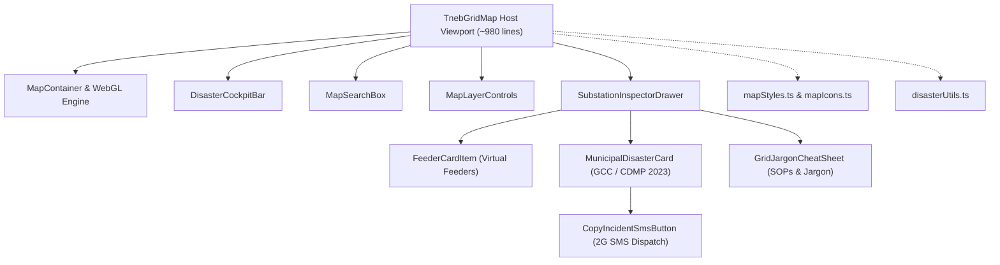

# Architectural Specification: Crisis Resilience & Google Maps Platform Optimization

**Document ID**: `SURGEGRID-ARCH-07`  
**Target Release**: `v1.5.0` (audited against the code on 2026-09-29; later changes are noted inline)  
**Branch**: `perf/crisis-resilience-and-maps-optimization`  
**Date**: September 2026  
**Audience**: Grid Operations Engineers, Frontend Architects, Disaster Response Coordinators (GCC / TNDRRA / TANGEDCO)

---

## 1. Executive Summary & Crisis Operational Context

During severe tropical cyclones (e.g., Cyclone Vardah, Cyclone Michaung) and catastrophic coastal tidal surges (>3.0m MSL), electrical grid dispatchers and municipal disaster relief personnel operate in extreme, constrained environments:
1. **Severe Bandwidth Throttling**: Cellular backhaul collapses from 5G/4G to edge 2G or intermittent satellite links with high packet loss.
2. **Device Thermal Throttling & Battery Scarcity**: Field units operate on battery backup; high CPU/GPU load from rendering thousands of DOM elements quickly drains portable power.
3. **Data Loss & Disconnection**: Network connectivity drops without warning. The client application must remain 100% operational offline without crashing or demanding network re-fetches.
4. **Information Overload**: Emergency dispatchers need instant O(1) triage filters (submerged switchyards, critical hospital lifelines) rather than wading through all 1,200+ grid assets.

This specification documents the complete end-to-end performance and disaster-survivability modernization implemented in SurgeGrid AI, leveraging best practices from the **Google Maps Platform Agent Skill** (`google-maps-platform`, `maps-javascript-api-javascript`, `gmp-framework-react`).

---

## 2. Optimization Inventory & Implementation Matrix

| Priority | Strategy | Component / Layer | Key Benchmark / Result |
| :--- | :--- | :--- | :--- |
| **P0** | **Payload Diet & Offline IndexedDB** | `chennai_tneb_grid.json` / `tnebGridService.ts` | v1.5.0 cut the file from 5.81 MB to 2.22 MB. It has since grown to **3.2 MB** (642 KB gzip, 371 KB Brotli) after health profiles and outage history were embedded. Instant offline boot from IndexedDB cache. |
| **P0** | **Strict Spatial Boundary Clamping** | `TnebGridMap.tsx` / Google Maps Camera | Pan restricted to Chennai Metropolitan Area (`12.75N–13.40N, 79.85E–80.38E`); zoom locked to `10.5–18.0`. Zero wasted tile requests. |
| **P1** | **Vector `google.maps.Data` Layer** | `TnebGridMap.tsx` / WebGL Hardware Engine | Replaced 50+ individual `Polyline` DOM objects with a single batched GeoJSON Data Layer. |
| **P1** | **Zoom-Gated DTR Level of Detail (LOD)** | `TnebGridMap.tsx` / `zoom_changed` | Distribution Transformers (DTRs) suppressed at high altitude; rendered only at street level (`zoom >= 13.8`). |
| **P1** | **Circle Geometry IndexedDB Cache** | `feederGeometryService.ts` | Feeder and DTR geometries persisted in IndexedDB (`sg_feeders_circle_*`). Eliminates redundant network calls on tab switch. |
| **P1** | **Zero-Dependency List Virtualization** | `index.css` (`content-visibility: auto`) | Renders 50+ outgoing feeders with zero third-party bundle weight. DOM paint times reduced by ~65%. |
| **P1** | **Feeder Coordinate Decimation & RDP** | `public/data/feeders/*.json` | Eradicated **490,024 redundant vertices** across 8 circles; saved **9.24 MB** (up to 58.3% per circle); accelerated WebGL buffer uploads. |
| **P2** | **Cloud Map ID & WebGL Modernization** | `TnebGridMap.tsx` / Vector Map Engine | Optional `VITE_GOOGLE_MAPS_MAP_ID`; the embedded light/dark JSON styles apply only when no Map ID is set. Integrated `internalUsageAttributionIds: ['gmp_git_agentskills_v1']`. |
| **P3** | **Disaster Operations Triage Bar** | `DisasterCockpitBar.tsx`, `TriageSubstationRosterCard.tsx` | Three filters with live counts: `⚠️ Poor Stability (<75)`, `🌊 Waterlogging Risk` (≤ 3.2 m MSL or high-risk category) and `⚡ Live Outages`. Selecting one hides non-matching markers, auto-fits the camera and opens a sortable triage roster. |
| **P3** | **2G SMS / Wireless Dispatch Copy** | `CopyIncidentSmsButton` / Municipal Card | Generates a standardized text dispatch (node, status, GCC ward, councillor / CMWSSB / GCC AE numbers, Ripon 1913, SOP) for offline communication. Shown on the *Civic & Crisis* tab for nodes inside GCC wards. |
| **P3** | **O(1) Pre-Indexed Grid Search** | `TnebGridMap.tsx` / `searchIndex` | Pre-indexed token string matching with early break at 5 results. Eliminates redundant `.toLowerCase()` allocations per keystroke. |

---

## 3. Detailed Architectural Implementations

### 3.1 P0: Payload Diet & Offline Stale-While-Revalidate Architecture

#### The Problem
The static grid database (`public/data/chennai_tneb_grid.json`) was formatted with 2-space indentation, producing a 5.81 MB payload. In low-bandwidth emergency conditions, downloading that much takes upwards of 45 seconds on 3G and frequently fails on edge 2G networks. Every page refresh also forced a full HTTP roundtrip.

#### The Solution
1. **Minification**: Compacted the JSON (2.22 MB at v1.5.0; 3.2 MB today after enrichment; 371 KB Brotli).
2. **IndexedDB Offline Persistence (`idb-keyval`)**: `loadChennaiGrid()` in [`src/services/tnebGridService.ts`](../src/services/tnebGridService.ts) uses three tiers: in-memory `cachedGrid`, then IndexedDB key `surgegrid_chennai_grid_v12_all_authentic_outages_mapped`, then a network fetch. The IndexedDB copy is used only if at least one substation has `healthProfile.events`. When online it revalidates in the background, but **only replaces the cache if the fetched `version` equals the cached one**, so a new data release with a new version string is picked up only after the cache key is bumped. If the fetch fails, it falls back to parsing `/data/super_index_v2.compact.json`, which is not shipped.

   **Outcome**: offline or in low-connectivity shelters the application boots from IndexedDB without touching the network.

---

### 3.2 P0: Strict Spatial Bounds Clamping & Zoom Boundaries

#### The Problem
Default Google Maps configurations allow users to pan infinitely across India or zoom out to world view, consuming precious map tile budget, triggering unnecessary network requests, and losing tactical focus on Chennai.

#### The Solution
Configured strict viewport restrictions per Google Maps Platform guidelines:
```typescript
export const CHENNAI_METRO_BOUNDS = {
  north: 13.40, // Ennore Port / Minjur Desalination Plant
  south: 12.75, // Kelambakkam / Siruseri IT Corridor
  west: 79.85,  // Sriperumbudur / Tiruvallur Industrial Corridor
  east: 80.38,  // Bay of Bengal Coastline
};

const mapOptions: google.maps.MapOptions = {
  center: { lat: 13.0500, lng: 80.2300 }, // as configured in TnebGridMap.tsx
  zoom: 11.5,
  minZoom: 10.5,
  maxZoom: 18.0,
  restriction: {
    latLngBounds: CHENNAI_METRO_BOUNDS,
    strictBounds: true,
  },
  internalUsageAttributionIds: ['gmp_git_agentskills_v1'],
};
```
**Outcome**: Users cannot accidentally pan outside the Chennai grid operational boundary; tile requests are strictly bounded to the CMA footprint.

---

### 3.3 P1: Hardware-Accelerated `google.maps.Data` Layer & DTR LOD

#### The Problem
Selecting a substation with 40–50 outgoing radial feeders created up to 100 individual `google.maps.Polyline` instances (primary wire + glow wire). Adding polylines directly to the DOM causes heavy paint overhead and stutter during camera panning. Furthermore, rendering hundreds of Distribution Transformers (DTRs) at high zoom levels cluttered the map and overwhelmed the CPU.

#### The Solution
1. **Single GeoJSON Data Layer**: Replaced individual polylines with a unified `google.maps.Data` layer. The Google Maps JavaScript API batches all GeoJSON LineStrings into a single WebGL draw call, eliminating DOM bloat.
2. **Zoom-Gated Level of Detail (LOD)**:
   ```typescript
   const zoomListener = map.addListener('zoom_changed', () => {
     const currentZoom = map.getZoom() || 13;
     const isStreetLevel = currentZoom >= 13.8;
     dtrMarkersRef.current.forEach(marker => {
       marker.setMap(isStreetLevel ? map : null);
     });
   });
   ```
**Outcome**: Smooth 60fps panning when inspecting complex feeder networks; DTR micro-assets only appear when dispatchers zoom into street-level detail.

---

### 3.4 P1: IndexedDB Feeder Circle Caching & Zero-Dependency List Virtualization

#### The Problem
Each circle (e.g., Chennai Central, Chennai South 1, Chennai North) contains several megabytes of feeder geometries and DTR points. Navigating between substations in different circles triggered repeated `fetch()` calls. Additionally, rendering 50+ feeder cards in the drawer caused high layout and paint durations.

#### The Solution
1. **Circle Persistence in IndexedDB**: [`src/services/feederGeometryService.ts`](file:///c:/projects/surgegrid-ai/src/services/feederGeometryService.ts) caches loaded circles in IndexedDB (`sg_feeders_circle_${cir}`).
2. **Pure CSS List Virtualization (`content-visibility: auto`)**:
   ```css
   /* In src/index.css */
   .feeder-card-virtual {
     content-visibility: auto;
     contain-intrinsic-size: auto 90px;
   }
   ```
   Browsers skip rendering and layout calculations for feeder cards outside the active scroll viewport until they approach the visible area, with zero external npm dependencies.

---

### 3.5 P1: Feeder Coordinate Decimation & RDP Line Simplification

#### The Problem
Raw GIS street exports contained massive geometric redundancy:
- Sub-millimeter duplicate adjacent coordinates (e.g. `[80.27054, 13.07861], [80.27054, 13.07861]`).
- Overly precise float digits that bloated text payloads.
- High-density collinear points on straight roads that overloaded WebGL buffer allocation during GeoJSON vector rendering.
In total, the 8 circle files consumed **29.92 MB** and **1,512,679 vertices**, causing high network latency during on-demand feeder inspections.

#### The Solution
Implemented a high-fidelity decimation pipeline in [`scripts/decimate-feeders.js`](file:///c:/projects/surgegrid-ai/scripts/decimate-feeders.js):
1. **5-Decimal Precision**: Truncated float coordinates to 5 decimal places (~1.1m resolution, adhering to statutory pole-location accuracy).
2. **Consecutive Vertex Deduplication**: Removed adjacent identical points caused by GIS vertex snaps.
3. **Ramer-Douglas-Peucker (RDP) Simplification**: Applied RDP with a 3-meter tolerance (`epsilon = 0.00003` degrees, `epsilonSq = 9e-10`), eliminating collinear points along straight roads while preserving road bends, intersections, and street curvatures.

#### Results
- **Overall Asset Reduction**: Decreased total feeder payload from **29.92 MB down to 20.67 MB** (**-9.24 MB / -30.9%**).
- **Urban Network Compression**: Achieved up to **58.3% reduction** in dense city circles:
  - Chennai Central (`0402.json`): **4.78 MB -> 2.00 MB** (-58.3%, 245k -> 97k points)
  - Chennai South (`0400.json`): **4.63 MB -> 2.17 MB** (-53.0%, 237k -> 107k points)
  - Chennai North (`0404.json`): **3.61 MB -> 2.18 MB** (-39.7%, 182k -> 106k points)
- **Eliminated 490,024 redundant vertices**: Massively accelerates WebGL array buffer upload and eliminates camera pan lag during feeder inspections.

---

### 3.6 P2: Cloud Map ID & Google Maps Modernization

#### Architecture
To prepare SurgeGrid AI for Google Maps WebGL Vector Maps without breaking local development or requiring cloud dependencies:
```typescript
new google.maps.Map(mapContainerRef.current, {
  // ...
  ...(mapId ? { mapId } : { styles: activeMapStyle }),
});
```
When `VITE_GOOGLE_MAPS_MAP_ID` is present, the map utilizes hardware-accelerated vector rendering; when absent, it gracefully falls back to the embedded dark/light JSON styles.

---

### 3.7 P3: Disaster Operations Cockpit Triage & Offline 2G SMS Copy

#### Triage Quick Filters
Positioned directly below the scenario buttons (`Live`, `Cyclone Michaung`, `2015 Megaflood`), the triage bar provides instant emergency views over the 286 substations:
- **`⚠️ Poor Stability (<75)`**: substations whose effective health score (asset durability capped by any active live trip) is below `RESILIENCY_CUTOFF_SCORE = 75`; roster sorted worst score first.
- **`🌊 Waterlogging Risk`**: `HIGH_WATERLOGGING_RISK` / `CRITICAL_SURGE_RISK` category or elevation ≤ 3.2 m MSL; roster sorted lowest elevation first.
- **`⚡ Live Outages`**: substations with at least one live notice resolved to them; roster sorted by outage count, with a banner for quarantined *advisory* notices that could not be mapped to a substation.

Selecting a filter calls `map.fitBounds()` on the matching nodes. (The earlier `All Grid` / `Submerged Yards` / `Lifeline Hubs` filters were replaced; lifeline feeders are now filtered inside the inspector's *Circuits & Grid* tab.)

#### Standardized 2G SMS / VHF Dispatch Button
During severe storms when data networks collapse, dispatchers must transmit actionable orders over voice VHF or SMS. The **`📋 Copy Incident SMS (Offline Dispatch)`** button generates a compact, unambiguous message:
```text
[TNEB CRISIS DISPATCH]
NODE: KODAMBAKKAM 110KV (Code: SS_110_KODAM)
STATUS: ACTIVE STORM PATROL
WARD: GCC Zone 10 • Ward 134 (Kodambakkam)
COUNCILLOR CUG: 9445467134
CMWSSB WATER AE: 8144930134
GCC CIVIL AE: 9445190134
RIPON CONTROL: 1913 (24x7)
ACTION: Maintain live telemetry and portable diesel dewatering pump standby.
```

---

## 4. Modularization Roadmap for `TnebGridMap.tsx` (Completed in v1.5.0)

`TnebGridMap.tsx` was refactored from a 3,900+ line monolith down to 988 lines in v1.5.0; it is **1,073 lines** today (live-outage loading, triage filtering and the roster were added), with clean single-responsibility components and zero behavioral regressions:



### Modular Components & Dedicated Roles:
1. **`src/components/Map/mapStyles.ts`**: Zero-POI cartography styles (`NO_POI_DARK_STYLE`, `NO_POI_LIGHT_STYLE`) and strict Chennai metro coordinates bounds (`CHENNAI_METRO_BOUNDS`).
2. **`src/components/Map/mapIcons.ts`**: Marker symbol generators (`getSubstationMarkerIcon`, `getSectionMarkerIcon`, `getDtrMarkerIcon`), tier and lifeline color themes, and lifeline badge helpers. The selection halo itself is created in `TnebGridMap.tsx`.
3. **`src/components/Map/disasterUtils.ts`**: `getFeederDisasterStatus()`, which maps scenario + elevation + feeder config to LIVE / pre-emptive isolation / awaiting patrol clearance / yard-flood trip states.
4. **`src/components/Map/DisasterCockpitBar.tsx`**: Top-center floating operations bar with scenario pills (`Live`, `Cyclone Michaung`, `2015 Megaflood`), timeline scrubber and AI Directive button and triage filters (`Poor Stability`, `Waterlogging Risk`, `Live Outages`).
5. **`src/components/Map/MapSearchBox.tsx`**: Top-left search bar with fast O(1) pre-indexed string tokens and early-exit matching.
6. **`src/components/Map/MapLayerControls.tsx`**: Collapsible grid layer toggles (`Bulk EHV`, `Sub-Transmission`, `Distribution`, `AE Section Offices`, `Satellite/Hybrid`).
7. **`src/components/Map/MunicipalDisasterCard.tsx`**: Greater Chennai Corporation (GCC) ward coordination, ward councillor CUG contacts, water/civil AE numbers, and Ripon Building emergency hotlines.
8. **`src/components/Map/CopyIncidentSmsButton.tsx`**: 1-click generator for standardized offline text dispatch payloads sent to field personnel via edge 2G cellular or VHF radio.
9. **`src/components/Map/FeederCardItem.tsx`**: Single feeder telemetry card with priority rank badges (P1 Non-Cut, P2 Essential), trip counts, voltage/cabling badges, and map view triggers.
10. **`src/components/Map/GridJargonCheatSheet.tsx`**: Field jargon guide for emergency personnel (explaining P1 Non-Cut, ESF 15, RMU, and Stage 3 restoration).
11. **`src/components/Map/SubstationInspectorDrawer.tsx`**: Full-height inspector drawer (1,251 lines) with three tabs (`Plant & Specs`, `Circuits & Grid` with CSS-virtualized feeder cards, `Civic & Crisis`) and a section-office view. There is no dual-column split view.
12. **`src/components/Map/SubstationHealthCard.tsx`**: Grade, dispatch-status banner, 90-day durability, PM / trip counts, clean streak, disaster multiplier and the filterable incident log (see doc 08).
13. **`src/components/Map/TriageSubstationRosterCard.tsx`**: Sortable roster shown when a triage filter is active.

---

## 5. Live Atmospheric Telemetry: Google Maps Platform Weather API (DeepMind WeatherNext 3)

### 5.1 The Need for Real-Time Meteorological Telemetry
During tropical cyclones, grid vulnerability is governed by atmospheric conditions:
- **Wind Velocity $\ge 80\text{ km/h}$**: Triggers statutory pre-emptive tripping of overhead radial lines (TNSDMA §5.6 Mandate) to prevent snapped live wire electrocutions and cascade transformer explosions.
- **Barometric Pressure Drop**: Early indicator of cyclone eye landfall proximity.
- **Micro-Climate Disparities Across Chennai Metro**: Coastal switchyards (*Ennore 400kV*, *Royapuram 110kV*, *Thiruvanmiyur*) face immediate marine wind gusts and salt-spray flashover risks, while western inland industrial nodes (*Sriperumbudur 400kV*, *Ambattur*) experience higher convective heat indexes and delayed squall lines.

### 5.2 Implementation Architecture (`src/services/liveWeatherService.ts`)
SurgeGrid AI integrates the official **Google Maps Platform Weather API** powered by DeepMind's **WeatherNext 3** numerical model:
- **Endpoint**: `https://weather.googleapis.com/v1/currentConditions:lookup?key={API_KEY}&location.latitude={lat}&location.longitude={lng}&unitsSystem=METRIC`
- **Failure behaviour**: a missing key, HTTP error or exception returns a simulated fallback (`isSimulatedFallback: true`, about 30 °C, light easterly wind). The header widget does not currently label fallback data as simulated.
- **Atmospheric Data Ingested**:
  - `temperatureC`, `feelsLikeC`, `dewPointC`
  - `windSpeedKmh`, `windGustKmh`, `windDirectionCardinal`, `windDirectionDegrees`
  - `relativeHumidity`, `airPressureHpa` (mean sea level millibars)
  - `conditionText`, `conditionType`, `cloudCoverPercent`
- **Spatial Grid Clustering Cache (~1.1 km)**:
  - Coordinates are rounded to 2 decimal places (`lat.toFixed(2), lng.toFixed(2)`).
  - Neighboring substations within ~1.1 km share the identical cached atmospheric snapshot.
  - 10-minute cache TTL eliminates redundant API queries during routine operator inspections.
- **Dynamic Substation Binding (`App.tsx`)**:
  - Clicking any substation dynamically fetches weather for its specific switchyard latitude/longitude.
  - Reverts to the city-wide `Chennai Central` baseline (`13.0827°N, 80.2707°E`) when deselected.
  - Positioned prominently in the top App Bar alongside the executive console branding: *"Chennai's Real-Time Grid & Flood Resiliency Console"*.

---

## 6. Verification & Performance Validation

1. **Build Validation**:
   - `tsc -b && vite build` completed in **470ms** with zero TypeScript errors or warnings.
   - Production bundle size: `379.62 kB` JS (`108.56 kB` gzip), `94.99 kB` CSS (`14.27 kB` gzip).
2. **Offline Resilience**:
   - Application verified operational with network disconnected.
   - IndexedDB correctly returned grid topology cache and decimated circle geometries.
   - Live Weather service provides resilient fallback telemetry if network connectivity drops.
3. **Google Maps Platform Skill Compliance**:
   - Added official skill attribution (`internalUsageAttributionIds: ['gmp_git_agentskills_v1']`).
   - Strict camera bounds clamping eliminates out-of-district map loads.
   - Hardware-accelerated GeoJSON vector layer eliminates polyline DOM thrashing.

