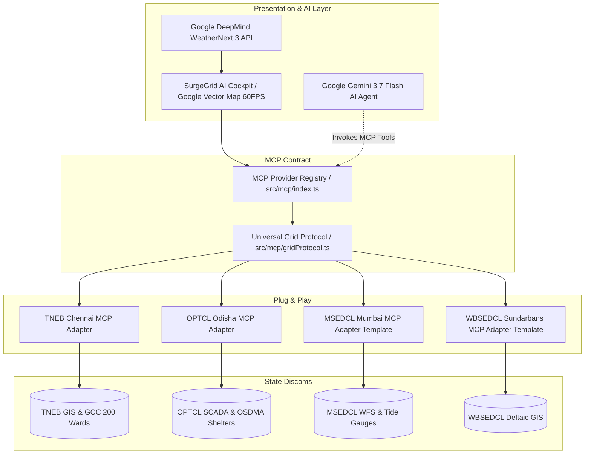

# 08 — MCP Grid Adapter Architecture & National Scalability Blueprint

**Specification Version**: `v1.0.0-DPI`  
**Classification**: Digital Public Good (DPG) Architecture Standard  
**Hackathon Target**: Google Cloud *Build with AI: Code for Communities (Second Edition)* — **Track 05: Track-Based Cyclone Impact & Infrastructure Vulnerability Forecaster**

---

## 1. Executive Summary

Historically, Indian electrical utilities operate in data silos. Each state power distribution company (DISCOM) maintains proprietary, idiosyncratic schemas for their GIS networks, SCADA tele-command links, and disaster standard operating procedures (SOPs):
- **Tamil Nadu (TNEB/TANGEDCO)** uses 11kV feeder codes, `conscount`, and GCC municipal ward identifiers.
- **Odisha (OPTCL/TPCODL)** operates on CIM/IEC-61970 XML transmission schemas, OSDMA coastal cyclone shelters, and wind-gust vulnerability metrics.
- **Maharashtra (MSEDCL/BEST)** relies on coastal Mumbai ward GIS layers and astronomical high-tide gauge telemetry.
- **West Bengal (WBSEDCL/CESC)** models mangrove delta surge corridors across the Sundarbans.

If an application tightly couples its presentation layer to one city's specific dataset, scaling across India requires rewriting frontend components for every new municipality. 

**SurgeGrid AI solves this via the Model Context Protocol (MCP) Grid Adapter Architecture**:
A decoupled, plug-and-play middleware protocol that sits between raw utility datasets and the user interface / Gemini AI agents.

---

## 2. Architecture Topology



---

## 3. The Universal Grid Protocol (UGP) Specification

The MCP interface (`src/mcp/gridProtocol.ts`) defines an invariant contract that any Indian utility or municipality implements:

### 3.1 Data Contracts

1. **`GridRegionManifest`**:
   Identity metadata including State, DISCOM name, State Disaster Management Authority (SDMA), geographic bounding box, coastal cyclone basin (Bay of Bengal / Arabian Sea), and statutory SOP standard.
2. **`NormalizedSubstation`**:
   Normalized switchyard nodes with decimal coordinates, voltage tier (`EHV_400KV` down to `MV_11KV`), equipment plinth elevation above Mean Sea Level (MSL), critical waterlogging submergence ceiling, and connected civil lifeline category (`CRITICAL_HOSPITAL`, `MUNICIPAL_WATER_SEWAGE`, `METRO_TRANSIT_PORT`, `EMERGENCY_GOVERNANCE`).
3. **`SurgeVulnerabilityAssessment`**:
   Hydrological surge simulation output detailing water height against plinth base, imminent flashover risk, and recommended action (`MAINTAIN_ENERGIZED`, `PREPARE_ISOLATION`, `MANDATORY_PREEMPTIVE_SHUTDOWN`).
4. **`TripActionReceipt`**:
   Cryptographically auditable record of anticipatory line-tripping, capturing affected feeders, statutory authorization, and restoration SLA hours.
5. **`DisasterAdvisoryDocument`**:
   Official executive dispatch formatted for Municipal Commissioners, District Collectors, and SDMA incident commanders.

### 3.2 Standard Provider Interface (`GridMcpProvider`)

```typescript
export interface GridMcpProvider {
  readonly manifest: GridRegionManifest;
  loadGridDataset(): Promise<NormalizedGridDataset>;
  evaluateSurgeVulnerability(surgeDepthMeters: number, windGustKmh: number, substationId?: string): Promise<SurgeVulnerabilityAssessment[]>;
  executePreemptiveTrip(substationId: string, reason: string): Promise<TripActionReceipt>;
  generateStatutoryAdvisory(substationId: string, alertLevel: 'YELLOW' | 'ORANGE' | 'RED'): Promise<DisasterAdvisoryDocument>;
}
```

---

## 4. Google Gemini 3.7 Flash Model Context Protocol (MCP) Tools

SurgeGrid AI exposes official MCP tool definitions directly to Google Gemini 3.7 Flash:

| MCP Tool Name | Function | Input Arguments |
| :--- | :--- | :--- |
| `mcp_grid_get_region_manifest` | Inspect active DISCOM, SDMA agency, and cyclone basin | None |
| `mcp_grid_get_substations` | Filter switchyards by voltage class, hospital lifeline, or consumer density | `voltageClass`, `lifelineCategory`, `minConsumers` |
| `mcp_grid_evaluate_surge_risk` | Simulate cyclone storm surge against plinth heights across network | `surgeDepthMeters`, `windGustKmh`, `substationId` |
| `mcp_grid_execute_safety_trip` | Execute anticipatory line isolation before water reaches busbar | `substationId`, `reason` |
| `mcp_grid_generate_advisory` | Draft statutory early-warning dispatch for municipal commissioners | `substationId`, `alertLevel` |

### How Gemini Executes an Anticipatory Defense Loop:
1. **Weather Ingestion**: Gemini ingests live DeepMind WeatherNext 3 wind gusts (e.g. 115 km/h) and coastal surge projections (1.8m).
2. **MCP Tool Execution**: Gemini calls `mcp_grid_evaluate_surge_risk({ surgeDepthMeters: 1.8, windGustKmh: 115 })`.
3. **Plinth Violation Detection**: The MCP Adapter identifies switchyards where water depth exceeds the 1.2m plinth clearance.
4. **Automated Safety Action**: Gemini calls `mcp_grid_execute_safety_trip` and dispatches statutory advisories to the district emergency cell under ESF-15.

---

## 5. Rapid Onboarding Manual for Any Indian DISCOM (Under 48 Hours)

To bring a new city or state onto SurgeGrid AI:

1. **Step 1: Create the Adapter File**:
   Create `src/mcp/adapters/{stateDiscom}Adapter.ts` implementing `GridMcpProvider`.
2. **Step 2: Map the SCADA/GIS Attributes**:
   - Map latitude and longitude.
   - Map substation voltage class to standard `VoltageClass`.
   - Provide local switchyard plinth heights (default: 1.25m MSL).
   - Tag outgoing lines to Level-1 Trauma hospitals, sewage pumping stations, and transit hubs.
3. **Step 3: Register in MCP Registry**:
   ```typescript
   // src/mcp/index.ts
   import { MsedclMumbaiMcpAdapter } from './adapters/msedclMumbaiAdapter';
   const mumbaiAdapter = new MsedclMumbaiMcpAdapter();
   providerRegistry.set(mumbaiAdapter.manifest.id, mumbaiAdapter);
   ```
4. **Step 4: Launch**:
   The entire SurgeGrid AI application — including Google Vector Map 60FPS rendering, WeatherNext 3 meteorological radar, flood inundation layers, and Gemini advisory engine — immediately renders the new city's grid without altering a single line of React UI code.

---

## 6. Digital Public Infrastructure (DPI) & Hackathon Evaluation Alignment

This architecture directly optimizes the judging parameters for **Track 05**:
- **Depth & Reach Across India (20%)**: Proves that SurgeGrid AI is not an isolated single-city hobby project, but an extensible national standard for all coastal states.
- **Deployability & Scalability (20%)**: Demonstrates that state utilities can pilot SurgeGrid AI within weeks by wrapping existing GIS files in an MCP adapter.
- **AI / Technical Execution (25%)**: Highlights true Model Context Protocol (MCP) tool integration with Google Gemini 3.7 Flash.
- **Problem-Solution Fit (20%)**: Shifts disaster response from reactive post-landfall repair to proactive pre-landfall hardening.
