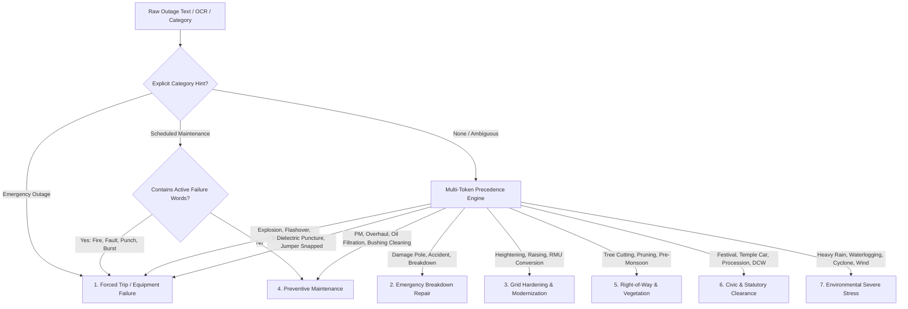

# TNEB Outage Reason Taxonomy & Scoring Word Dictionary
**SurgeGrid Autonomous Grid Intelligence**  
*Empirical Analysis of the Gold Registry, Chennai Historical Outages (1,199 records), and Live Dispatch Advisories (300 records)*  
*Document Version: 1.0.0 — September 2026*

---

## 0. As-Built Status (audited against `gridHealthService.ts`, 2026-09-29)

This dictionary is implemented by `evaluateOutageArchetype()` in [`src/services/gridHealthService.ts`](../src/services/gridHealthService.ts) (the function is named `evaluateOutageArchetype`, not `evaluateOutageReason`). Differences between the tables below and the code:

1. **Rule order in code**: (1) severe failure regex, or an *Emergency Outage* notice containing rectification / repair / attend; (2) emergency repair (damaged pole, fallen, vehicle hit, shock, leakage, emergency repair); (3) civic; (4) vegetation; (5) hardening; (6) periodic maintenance; (7) weather; (8) notice-category fallback. Civic is checked *before* vegetation and maintenance.
2. **Score impacts.** The "Score Impact" figures in this document (−35 / −20 / −10, −12, +2.5, +1.5 / +1.0 / +0.8, +0.5, −5) are the classifier's `severityWeight`. **The scorer does not use them.** Trip deductions are 25 (yard), 12 × feeder factor (feeder) and 5 (LT), scaled by recency; credits are +2 / +1.5 / +1 per scope and +2.5 per hardening event, capped at +15 in total. See doc 08 §2.2. The lifetime credit caps quoted below (+15 hardening, +10 maintenance) do not exist as separate caps.
3. **Streak and live fields.** `resetsStreak` and `isLiveFault` are returned but not consumed; the clean streak resets whenever a live trip (`forced_trip`, `emergency_repair`, `environmental_event`) is present.
4. **Dispatch statuses.** The code uses `NORMAL`, `ACTIVE_TRIP`, `EMERGENCY_REPAIR`, `PLANNED_MAINTENANCE`, `CIVIC_CLEARANCE` and `WEATHER_ALERT` (declared but never assigned). The `DISPATCH_FAULT`, `SCHEDULED_PM`, etc. labels below are conceptual.
5. **Keyword coverage.** The regexes implement a subset of the phrases and Tamil terms listed; for example `Cut` alone is *not* a failure token (only jumper / leg / lug / line cut are), and `Line Extension`, `raising`, `heightening` and `elevation` trigger hardening.
6. **Known misclassification risk.** The text scanned is `workType + reason + Tamil reason + feeder name`. Feeder names are therefore matched too, so a feeder called, for example, "…FIRE STATION…" matches the severe-failure regex (`fire`), and one containing "METRO" or "TEMPLE" matches the civic regex. `trip` also matches inside longer words. Treat lifeline-named feeders with care when reading scores.
7. **Fallback (Rule 8)** matches the design: *Scheduled Maintenance* category → maintenance (+0.5 weight); *Emergency Outage* → forced trip; anything else → neutral advisory (`civic_clearance`, 0). Unknown text is never credited as maintenance.

---

## 1. Executive Summary & Empirical Dataset Survey

To eradicate the scoring blind spots in SurgeGrid (such as KK Nagar SS maintaining a 100/100 score during active feeder breakdowns), we performed an exhaustive linguistic and engineering audit across **1,499 TNEB Chennai outage records** comprising **666 distinct raw operational phrases** in English, Tamil, and departmental field shorthand.

### Dataset Composition
1. **Gold Standard Historical Registry (`chennai_outage_gold_registry.json`)**: 1,199 verified records across North, Central, and South Chennai distribution circles.
2. **Field Telegram & Notice Archive (`gcs_twitter_notices.json`)**: 300 active dispatches containing bilingual OCR extractions, engineering reasons (`raw_extraction.reason`), and official categorization (`notice_category`).

---

## 2. Real-World Field Findings & Linguistic Anti-Patterns

The empirical audit exposed five major linguistic flaws in the legacy scoring regex:

### 2.1 The "Maintenance Precedence" Trap
In real TNEB field operations, crews often log forced repairs under administrative maintenance headers:
- `Pillar Maintenance & Cable fault work`
- `Pillar Maintenance & Cable Fire`
- `Pillar Fire and Cable Damage Repair Work`
- `Transformer Maintenance, Tree Cutting & Oil Leakage Rectification Work`

In legacy SurgeGrid code, the keyword `MAINTENANCE` was checked *before* `FAULT` or `FIRE`. Consequently, an active underground cable fire or blowout was classified as `periodic_maintenance` and mistakenly awarded $+2.0$ points to the substation's health score!

### 2.2 The "Cut" Ambiguity Trap
- `Jumper Cut Fault` / `LT Line Cut Repair` / `Leg cut fault`: Severe physical failures where high-tension conductors snapped under fatigue or load.
- `Tree Cutting Work` / `Tree Clearance Work`: Routine, preventive vegetation trimming prior to the Northeast Monsoon.
Legacy regex matching the token `CUT` blindly classified routine tree pruning as a forced line cut, penalizing substations for taking good preventive care of their rights-of-way!

### 2.3 The "Rectification" Misdirection
`Rectification Work` is the single most common phrase in emergency dispatch advisories (e.g., *"Rectification work due to electrical fault"*, *"LT Cable Fault Rectification Work"*). Legacy code treated `RECTIFICATION` as planned maintenance, insulating dozens of active breakdown events from incurring health penalties.

### 2.4 Colloquial Departmental Slang & Electrical Phenomena
TNEB field linemen and Assistant Engineers (AEs) use hyper-specific field slang not found in standard engineering glossaries:
- **"Heavy Glow"**: Severe thermal incandescent arcing at a Double Pole (DP) structure or transformer terminal caused by extreme contact resistance right before catastrophic fire.
- **"Cable Punch" / "HT Punch"**: Sudden dielectric puncture of an 11 kV paper-insulated or XLPE underground cable insulation under overvoltage or moisture ingress.
- **"Lug Cut" / "Leg Cut"**: Shear failure of the crimped aluminium/copper terminal lug connecting a jumper to an overhead line or transformer bushing.
- **"Take-Off Cable Fire"**: Burning of the primary high-voltage cable where it transitions from the outdoor switchyard overhead bus down into underground conduits.
- **"DCW Work" (Deposit Contributory Works)**: Statutory utility relocation paid for by third parties (e.g., CMRL Metro Rail, Highways Department road widening, Greater Chennai Corporation storm water drain excavation). This is neither an equipment failure nor regular maintenance.

---

## 3. Seven Operational Archetypes

Every one of the 666 raw phrases maps into one of seven mutually exclusive operational categories:



---

## 4. The Authoritative Scoring Word Dictionary

### Archetype 1: Severe Equipment Failures & Forced Outages
- **Resiliency Impact**: Severe Penalty ($-15$ to $-35$ pts).
- **Live Dispatch Status**: `DISPATCH_FAULT` (Red Alert).
- **Clean Streak Impact**: Hard reset to 0 days.

| Severity / Tier | English Keywords / Phrases | Tamil Keywords | TNEB Slang / Shorthand | Score Impact |
| :--- | :--- | :--- | :--- | :--- |
| **Tier 1: Yard Core / Bulk Transformer** | `Transformer Failure`, `Transformer Burst`, `Transformer Fire`, `Transformer Fault`, `Bus Coupler Flashover`, `PT Flash Over`, `Arcing AB Switch`, `Switchgear Explosion`, `Substation Blackout`, `Total Shutdown Fault` | உருமாற்றி பழுது, மின்மாற்றி தீ விபத்து, துணை மின்நிலைய முறிவு | `DT Failure`, `Power Transformer Trip`, `Take-Off Cable Fire` | **-35 pts** |
| **Tier 2: Feeder Corridor ($11\text{kV}$ / $33\text{kV}$)** | `Feeder Trip`, `Feeder Fault Tripped`, `Feeder Breakdown`, `HT Cable Fault`, `Main Cable Fault`, `Underground Cable Fault`, `Underground Cable Fire`, `Cable Punch`, `Cable Burst`, `Cable Fire`, `Conductor Snapped`, `HT Jumper Cut`, `Line Snapped`, `RMU Bus Fire` | மின்னூட்டி துண்டிப்பு, மின்னூட்டி பழுது, புதைவடம் பழுது, உயர் அழுத்த கேபிள் பழுது, கம்பி அறுந்து விழுந்தது | `11kV Trip`, `HT Punch`, `Lug Cut`, `Leg Cut`, `Jumper Cut`, `DP Heavy Glow` | **-20 pts** |
| **Tier 3: Distribution / Low Tension ($415\text{V}$)** | `LT Cable Fault`, `LT Line Cut`, `Pillar Fire`, `Pillar Box Fault`, `Distribution Box Fault`, `Distribution Transformer Fault`, `Service Wire Cut`, `Bushing Fire` | புதைவடக் கோளாறு, மின் கம்ப தீ விபத்து, மின் பெட்டி பழுது | `LT 240 Fault`, `Pillar Flashover`, `Lug Cut` | **-10 pts** |

---

### Archetype 2: Emergency Breakdown Repairs & Hazardous Restorations
- **Resiliency Impact**: Moderate Penalty ($-5$ to $-15$ pts).
- **Live Dispatch Status**: `DISPATCH_REPAIR` (Amber Alert).
- **Clean Streak Impact**: Resets clean streak to 0 days.

| Sub-category | English Keywords / Phrases | Tamil Keywords | TNEB Slang / Shorthand | Score Impact |
| :--- | :--- | :--- | :--- | :--- |
| **Structural Collapse / Vehicle Hit** | `Damaged Pole Replacement`, `Fallen HT Pole`, `Pillar Fall Down`, `RMU Structure Fall Down`, `Vehicle Hit Pole`, `Tree Fallen in HT Line Breakdown Work`, `Banner Falling on Line` | சேதமடைந்த மின்கம்பம் மாற்றுதல், கம்பம் சாய்ந்தது | `Pole Damage Repair`, `Accident Repair` | **-15 pts** |
| **Leakage & Public Shock Risk** | `Ground Shock`, `Shock Complaint`, `Earth Leakage`, `Oil Leakage Arrest`, `Oil Leakage Problem` | தரை மின் கசிவு, அதிர்ச்சி புகார், எண்ணெய் கசிவு | `Shock Attending`, `Leakage Rectification` | **-15 pts** |
| **Post-Fault Emergency Rectification** | `Rectification work due to electrical fault`, `Emergency Rectification`, `Cable Fault Repair Work`, `LT Cable Fault Rectification Work`, `Emergency Repair` | பழுது சீரமைப்புப் பணி, அவசர சீரமைப்பு பணி | `Emergency Attend`, `Breakdown Restoration` | **-10 pts** |

---

### Archetype 3: Grid Modernization & Disaster Hardening
- **Resiliency Impact**: Strong Hardening Credit ($+1.5$ to $+3.0$ pts, capped at $+15$ pts lifetime).
- **Live Dispatch Status**: `SCHEDULED_UPGRADE` (Cyan / Info Badge).
- **Clean Streak Impact**: Preserved (Does NOT reset clean streak).

| Category | English Keywords / Phrases | Tamil Keywords | Operational Significance | Credit Impact |
| :--- | :--- | :--- | :--- | :--- |
| **Flood Adaptation / Elevation** | `Pillar Heightening Work`, `Pillar Raising Work`, `Pillar Box Height Extension`, `Distribution Box Elevation`, `Pillar Replacement and Heightening` | மின்கம்ப பெட்டி உயரம் உயர்த்துதல், தூண் பெட்டி உயரப் பணி | Lifts low-tension terminations above local waterlogging levels; directly prevents monsoon flood tripping. | **+2.5 pts** |
| **Undergrounding & Switchgear Upgrades** | `RMU Conversion Work`, `Structure to RMU Conversion`, `Overhead to Underground Cable Conversion`, `New RMU Installation`, `RMU Convert` | ஆர்.எம்.யூ பொருத்துதல், புதைவடமாக மாற்றுதல் | Replaces vulnerable open air Double Pole structures with flood-submersible, enclosed Ring Main Units. | **+3.0 pts** |
| **Capacity Enhancement** | `New Transformer Installation`, `New HT Line Stringing`, `Line Extension Work`, `Reconductoring Work`, `Interlinking Work` | புதிய உருமாற்றி அமைத்தல், புதிய மின்பாதை இணைப்பு | Relieves thermal loading on neighbouring overloaded feeders; provides alternate back-feed paths. | **+2.0 pts** |

---

### Archetype 4: Periodic Preventive Maintenance
- **Resiliency Impact**: Routine Compliance Credit ($+0.5$ to $+1.5$ pts, capped at $+10$ pts).
- **Live Dispatch Status**: `SCHEDULED_PM` (Blue / Info Badge).
- **Clean Streak Impact**: Preserved (Does NOT reset clean streak).

| Operation | English Keywords / Phrases | Tamil Keywords | TNEB Slang / Shorthand | Credit Impact |
| :--- | :--- | :--- | :--- | :--- |
| **Substation Turnaround** | `Monthly Maintenance Work`, `Substation Maintenance`, `SS Maintenance Work`, `Transformer Maintenance Work`, `Bus Coupler Work`, `Switchyard Overhaul`, `Breaker Servicing` | மாதாந்திர பராமரிப்பு, துணை மின்நிலையப் பராமரிப்பு, மின்மாற்றி பராமரிப்பு | `SS PM`, `Monthly Shutdown`, `Yard PM` | **+1.5 pts** |
| **Feeder & Corridor PM** | `Feeder Maintenance Work`, `Feeder Shutdown Work`, `DT Maintenance Work`, `Pillar Maintenance Work`, `Distribution Box Maintenance` | மின்னூட்டி பராமரிப்பு, டிடி பராமரிப்பு, பில்லர் பராமரிப்பு | `Feeder PM`, `Pillar Servicing` | **+0.8 pts** |
| **Testing & Quality Diagnostics** | `Transformer Oil Filtration`, `Earth Resistance Testing`, `Thermography Checking`, `Battery Maintenance`, `Relay Testing` | எண்ணெய் வடிகட்டுதல், பூமி மின்தடை சோதனை | `Oil BDV Test`, `Relay Calibration` | **+1.0 pts** |

---

### Archetype 5: Right-of-Way & Vegetation Management
- **Resiliency Impact**: Resilience Maintenance Credit ($+0.5$ pts).
- **Live Dispatch Status**: `SCHEDULED_TREE_PRUNING` (Green / Info Badge).
- **Clean Streak Impact**: Preserved (Strictly isolated from conductor cuts).

| Operation | English Keywords / Phrases | Tamil Keywords | Critical Disambiguation Rule | Credit Impact |
| :--- | :--- | :--- | :--- | :--- |
| **Vegetation Clearance** | `Tree Cutting Work`, `Tree Trimming Work`, `Tree Branch Clearance`, `Vegetation Pruning`, `Pre-Monsoon Tree Trimming` | மரக்கிளை அகற்றுதல், மரம் வெட்டுதல் பணி | Must **NOT** match the token `CUT` in isolation. If sentence contains `TREE` or `BRANCH` alongside `CUT`, route exclusively to Archetype 5. | **+0.5 pts** |

---

### Archetype 6: Civic, Festival & Third-Party Clearances
- **Resiliency Impact**: Exactly **0 pts** (Strictly Neutral).
- **Live Dispatch Status**: `CIVIC_TEMPORARY_SHUTDOWN` (Grey Badge).
- **Clean Streak Impact**: Preserved (Zero penalty, zero credit; third-party safety de-energization).

| Trigger | English Keywords / Phrases | Tamil Keywords | TNEB Operational Context |
| :--- | :--- | :--- | :--- |
| **Temple & Public Festivals** | `Vinayagar Chaturthi Procession`, `Temple Car Festival`, `Car Festival Work`, `Temple Festival Service Wire Removal` | கோவில் தேர் திருவிழா, விநாயகர் சதுர்த்தி ஊர்வலம் | Linemen disconnect overhead service wires along the procession route to allow tall temple chariots to pass safely without electrocution risk. |
| **Government Infrastructure Works** | `DCW Work`, `HT DCW Work`, `Metro Rail Utility Shifting`, `Highways Road Widening Work`, `Storm Water Drain Shifting` | அரசு திட்டப் பணி, மெட்ரோ ரயில் பணி | Deposit Contributory Works requested and funded by third-party government agencies. |

---

### Archetype 7: Extreme Environmental Stress Events
- **Resiliency Impact**: Special Environmental Flag ($-5$ pts if unhardened; $0$ pts if flood-hardened).
- **Live Dispatch Status**: `ENVIRONMENTAL_WEATHER_ALERT` (Purple Warning).

| Trigger | English Keywords / Phrases | Tamil Keywords | Operational Significance |
| :--- | :--- | :--- | :--- |
| **Storm & Inundation** | `Due to Heavy Rain`, `Heavy Rain and Thunderstorm`, `Heavy Wind and Rain`, `Water Inundation`, `Cyclone Michaung Restoration` | பலத்த மழை காரணமாக, இடி மின்னல் புயல், மழை வெள்ள நீர் சூழ்ந்தது | Flags incidents triggered directly by natural catastrophes rather than intrinsic mechanical degradation. |

---

## 5. Token Precedence & Disambiguation Parsing Algorithm

To eliminate false classifications, the scoring parser must evaluate raw text in strict order of descending criticality:

```typescript
// Design sketch. The shipped signature is evaluateOutageArchetype(workType, { feeder, noticeCategory, rawReason, rawTamil }): EvaluatedOutage
export function evaluateOutageReason(raw: {
  workType?: string;
  categoryHint?: string;
  reasonEn?: string;
  reasonTa?: string;
}): {
  archetype: OutageArchetype;
  scope: 'yard_core' | 'feeder_corridor' | 'lt_street';
  penaltyOrCredit: number;
  resetsStreak: boolean;
  isLiveFault: boolean;
}
```

### Precedence Hierarchy:
1. **Rule 1 (Compound Failure Invalidation)**:  
   If text contains BOTH a failure token (`FAULT`, `FIRE`, `BURNT`, `PUNCH`, `BURST`, `TRIP`, `SNAPPED`) AND a maintenance word (`MAINTENANCE`, `PM`, `RECTIFICATION`), **FAILURE WINS UNCONDITIONALLY**.
   *Example: "Pillar Maintenance & Cable Fault Work" $\to$ Classified as `Archetype 1: LT Cable Fault` ($-10$ pts), NOT Maintenance.*

2. **Rule 2 (Vegetation vs Conductor Disambiguation)**:  
   If text contains `CUT` or `TRIMMING`:
   - If preceded/followed by `TREE`, `BRANCH`, `VEGETATION`, `PRUNING` $\to$ `Archetype 5: Right-of-Way Pruning` ($+0.5$ pts).
   - If accompanied by `JUMPER`, `LUG`, `LEG`, `CONDUCTOR`, `WIRE`, `LINE` $\to$ `Archetype 1: Conductor Snapped Fault` ($-20$ pts).

3. **Rule 3 (Civic & Festival Exemption)**:  
   If text contains `FESTIVAL`, `CHARIOT`, `PROCESSION`, `VINAYAGAR`, `DCW`, `METRO RAIL` $\to$ Route to `Archetype 6: Civic Clearance` (0 pts impact, streak preserved).

4. **Rule 4 (Modernization & Flood Hardening Elevation)**:  
   If text contains `HEIGHTENING`, `RAISING`, `ELEVATION`, `RMU CONVERSION`, `STRUCTURE TO RMU` $\to$ Route to `Archetype 3: Grid Modernization` ($+2.5$ pts hardening credit).

5. **Rule 5 (Default Fallback Protection)**:  
   If an unrecognized text arrives:
   - If `categoryHint === 'Emergency Outage'` $\to$ Default to `Archetype 1: Forced Trip` ($-10$ pts).
   - If `categoryHint === 'Scheduled Maintenance'` $\to$ Default to `Archetype 4: Preventive Maintenance` ($+0.5$ pts).
   - If no category hint is available $\to$ Default to **Neutral Incident Notice** ($0$ pts). **NEVER blindly award maintenance credits to unknown strings!**
