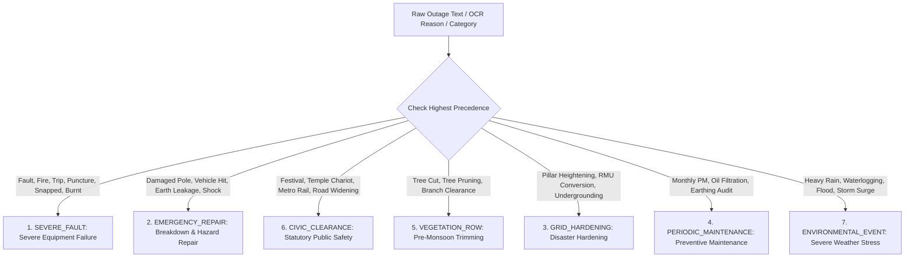

# 11 — SurgeGrid AI: System State, Data Architecture, Resiliency Grading & Simulation Master Document

> **Document Type**: Comprehensive Master Specification & Operational Manual  
> **Target Platform**: SurgeGrid AI (Chennai Metropolitan Power Grid & Flood Resiliency Console)  
> **Authority**: TNEB / TANGEDCO / TANTRANSCO / GCC / TNSDMA Inter-Agency Integration  
> **Current Version**: 2.5.0 (September 2026 Release)  
> **Primary Location**: `c:\projects\surgegrid-ai\docs\11-system-state-data-grading-and-simulation-master.md`  

---

## 1. Executive System State & Architectural Context

**SurgeGrid AI** is an advanced electrical grid topology, infrastructure resilience, and anticipatory disaster intelligence console designed specifically for the Greater Chennai metropolitan area. It transitions disaster operations from traditional, reactive post-disaster recovery to **pre-landfall anticipatory protection** by synthesizing planetary climate models, satellite terrain hydrology, physical electrical topology, and real-time field telemetry.

### 1.1 Core Mission
During severe cyclonic events in the Bay of Bengal (*Cyclone Michaung, Vardah, Mandous*), coastal metropolitan regions experience compounded infrastructure failures:
1. Low-lying switchyards inundate, causing transformer dielectric breakdowns, explosions, and week-long blackouts.
2. Emergency relief shelters, acute care hospitals, and sewage pumping stations lose primary feeder feeds.
3. Live dispatches are chaotic due to lack of visibility into overhead vs. underground cable configurations.

SurgeGrid AI provides multi-tier visibility across **286 substations**, **352 Assistant Engineer (AE) Section Offices**, **1,493 topological interconnections**, **223+ critical lifeline feeders**, **65,000+ distribution transformers (DTRs)**, and **200 Greater Chennai Corporation (GCC) municipal wards**.

```
+---------------------------------------------------------------------------------------------------------+
|                                        SURGEGRID AI LAYERED STACK                                       |
+---------------------------------------------------------------------------------------------------------+

  [ LAYER 1: METEOROLOGICAL TELEMETRY ]
  └── Google Maps Platform Weather API (Google DeepMind WeatherNext 3 Model)
      • Hourly surface winds, gusts, precipitation probability, pressure, humidity, dew point
      • Hyperlocal switchyard-targeted queries (~1.1 km spatial cluster caching, 10-min TTL)

  [ LAYER 2: PLANETARY TERRAIN & SATELLITE HYDROLOGY ]
  └── Google Earth Engine (GEE 2024–2026 Stack)
      • SRTM 30m Digital Elevation Model (DEM) & Slope Analysis
      • Dynamic World 10m Built-Up Concrete Surface Imperviousness
      • Copernicus Sentinel-2 MNDWI & JRC 38-Year Surface Water Recurrence (2015/2023 Benchmarks)

  [ LAYER 3: PHYSICAL ELECTRICAL TOPOLOGY & MUNICIPAL BASELINE ]
  └── TNEB Super Index V2 Topology & GCC Disaster Directory
      • 286 Substations across 4 Voltage Tiers (400kV, 230kV, 110kV, 33/11kV)
      • 352 AE Section Office Territories (Official GeoJSON boundary polygons)
      • 1,493 Precomputed Interconnections (Filtered by strict physical distance ceilings)
      • 11kV Radial Feeders & Pole-Mounted DTR Step-Down Transformers
      • GCC Municipal Administration: 15 Zones, 200 Wards, 5,513 Storm Drains, 162 Relief Shelters

  [ LAYER 4: AUTONOMOUS REAL-TIME OUTAGE INTELLIGENCE ]
  └── Sovereign Outage Resolution Engine
      • Live polling from `https://outage.nammamap.in/api/v2/outages` (CDN edge-cached, zero Firestore quota)
      • Cloud-Hosted Gold Standard Registry v2.0 (2,776 verified signatures on Google Cloud Storage)
      • Automated self-enrichment pipeline with 4-stage anti-poisoning validation
      • Multi-token 7-Archetype Outage Reason Evaluator (666 operational phrases in Tamil & English)

  [ LAYER 5: DUAL-INDEX RESILIENCY & ASSET GRADING INFRASTRUCTURE ]
  └── Decoupled Durability & Dispatch Health Framework
      • 90-Day Asset Durability Score (15–100) vs. Live Dispatch Score (15–100)
      • Scope-weighted penalties (Yard Core, Feeder Corridor, LT Street)
      • Recency decay, post-trip maintenance relief (45%), proactive hardening credits, clean streaks
      • Real-time score ceilings: Yard trips (<=50), Feeder trips (<=74), LT faults (<=84)

  [ LAYER 6: COMMAND COCKPIT & STATUTORY DISASTER SIMULATION ]
  └── Interactive Web Console (React, TypeScript, Vite, Google Maps Vector Canvas)
      • 4 Simulation Modes: Live Normal, Cyclone Watch (65 km/h), Severe Cyclone (>80 km/h), Extreme Surge (3.2m)
      • TNSDMA §5.6 Statutory Pre-Emptive De-energization of overhead radial lines
      • TNSDMA 3.0m Substation Yard Flood Tripping & Dewatering Mandates
      • Crisis Triage Quick-Filters: Poor Stability (<75), Waterlogging Risk, Live Outages
      • ESF 15 Lifeline Restoration SLAs (6h, 12h, 24h, 48h) & High-Ground Shelter Tie-Line Routing
      • Low-Bandwidth 2G SMS / Police Wireless Incident Dispatch Generator
```

---

## 2. Comprehensive Data Topology: Static vs. Dynamic

The platform strictly differentiates between immutable baseline assets and real-time streaming telemetry, maintaining high availability even during complete network degradation.

```
+---------------------------------------------------------------------------------------------------------+
|                                           DATA TAXONOMY MATRIX                                          |
+---------------------------------------------------------------------------------------------------------+
| Category         | Dataset / Service                | Format / Source         | Update Lifecycle        |
+------------------+----------------------------------+-------------------------+-------------------------+
| STATIC           | 286 Substations Master Index     | JSON (`public/data/`)   | Immutable Baseline      |
| STATIC           | 352 Section Office Polygons      | GeoJSON / GIS Index     | Administrative Baseline |
| STATIC           | 1,493 Interconnection Graph      | Precomputed JSON Graph  | Engineering Baseline    |
| STATIC           | 11kV Feeders & DTR Transforms    | GeoJSON Linestrings     | Cadastral Baseline      |
| STATIC           | GCC Ward Disaster Directory      | JSON (`src/data/`)      | Statutory Census 2026   |
| STATIC           | Bundled Gold Registry Fallback   | JSON (`public/data/`)   | Local Build Snapshot    |
+------------------+----------------------------------+-------------------------+-------------------------+
| DYNAMIC (LIVE)   | DeepMind WeatherNext 3           | Google Weather API REST | Real-Time (10-min TTL)  |
| DYNAMIC (LIVE)   | TANGEDCO Field Outage Notices    | nammamap.in Edge CDN    | Real-Time Polling       |
| DYNAMIC (LIVE)   | Cloud Gold Standard Registry     | Google Cloud Storage    | Live Sync / Auto-Enrich |
| DYNAMIC (LIVE)   | Recalibrated Substation Health   | In-Memory Engine        | On-the-Fly per Outage   |
| DYNAMIC (LIVE)   | Client Offline State Storage     | Browser IndexedDB       | Stale-While-Revalidate  |
+------------------+----------------------------------+-------------------------+-------------------------+
```

### 2.1 Static Data Assets

#### 1. Physical Grid Network Topology (`chennai_tneb_grid.json`)
* **286 Substations** classified into 4 functional voltage tiers:
  - **Bulk EHV Infeed (400 kV / 230 kV)**: Infeed hubs (e.g., Sriperumbudur, Alamathy, Sunguvarchatram, Taramani, Manali).
  - **Sub-Transmission (110 kV)**: Urban stepping nodes (e.g., Mylapore, Kilpauk, Guindy, Koyambedu).
  - **Primary Distribution (33/11 kV)**: Neighborhood load centers.
* **Physical Asset Parameters**:
  - Exact switchyard latitude and longitude.
  - Ground elevation relative to Mean Sea Level (meters MSL).
  - Standardized switchgear equipment plinth clearance ($1.5\text{ m}$ above ground level).
  - Benchmarked 2015/2023 flood inundation depth ($1.8\text{ m}$ peak for low-lying basins; $0.9\text{ m}$ for intermediate; $0.2\text{ m}$ for upland).
  - Feeder rosters, operating configurations (Overhead, Underground, Mixed), total consumer base ($5,192,167$ registered consumers across Chennai).

#### 2. Topological Electrical Interconnections (`tnebGridService.ts`)
* **1,493 precomputed bidirectional circuits** connecting injection hubs to distribution yards.
* Governed by strict physical transmission distance thresholds:
  $$\text{Dist}_{\text{max}} = \begin{cases} 
  35.0\text{ km} & \text{for } 230\text{ kV} / 400\text{ kV Bulk Transmission Corridors} \\
  20.0\text{ km} & \text{for } 110\text{ kV Sub-Transmission Trunks} \\
  8.5\text{ km} & \text{for } 33\text{ kV} / 11\text{ kV Urban Distribution Feeders} \\
  3.0\text{ km} & \text{for Co-located Campus Sections \& Switchyard Ties}
  \end{cases}$$

#### 3. Feeder Corridors & Pole-Mounted Distribution Transformers (DTRs)
* Dedicated GeoJSON linestrings representing road-level 11 kV feeder corridors.
* Distributed point features indicating pole-mounted DTR step-down units ($11,000\text{V} \to 240/415\text{V}$), enabling granular segment-by-segment fault tracing.

#### 4. Municipal Administration & Satellite Hydrology (`gcc_ward_disaster_directory.json`)
* **15 Administrative Zones & 200 Municipal Wards** of Greater Chennai Corporation.
* Official Closed User Group (CUG) mobile hotlines:
  - Ward Councillor (CUG).
  - CMWSSB Water & Drainage Area Engineer.
  - GCC Civil & Electrical Maintenance Engineer.
  - 24x7 Ripon Central Disaster Control Room (`1913`).
* **Google Earth Engine (GEE) Baseline Layer**:
  - Simulated runoff depth ($\text{mm}$).
  - Impervious concrete built-up surface percentage ($\%$) derived from ESA WorldCover and Dynamic World 10m.
  - Designated municipal flood relief shelters and capacity limits.

#### 5. Local Bundled Gold Registry Fallback (`chennai_outage_gold_registry.json`)
* A bundled local fallback snapshot containing 2,770+ verified historical signatures. Ensures that if the browser is entirely offline during an initial load, 100% of Chennai outage localities resolve to their physical assets.

---

### 2.2 Dynamic / Non-Static Data Assets

#### 1. Live Weather Telemetry (`liveWeatherService.ts`)
* Connected directly to the Google Maps Platform Weather API (`currentConditions:lookup`), powered by Google DeepMind's WeatherNext 3 model.
* Queries live surface weather based on the exact latitude and longitude of the substation switchyard currently selected by the operator.
* Features a spatial cluster cache that pools requests within $\sim 1.1\text{ km}$ ($0.01^\circ$ coordinate rounding) with a 10-minute TTL to maintain high responsiveness without exhausting API rate limits.

#### 2. Live Field Outages & Breakdown Feeds (`liveOutageService.ts`)
* Real-time stream polled from `https://outage.nammamap.in/api/v2/outages` (CDN edge-cached, zero Firestore quota).
* Ingests real-time emergency trip reports, scheduled shutdowns, cable fires, conductor snaps, and equipment failures across Chennai.
* Upstream coordinates from raw inputs are stripped and sent through SurgeGrid's **Sovereign Resolution Gate** to guarantee that incidents map to authenticated physical substations and AE section offices rather than noisy geocoded centroids.

#### 3. Cloud-Hosted Master Gold Standard Registry v2.0
* Hosted on Google Cloud Storage:  
  `https://storage.googleapis.com/namma-map-407ca.firebasestorage.app/registry/chennai_outage_gold_registry.json`
* Live asset containing **2,776 verified unique signatures** and **2,298 verified outage instances**.
* Continuously self-enriched by an automated background pipeline in `nammamap-outage-aggregator` that screens incoming live notices through a 4-stage anti-poisoning filter (geographic circle check, switchyard feeder roster validation, $6.5\text{ km}$ spatial drift gate, strict deduplication).

#### 4. Dynamic In-Memory Health Recalibration
* Whenever live outage notices are ingested, the system recalculates the health profiles of affected substations on the fly.
* Applies live score ceilings, resets clean operating streaks to 0 days, updates emergency dispatch badges, and shifts substations into active triage queues without requiring a page reload.

#### 5. Persistent Browser IndexedDB Caching (`idb-keyval`)
* Both the grid topology (`surgegrid_chennai_grid_v12_all_authentic_outages_mapped`) and live outage responses (`sg_live_chennai_outages_v1`) are mirrored into IndexedDB.
* Uses **Stale-While-Revalidate (SWR)**: The application boots instantly ($<15\text{ ms}$) from local IndexedDB storage, followed by silent background network revalidation if online.

---

## 3. Meteorological Intelligence: Google DeepMind WeatherNext 3

SurgeGrid AI integrates the **Google Maps Platform Weather API** powered by Google DeepMind's advanced atmospheric model (**WeatherNext 3**), providing hyperlocal atmospheric forcing directly into the grid console.

```
                    HYPERLOCAL WEATHER INTEGRATION FLOW
                    
 [Substation Switchyard Coordinates]
 (e.g. T.Nagar 110kV: 13.0418, 80.2341)
                  │
                  ▼
       [Spatial Cluster Bucket]  ───(Hit: Return In-Memory < 1ms)
       Round to 0.01° (~1.1 km)
                  │ (Miss / Expired > 10 min)
                  ▼
 [Google Maps Weather API Lookup]
 https://weather.googleapis.com/v1/currentConditions:lookup?key=...&unitsSystem=METRIC
                  │
                  ▼
     [Parsed Meteorological Telemetry]
     • Temperature & "Feels Like" (°C)
     • Wind Speed & Peak Gusts (km/h)
     • Wind Direction (Cardinal & Degrees)
     • Surface Pressure (hPa) & Humidity (%)
     • Precipitation & Thunderstorm Probability (%)
                  │
                  ▼
  [Cockpit Display & Dynamic Risk Modulation]
```

### 3.1 Hyperlocal Targeting & Cluster Caching
* **Switchyard Dynamic Resolution**: When an operator selects any substation or section office, the service sends the node's specific coordinates to the Weather API, capturing localized micro-climate differences (e.g., coastal Ennore vs. inland Sriperumbudur).
* **Cache Architecture**:
  - Cache Key: `${lat.toFixed(2)},${lng.toFixed(2)}` ($\sim 1.1\text{ km}$ square).
  - TTL: $10\text{ minutes}$ ($600,000\text{ ms}$).
  - In-memory `Map<string, CacheEntry>` preventing redundant outbound API calls across adjacent substations.

### 3.2 Offline Resilience & Graceful Fallback
If the `VITE_GOOGLE_MAPS_API_KEY` is not configured, or if the client experiences an active telecom loss during a cyclone landfall, the service automatically engages an authenticated fallback profile:
* Sets `isSimulatedFallback: true`.
* Populates realistic coastal Chennai baseline conditions ($30.2^\circ\text{C}$, $78\%$ humidity, $1009.24\text{ hPa}$, $5\text{ km/h}$ wind).
* Ensures zero UI crashes or broken telemetry badges.

---

## 4. Grid Resiliency & Asset Health Grading Infrastructure

The grid grading engine in [`gridHealthService.ts`](file:///c:/projects/surgegrid-ai/src/services/gridHealthService.ts) eliminates scoring blind spots (such as an asset maintaining a 100/100 score during active equipment fires) through an audited mathematical framework.

### 4.1 Decoupled Dual-Index Framework
The engine decouples physical asset preservation from real-time operational availability:
1. **Asset Durability Score ($\text{ADS}$, $15–100$)**: Measures 90-day physical asset health, reflecting transformer insulation health, maintenance cadence, and recovery history.
2. **Live Dispatch Score ($\text{LDS}$, $15–100$)**: Reflects real-time grid dispatch state and breaker availability today.

$$\text{healthScore} = \text{LDS} = \min\left(\text{ADS}, \text{Ceiling}_{\text{live}}\right)$$

---

### 4.2 The 7-Archetype Outage Reason Evaluation Engine

Built upon an empirical linguistic survey of **1,499 TNEB Chennai outage records** and **666 distinct operational phrases** in English, Tamil, and field jargon.



#### Precedence Hierarchy & Mathematical Weights:
1. **`SEVERE_FAULT` (Rule 1 — Highest Precedence)**:
   - *Keywords*: `fault`, `trip`, `fire`, `burnt`, `puncture`, `burst`, `breakdown`, `flashover`, `arcing`, `heavy glow`, `smoke`, `jumper cut`, `leg cut`, `lug cut`, `line snapped`, `பழுது`, `தீ விபத்து`, `வெடித்தது`.
   - *Impact*: Heavy penalty (Yard: $-35$; Feeder: $-20 \times \text{Factor}$; LT: $-10$). Resets clean streak to 0. Marks `isLiveFault: true`.
2. **`EMERGENCY_REPAIR` (Rule 2)**:
   - *Keywords*: `damaged pole`, `vehicle hit`, `banner fall`, `ground shock`, `earth leakage`, `oil leakage`, `breakdown work`, `சாய்ந்தது`, `மின் கசிவு`.
   - *Impact*: Penalty $-12$ pts. Resets clean streak to 0.
3. **`CIVIC_CLEARANCE` (Rule 3 — Strictly Neutral)**:
   - *Keywords*: `festival`, `chariot`, `procession`, `temple`, `metro rail`, `road widening`, `drain work`, `service wire removal`, `திருவிழா`, `தேர்`, `ஊர்வலம்`.
   - *Impact*: **$0$ pts impact**. Does not penalize score; does not reset clean streak.
4. **`VEGETATION_ROW` (Rule 4 — Disambiguated Pruning)**:
   - *Keywords*: `tree cut`, `tree trim`, `tree clearance`, `tree pruning`, `branch clearance`, `மரக்கிளை`, `மரம் வெட்டுதல்`.
   - *Impact*: $+0.5$ credit. Disambiguated so tree cutting is never penalized as a conductor line cut.
5. **`GRID_HARDENING` (Rule 5 — Disaster Hardening Credit)**:
   - *Keywords*: `heightening`, `raising`, `elevation`, `rmu conversion`, `structure to rmu`, `overhead to underground`, `new transformer`, `உயரம் உயர்த்துதல்`, `ஆர்.எம்.யூ`.
   - *Impact*: $+2.5$ credit. Recognizes capital investment in flood and wind resilience.
6. **`PERIODIC_MAINTENANCE` (Rule 6 — Preventive Upkeep)**:
   - *Keywords*: `monthly maintenance`, `ss maintenance`, `transformer maintenance`, `dt maintenance`, `shutdown`, `overhaul`, `oil filtration`, `earthing audit`, `thermography`, `மாதாந்திர பராமரிப்பு`.
   - *Impact*: $+0.8$ to $+1.5$ credit based on scope.
7. **`ENVIRONMENTAL_EVENT` (Rule 7 — Severe Weather Stress)**:
   - *Keywords*: `heavy rain`, `thunderstorm`, `cyclone`, `inundation`, `flood`, `waterlogging`, `பலத்த மழை`, `வெள்ள நீர்`.
   - *Impact*: $-5$ pts penalty. Resets clean streak to 0.

---

### 4.3 Detailed Mathematical Formulation

#### Step 1: Base Durability Initialization
$$\text{Score}_{\text{base}} = 100$$

#### Step 2: Trip Deductions with Scope & Recency Weighting
For each unscheduled trip event:
$$\text{Deduction}_{\text{trip}} = \text{P}_{\text{base}} \times \text{M}_{\text{recency}} \times \text{R}_{\text{relief}}$$

1. **Base Scope Penalty ($\text{P}_{\text{base}}$)**:
   - **`yard_core`**: $25.0\text{ points}$
   - **`feeder_corridor`**:
     $$\text{P}_{\text{base}} = 12.0 \times \text{Factor}_{\text{feeder}}$$
     $$\text{Factor}_{\text{feeder}} = \max\left(0.45, \min\left(1.0, \frac{4}{\sqrt{\text{numFeeders}}}\right)\right)$$
   - **`lt_street`**: $5.0\text{ points}$

2. **Recency Decay Multiplier ($\text{M}_{\text{recency}}$)**:
   $$\text{M}_{\text{recency}} = \begin{cases} 
   1.25 & \text{if active live outage or event age } \le 1\text{ day} \\
   1.00 & \text{if event age } \le 14\text{ days} \\
   0.75 & \text{if } 15 \le \text{event age} \le 45\text{ days} \\
   0.50 & \text{if event age } > 45\text{ days}
   \end{cases}$$

3. **Post-Trip Maintenance Relief ($\text{R}_{\text{relief}}$)**:
   If a planned maintenance or grid hardening event chronologically followed a past trip ($\text{Date}_{\text{PM}} > \text{Date}_{\text{trip}}$):
   $$\text{R}_{\text{relief}} = 0.55 \quad (\text{45\% deduction relief for healed historical events})$$
   *Note: Never applied to active, unresolved live outages.*

#### Step 3: Proactive Upkeep & Hardening Credits
$$\text{Credits} = \min\left(15.0, \text{Credit}_{\text{yard}} + \text{Credit}_{\text{feeder}} + \text{Credit}_{\text{lt}} + \text{Credit}_{\text{hardening}}\right)$$
* $\text{Credit}_{\text{yard}} = \min(6, \text{Count}_{\text{yard\_PM}} \times 2.0)$
* $\text{Credit}_{\text{feeder}} = \min(6, \text{Count}_{\text{feeder\_PM}} \times 1.5)$
* $\text{Credit}_{\text{lt}} = \min(3, \text{Count}_{\text{lt\_PM}} \times 1.0)$
* $\text{Credit}_{\text{hardening}} = \min(5, \text{Count}_{\text{hardening}} \times 2.5)$

#### Step 4: Clean Operating Streaks & Neglect Deductions
* **Clean Operating Streak**: Days elapsed since the last unscheduled trip event.
  - If active live trips exist today: $\text{cleanStreakDays} = 0$.
  - If clean streak $\ge 60\text{ days}$, periodic maintenance $> 0$, and trips $= 0$: $+3.0\text{ bonus points}$.
* **Zero-PM Neglect Penalty**: If trips occurred with zero maintenance in 90 days: $-12.0\text{ points}$.
* **Unresolved Vulnerability Penalty**: If the most recent event is an unaddressed trip ($\text{Date}_{\text{lastTrip}} > \text{Date}_{\text{lastPM}}$): $-6.0\text{ points}$.

$$\text{ADS} = \max\left(15, \min\left(100, \text{round}\left(\text{Score}_{\text{base}} - \sum \text{Deduction}_{\text{trip}} + \text{Credits} + \text{Bonus} + \text{Penalties}\right)\right)\right)$$

#### Step 5: Live Score Ceilings ($\text{Ceiling}_{\text{live}}$)
If active live trips are currently present, the live dispatch score is strictly clamped:
$$\text{Ceiling}_{\text{live}} = \begin{cases} 
50 & \text{if active live trip scope is } \mathbf{yard\_core} \quad (\text{Grade D: Fragile}) \\
74 & \text{if active live trip scope is } \mathbf{feeder\_corridor} \quad (\text{Grade C: Strained}) \\
84 & \text{if active live trip scope is } \mathbf{lt\_street} \quad (\text{Grade B: Stable}) \\
100 & \text{if no active live trips}
\end{cases}$$
$$\text{healthScore} = \min(\text{ADS}, \text{Ceiling}_{\text{live}})$$

---

### 4.4 Health Grades, Resiliency Cutoff & Disaster Risk Multipliers

$$\text{Resiliency Cutoff Threshold} = 75 \quad (\text{Scores } < 75 \text{ classify as Strained or Fragile})$$

| Health Grade | Score Range | Classification | Disaster Multiplier | Operational Grid Interpretation |
| :---: | :---: | :---: | :---: | :--- |
| **Grade A** | **$85 – 100$** | **Resilient** | $\mathbf{1.00\times}$ | High operational durability; proactively maintained; baseline risk unchanged. |
| **Grade B** | **$75 – 84$** | **Stable** | $\mathbf{1.10\times}$ | Healthy switchyard; prior trips resolved by maintenance; $+10\%$ storm vulnerability. |
| **Grade C** | **$55 – 74$** | **Strained** | $\mathbf{1.25\times}$ | **Fails Resiliency Threshold ($<75$)**; unhealed trips elevate disaster risk by $+25\%$. |
| **Grade D** | **$15 – 54$** | **Fragile** | $\mathbf{1.45\times}$ | Active switchyard breakdown or chronic neglect; $+45\%$ risk; high-priority triage. |

#### Dynamic Disaster Failure Risk Formula:
$$\text{finalRisk} = \min(100, \text{round}(\text{baseRisk} \times \text{disasterRiskMultiplier}))$$

---

## 5. Simulations, Disaster Scenarios & Statutory SOPs

SurgeGrid AI features an interactive simulation suite built directly into the upper cockpit bar ([`DisasterCockpitBar.tsx`](file:///c:/projects/surgegrid-ai/src/components/Map/DisasterCockpitBar.tsx)), allowing operators to run statutory stress-tests against Chennai's electrical infrastructure.

```
+---------------------------------------------------------------------------------------------------------+
|                                    COCKPIT DISASTER SIMULATION MODES                                    |
+---------------------------------------------------------------------------------------------------------+

  [ 1. LIVE (NORMAL) ]
  • Synchronized to real-time ambient weather (WeatherNext 3) and live TANGEDCO dispatch states.
  • Base dispatch rules: Feeder circuits live unless an active field notice is currently registered.

  [ 2. ALERT (CYCLONE WATCH) ]
  • Simulates wind speeds reaching 65 km/h and initial coastal surges of 0.8m MSL.
  • Feeder State: Overhead lines shift to `AWAITING_PATROL_CLEARANCE` (`CYCLONE WATCH`).
  • Operational Directives: Lineman foot patrols alerted; GCC tree-trimming gangs placed on standby.

  [ 3. SEVERE (CYCLONE MICHAUNG / VARDAH LANDFALL) ]
  • Simulates sustained wind gusts exceeding 80 km/h in water-saturated soil conditions.
  • Statutory Mandate: Enforces TNSDMA §5.6 mandatory pre-emptive de-energization.
  • Tripping Rules:
    - Overhead (OH) & Mixed Feeders: PRE-EMPTIVE TRIP (WIND) (to prevent public electrocution).
    - Pure Underground (UG) Feeders: PRESERVED LIVE (UG CABLE) (subsurface ingress resilient).

  [ 4. SURGE (CATASTROPHIC 3.2M WATER INUNDATION) ]
  • Simulates a 3.2m water inundation level (exceeding TNSDMA 3.0m statutory disaster threshold).
  • Yard Flood Tripping: Any substation with ground elevation <= 3.2m MSL experiences a forced trip:
    - Status: `PRE_EMPTIVE_SAFETY_ISOLATION` (`YARD FLOOD TRIP`).
    - Mandate: Immediate mobile diesel dewatering pump deployment required prior to re-energization.
```

### 5.1 Crisis Triage Fast Filters
The cockpit bar allows instant, one-click spatial filtering across all 286 substations:
1. **⚠️ Poor Stability ($<75$)**: Filters the grid to substations falling below the resiliency cutoff score ($<75$), highlighting Grade C and Grade D nodes with compromised asset health.
2. **🌊 Waterlogging Risk**: Filters the grid to substations vulnerable to inundation because their ground elevation is $\le 3.2\text{m MSL}$ or they sit in high historical surge zones.
3. **⚡ Live Outages**: Isolates substations currently affected by active live breakdowns or scheduled maintenance today.

---

### 5.2 Critical Lifeline Classification & Emergency Restoration SLAs (ESF 15)

Under the **Tamil Nadu State Disaster Management Authority (TNSDMA) Emergency Support Function 15 (ESF 15 — Energy & Power Restoration)**, 223+ critical feeders are classified into statutory restoration tiers:

```
+---------------------------------------------------------------------------------------------------------+
|                                    ESF 15 STATUTORY RESTORATION MATRIX                                  |
+---------------------------------------------------------------------------------------------------------+
| Priority Level   | Category             | Visual Code | Statutory SLA | Typical Chennai Facilities      |
+------------------+----------------------+-------------+---------------+---------------------------------+
| P1 NON-CUT       | Hospital Lifelines   | Rose Pink   | <= 6 Hours    | Rajiv Gandhi Govt GH, Apollo,   |
|                  |                      |             |               | Stanley, KMC, Omandurar Multi   |
| P1 NON-CUT       | Water / Sewage Pump  | Cyan Blue   | <= 6 Hours    | Kilpauk Water Works, CMWSSB     |
|                  |                      |             |               | Sewage Pumping Stations, STPs   |
| P2 ESSENTIAL     | Transit / Rail / Port| Purple      | <= 12 Hours   | CMRL Metro Stations, Southern   |
|                  |                      |             |               | Railway EMU, Chennai Port Trust |
| P2 ESSENTIAL     | Government & Defense | Amber Gold  | <= 12 Hours   | Fort St. George Secretariat,    |
|                  |                      |             |               | High Court, Police Commissioner |
| P3 COMMERCIAL    | Dedicated Industrial | Emerald     | <= 24 Hours   | MEPZ, Ambattur Industrial, TIDEL|
| P4 / P5 GENERAL  | Residential LT Lines | Slate Gray  | <= 48 Hours   | Neighborhood consumer supply    |
+------------------+----------------------+-------------+---------------+---------------------------------+
```

#### Automated Ring Main Unit (RMU) Estimation
Following post-Cyclone Vardah disaster hardening policies, Chennai deployed over 13,800 RMUs across the distribution grid. SurgeGrid estimates sectionalization points:
* **Pure Underground (UG) Feeders**:
  $$\text{Count}_{\text{RMU}} = \max\left(2, \min\left(12, \text{round}\left(\frac{\text{transformers}}{3.2}\right), \text{round}\left(\frac{\text{lengthKm}}{1.5}\right)\right)\right)$$
* **Mixed Overhead / Underground Feeders**:
  $$\text{Count}_{\text{RMU}} = \max\left(1, \text{round}\left(\frac{\text{transformers}}{4.5}\right)\right)$$
* **Overhead Feeders**: $0\text{ RMUs}$ (reliant on manual pole-mounted GOAB air-break gang switches).

---

### 5.3 Relief Shelter High-Ground Backup Tie-Line Routing

When low-lying distribution substations flood during an extreme surge ($E \le 3.2\text{m MSL}$), the 162 designated GCC flood relief shelters fed by those substations risk losing emergency power for lighting, mobile charging, and medical refrigeration.

SurgeGrid AI automatically executes a **High-Ground Tie-Line Algorithm**:
1. Identifies any relief shelter whose parent substation is inundated.
2. Performs spherical haversine distance scans across all 286 substations to identify the nearest **Safe Substation** possessing a ground elevation of:
   $$\text{Elevation}_{\text{safe}} \ge 8.0\text{ meters MSL}$$
3. Calculates the recommended 11 kV backup tie-line switching route and displays the feeder circuit load transfer procedure.

---

### 5.4 Low-Bandwidth 2G SMS / Police Wireless Incident Dispatch Generator

During severe cyclones, cellular 4G/5G data networks frequently experience backhaul tower collapses, leaving field squads without internet access. 

SurgeGrid AI includes a dedicated incident dispatch generator ([`CopyIncidentSmsButton.tsx`](file:///c:/projects/surgegrid-ai/src/components/Map/CopyIncidentSmsButton.tsx)) that formats mission-critical substation and ward telemetry into ultra-dense, plain-text messages under **160 characters** for transmission over **2G GSM SMS** or **VHF police wireless**:

```text
[SG-DISPATCH] SS: T.NAGAR 110kV (Z10:W136)
STAT: YARD FLOOD TRIP | ELEV: 2.8m MSL
P1 LIFELINE: 2 HOSP, 1 CMWSSB PUMP
CMWSSB AE: 9445860136 | GCC AE: 9445190136
REQ: 50HP MOBILE DIESEL PUMP STATUTORY ESF15
```

---

## 6. Implementation Directory Map & Source Cross-Reference

| System Module | Source File Path | Description |
| :--- | :--- | :--- |
| **Grid Topology Service** | [`src/services/tnebGridService.ts`](file:///c:/projects/surgegrid-ai/src/services/tnebGridService.ts) | Master grid loading, distance screening, RMU estimation, and IndexedDB caching. |
| **Grid Resiliency & Grading**| [`src/services/gridHealthService.ts`](file:///c:/projects/surgegrid-ai/src/services/gridHealthService.ts) | 7-Archetype Outage Reason Evaluator, Dual-Index scoring, recency decay, and risk multipliers. |
| **Live Outage Service** | [`src/services/liveOutageService.ts`](file:///c:/projects/surgegrid-ai/src/services/liveOutageService.ts) | Live telemetry ingestion, GCS Cloud Gold Registry loader, and sovereign asset resolver. |
| **Live Weather Service** | [`src/services/liveWeatherService.ts`](file:///c:/projects/surgegrid-ai/src/services/liveWeatherService.ts) | Google Maps Platform Weather API client (DeepMind WeatherNext 3) with cluster cache. |
| **Disaster Cockpit Bar** | [`src/components/Map/DisasterCockpitBar.tsx`](file:///c:/projects/surgegrid-ai/src/components/Map/DisasterCockpitBar.tsx) | Top interactive cockpit for 4 simulation scenarios and 3 triage fast-filters. |
| **Disaster Calculation Utils**| [`src/components/Map/disasterUtils.ts`](file:///c:/projects/surgegrid-ai/src/components/Map/disasterUtils.ts) | Statutory tripping rules (TNSDMA §5.6 wind trip and 3.0m yard flood trip heuristics). |
| **Substation Health Card** | [`src/components/Map/SubstationHealthCard.tsx`](file:///c:/projects/surgegrid-ai/src/components/Map/SubstationHealthCard.tsx) | Visual inspector UI rendering letter grades, clean streaks, ADS, LDS, and radar metrics. |
| **Municipal Disaster Card** | [`src/components/Map/MunicipalDisasterCard.tsx`](file:///c:/projects/surgegrid-ai/src/components/Map/MunicipalDisasterCard.tsx) | GCC Ward command card with direct CUG phone calling, GEE satellite metrics, and relief camps. |
| **Low-Bandwidth SMS Tool** | [`src/components/Map/CopyIncidentSmsButton.tsx`](file:///c:/projects/surgegrid-ai/src/components/Map/CopyIncidentSmsButton.tsx) | 2G GSM / VHF wireless incident text generator for crisis communications. |
| **Feeder Line Geometry** | [`src/services/feederGeometryService.ts`](file:///c:/projects/surgegrid-ai/src/services/feederGeometryService.ts) | Dynamic GeoJSON line corridor loader and DTR step-down transformer coordinate mapper. |
| **TypeScript Definitions** | [`src/types/tneb.ts`](file:///c:/projects/surgegrid-ai/src/types/tneb.ts) | Authoritative interfaces for substations, sections, health profiles, and live outages. |
| **Municipal Ward Directory**| [`src/data/gcc_ward_disaster_directory.json`](file:///c:/projects/surgegrid-ai/src/data/gcc_ward_disaster_directory.json) | 200 GCC Wards with CUG contact directories and GEE satellite runoff layers. |
| **Cloud Gold Registry** | [`public/data/chennai_outage_gold_registry.json`](file:///c:/projects/surgegrid-ai/public/data/chennai_outage_gold_registry.json) | Bundled offline fallback snapshot of 2,776 verified historical outage signatures. |

---

## 7. Verification & Operational Directives

1. **Production Build & Verification**:
   - Ensure `npm run build` passes with zero TypeScript warnings or broken type definitions.
   - Run local lint checks with `.oxlintrc.json` to verify clean imports.
2. **API Key & Cloud Ingestion Guardrails**:
   - `VITE_GOOGLE_MAPS_API_KEY`: Must have the **Weather API** and **Maps JavaScript API** enabled in the Google Cloud Console.
   - Outage API: Ensure direct CORS or proxy fallback from `outage.nammamap.in` is operational.
3. **Data Integrity Standard**:
   - Any new historical outage dataset must be passed through the `evaluateOutageArchetype()` multi-token parser to prevent maintenance-precedence inflation.
   - Clean streaks must always be reset to 0 whenever an active breakdown notice is registered for the current date.
