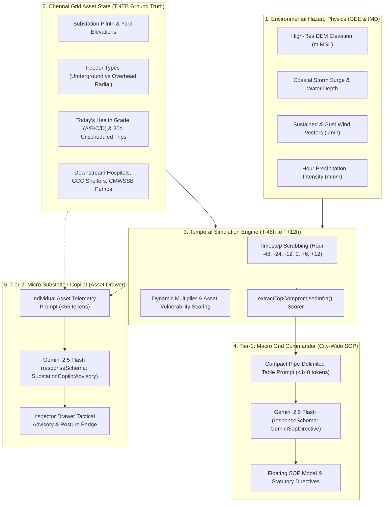
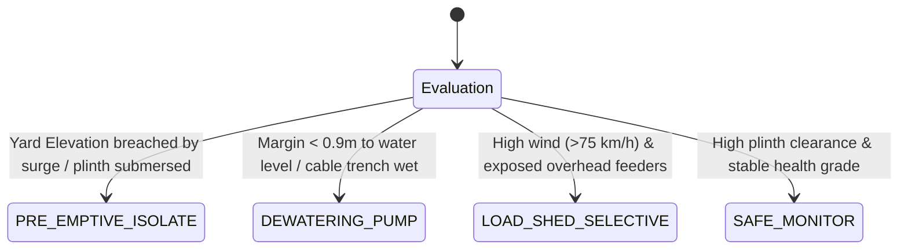

# SurgeGrid AI: Disaster Simulation Mechanics & Gemini AI Architecture

> **Chennai Grid & Climate Resiliency System**  
> *Autonomous Standard Operating Procedures (SOP) & Switchyard Tactical Advisory Engine*

---

## 1. Executive Overview

During extreme meteorological events—such as Category-3 tropical cyclones (**Michaung 2023**) or catastrophic 500-year urban floods (**2015 Megaflood**)—power grid control room operators face high-velocity telemetry overload. Cascading feeder faults, coastal switchyard submersion, conductor snaps, and equipment explosions occur faster than humans can consult printed SOP binders.

**SurgeGrid AI** bridges this gap by unifying:
1. **High-Fidelity Physical Simulation**: Dynamic geospatial overlays combining Google Earth Engine (GEE) Digital Elevation Models (DEM), storm surge hydrodynamics, and ERA5/IMD wind vectors.
2. **Real-World Infrastructure Baselines**: "Today's" live electrical state, including chronic health grading ($A/B/C/D$), 90-day unscheduled trip frequencies, and underground vs. overhead feeder configurations.
3. **Two-Tier Gemini 2.5 Flash Intelligence**:
   - **Tier 1 — Macro Grid Commander**: Autonomous city-wide SOPs, statutory civil defence mandates (TNSDMA §5.6 / CEA Safety Regs), and feeder group trip sequencing.
   - **Tier 2 — Micro Substation Copilot**: Asset-specific tactical checklists generated on-demand for individual switchyards (dewatering pump staging, plinth clearance margins, breaker lockout, and hospital lifeline isolation).



---

## 2. Disaster Simulation Mechanics: Step-by-Step

SurgeGrid AI's simulation does not replay static animations. It calculates physics-driven grid failure probabilities across a discrete timeline from pre-landfall staging to post-storm restoration.

### 2.1 Timeline Discrete Steps

| Timestep | Phase | Simulation Focus | Typical Wind | Typical Surge |
|---|---|---|---|---|
| **$T - 48\text{h}$** | Early Warning | GEE watershed saturation, reservoir inflows, preventive tree canopy trimming | $35 - 45\text{ km/h}$ | $0.2\text{m MSL}$ |
| **$T - 24\text{h}$** | Pre-Landfall Watch | Hospital diesel backup verification, mobile dewatering staging, overhead circuit patrol | $60 - 75\text{ km/h}$ | $0.8\text{m MSL}$ |
| **$T - 12\text{h}$** | Outer Rain Bands | Radial overhead lines experience gale gusts; high-risk plinths face surface runoff pooling | $80 - 95\text{ km/h}$ | $1.4\text{m MSL}$ |
| **$T - 0\text{h}$** | Eye Wall Landfall | Peak mechanical & hydro stress; statutory safety de-energization; flashover prevention | $110 - 130\text{ km/h}$ | $3.2\text{m MSL}$ |
| **$T + 6\text{h}$** | Tail Water Surge | Runoff drains toward Adyar/Cooum river mouths; switchyard backwater flooding risks | $65 - 80\text{ km/h}$ | $2.6\text{m MSL}$ |
| **$T + 12\text{h}$** | Controlled Recovery | Sequential 5-stage energization: EHV Ring $\rightarrow$ 33kV GIS $\rightarrow$ Hospital Lifelines $\rightarrow$ LT | $< 40\text{ km/h}$ | $< 0.8\text{m MSL}$ |

### 2.2 Physical Hazard Calculations

For each substation $i$ at simulation timestep $t$, the simulation calculates two compounding risks:

#### A. Inundation & Plinth Submersion
$$\text{Water Depth}_i(t) = \max\Big(0,\; \text{SurgeMSL}(t) + \text{LocalRunoff}(t) - \text{ElevationMSL}_i\Big)$$
- If $\text{Water Depth}_i(t) > 0.3\text{m}$: Substation yard plinths are breached. Equipment must be pre-emptively de-energized to avoid transformer bushing flashover and oil tank contamination.
- If $0 < \text{Water Depth}_i(t) \le 0.3\text{m}$: Cable trench waterlogging threatens 11kV/33kV control wiring; dewatering pumps must be energized.

#### B. Overhead Line Wind Stress & Conductor Snapping
$$\text{Wind Force} \propto \big(\text{WindSpeed}_{10\text{m}}(t)\big)^2$$
- If sustained wind exceeds $80\text{ km/h}$, overhead radial lines face acute snap hazards from flying debris and falling branches. Statutory orders mandate de-energization under **TNSDMA Section 5.6** to prevent pedestrian electrocution.
- Underground (UG) cables remain protected from wind and are prioritized for critical ring feeds.

### 2.3 Compounding Asset Health ("Today's" Condition)

A well-maintained GIS substation with Grade $A$ health withstands minor flooding with zero issues. A degraded Grade $D$ switchyard with multiple unscheduled trips in the past 30 days will fail at the first lightning surge or moisture ingress.

SurgeGrid AI computes an active **Disaster Score**:
$$\text{DisasterScore}_i = \text{BaseVulnerability} + \text{HealthDegradation} + \text{TerrainHazard}$$
Where:
- **Grade $D$ Asset**: $+70$ points
- **Grade $C$ Asset**: $+45$ points
- **Unscheduled Trips**: $+5$ points per trip (capped at $+50$)
- **Plinth Inundation ($\le \text{Surge} + 0.3\text{m}$)**: $+65$ points
- **Low-Lying Bowl ($\le 3.2\text{m MSL}$)**: $+30$ points

The function `extractTopCompromisedInfra()` dynamically ranks all substations and extracts the **Top 6 most vulnerable assets** at that exact simulation hour.

---

## 3. Tier 1: Macro Grid Commander (City-Wide SOP)

The **Macro Grid Commander** provides strategic, city-wide command decisions. It automatically pops up at pivotal milestone hours ($T-24\text{h}$, $T-0\text{h}$, $T+12\text{h}$) or can be opened manually via the floating SOP pill.

### 3.1 Token Optimization & Prompt Architecture

Traditional AI prompts send lengthy JSON payloads that consume thousands of tokens and cause slow generation ($3 - 6\text{s}$). SurgeGrid AI converts live telemetry into an ultra-compact **pipe-delimited table**:

```text
SCENARIO: Cyclone Michaung (Cat-3)
TIMESTEP: T-0h Landfall Peak (Hour: 0)
WEATHER: Wind 112.0 km/h | Rain 58.2 mm/h | Surge 3.2m MSL

COMPROMISED ASSETS:
SUBSTATION|GRADE|SCORE|ELEV_M|UNSCHEDULED_TRIPS|RISK_CAT
110KV VELACHERY|D|42|1.8|5|CRITICAL_SURGE
230KV TARAMANI|C|64|2.4|3|CRITICAL_SURGE
33KV ENNORE|D|38|0.9|6|CRITICAL_SURGE
110KV KOYAMBEDU|C|59|4.2|4|HIGH_WATERLOGGING
110KV BESANT NAGAR|B|78|3.1|1|MODERATE
230KV PERAMBUR|B|82|5.8|0|SAFE

Formulate statutory directives specifically targeting these compromised substations.
```

### 3.2 Native System Instruction & Response Schema

SurgeGrid AI leverages Gemini 2.5 Flash's native features:
1. **`systemInstruction`**: Defines the persona as the *TANGEDCO Senior Grid Commander & SLDC Operations Director* bound by TNSDMA and CEA safety regulations.
2. **`responseSchema`**: Enforces strict JSON decoding at the inference engine level. Hallucinations or malformed JSON keys are mathematically impossible:

```typescript
responseSchema: {
  type: 'OBJECT',
  properties: {
    title: { type: 'STRING' },
    summaryEn: { type: 'STRING' },
    statutoryReference: { type: 'STRING' },
    actionItems: {
      type: 'ARRAY',
      items: {
        type: 'OBJECT',
        properties: {
          id: { type: 'STRING' },
          priority: { type: 'STRING', enum: ['P0_CRITICAL', 'P1_LIFELINE', 'P2_FIELD'] },
          category: {
            type: 'STRING',
            enum: ['DE_ENERGIZE', 'LIFELINE_PROTECT', 'DEWATERING', 'SAFETY_LOCKOUT', 'RESTORATION', 'FIELD']
          },
          title: { type: 'STRING' },
          description: { type: 'STRING' },
          targetFeedersOrSubstations: {
            type: 'ARRAY',
            items: { type: 'STRING' }
          }
        },
        required: ['id', 'priority', 'category', 'title', 'description', 'targetFeedersOrSubstations']
      }
    }
  },
  required: ['title', 'summaryEn', 'statutoryReference', 'actionItems']
}
```

### 3.3 Output Rendering in UI

The resulting directives appear in the [`GeminiSopDialog.tsx`](file:///c:/projects/surgegrid-ai/src/components/Map/GeminiSopDialog.tsx):
- **Executive Directive Summary**: High-level civil defense orders and statutory backing (e.g., *TNSDMA §5.6 · CEA Safety Reg. 33*).
- **Targeted Assets Tray**: Direct clickable badges of the degraded substations identified by Gemini.
- **Categorized Checklist**: Priority items ($P0$ Critical Isolation, $P1$ Lifeline Islanding, $P2$ Dewatering Field Action) with interactive completion toggles.

---

## 4. Tier 2: Micro Substation Copilot (Asset-Specific Advisory)

While Tier 1 guides city-wide SLDC coordinators, field engineers and substation operators need asset-level tactical actions. 

When an operator selects any substation on the map, the **Substation Inspector Drawer** displays the **Gemini Asset Copilot (Tier-2)** widget inside [`SubstationHealthCard.tsx`](file:///c:/projects/surgegrid-ai/src/components/Map/SubstationHealthCard.tsx).

### 4.1 Asset Telemetry Encoding (< 55 Tokens)

The prompt payload is constructed dynamically from the asset's active state:

```text
ASSET: 110KV VELACHERY (110 kV) | ELEV: 1.8m MSL (CRITICAL_SURGE_RISK)
TODAY_HEALTH: Grade D (42/100) | TRIPS_30D: 5 | CLEAN_STREAK: 8d
DISASTER: MICHAUNG_CAT3 @ T+0h | SURGE: 3.2m MSL | WIND: 112 km/h | RAIN: 58 mm/h
CIRCUITS: 8 Feeders (2 UG, 6 OH) | LIFELINES: 2
TASK: Output posture & 3 precise switchyard directives.
```

### 4.2 Tactical Posture Classification

Gemini evaluates the asset against active physics and assigns one of four standardized operational postures:



| Posture | Color Badge | Typical Operational Meaning |
|---|---|---|
| `PRE_EMPTIVE_ISOLATE` | **Rose (Pulsing)** | Immediate bus de-energization to prevent catastrophic flashover and arc explosion. |
| `DEWATERING_PUMP` | **Cyan** | Plinth clearance safe but water accumulating in cable trench sump; mobilize diesel pumps. |
| `LOAD_SHED_SELECTIVE` | **Amber** | Trip tree-exposed overhead radials while preserving underground hospital feeds. |
| `SAFE_MONITOR` | **Emerald** | Adequate freeboard clearance; keep SCADA alarms unmuted and monitor battery bank. |

### 4.3 Structure of Tactical Directives

Gemini delivers exactly three actionable switchyard directives categorized by:
1. **Equipment Plinth / Yard Core**: Substation yard transformers, switchgear, bus couplers, and dewatering pumps.
2. **Feeder Isolation**: Circuit breakers (VCB/SF6), automatic reclosers (ACR), and radial de-energization.
3. **Lifeline Ring / Downstream Continuity**: Transferring critical hospitals, GCC relief shelters, and water pumping stations to hardened underground loops.

---

## 5. Resiliency, Latency & Offline Fallback Mechanics

To guarantee zero latency and high availability during actual emergencies, the architecture implements two critical safety nets:

### 5.1 Hierarchical In-Memory Caching

Every request is cached using an exact key:
- **Tier 1 Cache Key**: `${scenarioId}_${timestepHour}_${assetCodes.join('-')}`
- **Tier 2 Cache Key**: `${substationCode}_${scenarioId}_${timestepHour}`

When an operator scrubs back and forth across the timeline, previously evaluated substations load in **$0\text{ms}$** with a green `Cached` tag, incurring zero Gemini API billing or rate limit usage.

### 5.2 Deterministic Heuristic Engine (Offline Fallback)

If the system is offline, running in an air-gapped field control room, or `VITE_GEMINI_API_KEY` is not supplied:
- The system automatically engages [`generateDeterministicTacticalAdvisory()`](file:///c:/projects/surgegrid-ai/src/services/geminiSubstationCopilotService.ts).
- This deterministic engine implements the same electrical engineering rules codified in the TNEB Grid Disaster Manual:
  $$\text{If } \text{Elevation} \le \text{Surge} + 0.3\text{m} \implies \text{PRE\_EMPTIVE\_ISOLATE}$$
  $$\text{Else If } \text{Elevation} \le \text{Surge} + 0.9\text{m} \implies \text{DEWATERING\_PUMP}$$
  $$\text{Else If } \text{Wind} \ge 75\text{ km/h} \text{ and } \text{OverheadCount} > 0 \implies \text{LOAD\_SHED\_SELECTIVE}$$
  $$\text{Else} \implies \text{SAFE\_MONITOR}$$
- The UI renders seamlessly without any error banners, ensuring the operator always has actionable guidance.

---

## 6. Summary Comparison: Tier 1 vs. Tier 2

| Feature | Tier 1: Macro Grid Commander | Tier 2: Micro Substation Copilot |
|---|---|---|
| **Location** | Floating Header Dialog (`GeminiSopDialog.tsx`) | Substation Drawer Health Card (`SubstationHealthCard.tsx`) |
| **User Role** | SLDC Chief Grid Director / TNSDMA Coordinator | Substation Executive Engineer / Field Operator |
| **Input Data** | Top 6 compromised substations across Chennai | Single inspected substation telemetry & circuit inventory |
| **Token Budget** | $\sim 140\text{ tokens}$ prompt $\rightarrow 350\text{ tokens}$ output | $\sim 50\text{ tokens}$ prompt $\rightarrow 80\text{ tokens}$ output |
| **Primary Output** | City-wide statutory de-energization and restoration orders | 1 Posture badge + 3 switchyard electrical actions |
| **Trigger Method** | Automatic on critical storm hours or manual button | Automatic on substation selection / drawer inspection |
| **Offline Mode** | Pre-computed deterministic SOP milestones | Algorithmic plinth & wind heuristic rules engine |
