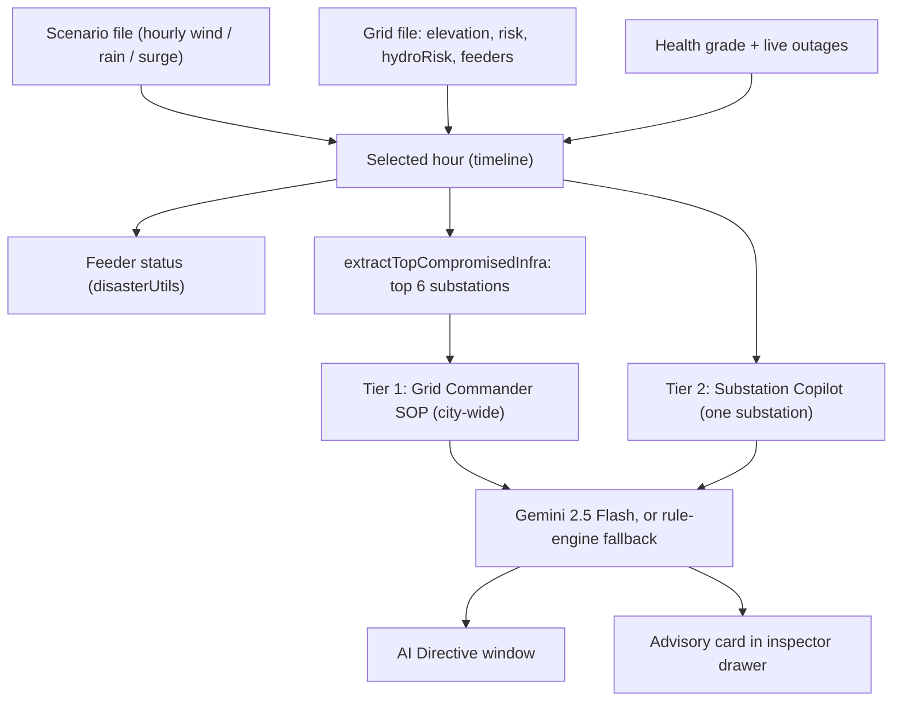

# Disaster Simulation & Gemini AI Architecture

> Describes what the code does today (audited against `src/` on 2026-09-29).
> Files: `scenarioService.ts`, `disasterUtils.ts`, `geminiSopService.ts`, `geminiSubstationCopilotService.ts`, `GeminiSopDialog.tsx`, `SubstationHealthCard.tsx`.

## 1. Overview

The app replays a storm hour by hour. At each hour it works out which substations are most at risk, then uses Gemini to write the plan for the control room. If Gemini is unavailable, a built-in rule engine writes a plan instead, so the screen always shows guidance.

## 2. Simulation

### 2.1 Scenarios and timeline
| Scenario | Data file | Steps | What it is |
|---|---|---|---|
| Cyclone Michaung | `public/data/scenarios/michaung_class_cat3.json` | 61 hourly, T-48h to T+12h | Modelled Category-3 benchmark. Peak ~134 km/h wind, ~46 mm/h rain, ~4 m surge at landfall (T-0h). Not a live forecast. |
| 2015 Megaflood | `public/data/scenarios/floods2015.json` | 120 hourly, -85h to +34h | Hindcast from NASA IMERG rain and ERA5-Land wind (Earth Engine). No surge (sea level held at 0.4 m). |

The user plays, pauses, steps or scrubs hour by hour in the cockpit bar. Playback advances one step every 2.2 s. The AI Directive window opens by itself (and playback pauses) at milestone hours: **Michaung -24, 0, 12; Megaflood -48, 0, 12** (see `SCENARIO_MILESTONES`, `TnebGridMap.tsx`).

### 2.2 Feeder status rules (`disasterUtils.ts`)
Checked in order for each feeder at the current hour:
1. **Yard flood trip**: substation elevation is at or below the surge (in the Megaflood, at or below a fixed 4.0 m).
2. **Pre-emptive wind trip**: wind above 80 km/h on an overhead or mixed feeder (TNSDMA §5.6).
3. **Cyclone watch**: wind above 60 km/h on an overhead or mixed feeder.
4. **Live (underground)**: everything else.

There is no water-depth calculation. Flood depth per substation comes pre-computed in the grid file (`hydroRisk`).

### 2.3 Disaster score (`extractTopCompromisedInfra`)
Used to pick the 6 substations sent to Gemini. Points are added up:
- Health grade: D +70, C +45, B +15
- Health score: +1.2 for each point below 100
- Unscheduled trips: +5 each, capped at +50
- Elevation at or below surge + 0.3 m: +65; otherwise at or below 3.2 m: +30
- Risk category: `CRITICAL_SURGE_RISK` +35, `HIGH_WATERLOGGING_RISK` +25
- If wind is 75 km/h or more: within 6 km of the coast +30, has overhead feeders +20

## 3. Tier 1 — Grid Commander SOP (city-wide)

**Rule engine (always runs first)**: `getDirectiveForTimestep` picks a phase and fills a template with the top substations' names.
- Michaung: hour ≥ 6 → Restoration, hour ≥ -12 → Critical, otherwise Watch.
- Megaflood: hour ≥ 12 → Restoration, otherwise Critical (there is no Watch phase, and the title and statutory reference always come from the flood template).
- The impact numbers (at-risk, tripped feeders, protected lifelines) are **rough estimates from a formula**, not counted data. The fixed templates also contain sample figures (for example patrol-gang counts).
- The Tamil summary is left empty in the dynamic output.

**Gemini call (only if `VITE_GEMINI_API_KEY` is set)**: `fetchLiveGeminiDirective`
- Runs whenever the hour changes, not just at milestones, and is cached by `scenario_hour_assetCodes`. Only successful Gemini replies are cached.
- Prompt is a compact pipe-delimited table of the top 6 substations (name, grade, score, elevation, trips, risk) plus the weather line. It does not include hospitals, feeder types or lifelines.
- Uses a system instruction (Senior Grid Commander persona) and a response schema (title, summary, statutory reference, action items with priority and category).
- Only title, summary, statutory reference and action items are taken from Gemini. Urgency, impact numbers and weather come from the rule engine.
- The schema fixes the *shape* of the reply. It does not check that the content is correct, so names Gemini writes may not match real substations.

**UI**: `GeminiSopDialog.tsx` shows the summary, targeted-asset badges, and a checklist with priority badges and tick-off. It can be minimized to a floating pill.

## 4. Tier 2 — Substation Copilot (one substation)

Shown in `SubstationHealthCard.tsx` while a scenario is running (not in Live mode).

**Rule engine (`generateDeterministicTacticalAdvisory`)**, first match wins:
1. **PRE_EMPTIVE_ISOLATE**: elevation ≤ surge + 0.3 m, or the grid file says `cycloneIsolateRecommended` (any scenario other than normal).
2. **DEWATERING_PUMP**: elevation ≤ surge + 0.9 m, or risk category is `CRITICAL_SURGE_RISK`.
3. **LOAD_SHED_SELECTIVE**: wind ≥ 75 km/h and the substation has overhead or mixed feeders.
4. **SAFE_MONITOR**: otherwise.

Each posture returns three fixed-style actions (plinth, feeder isolation, lifeline loop; some use real feeder names such as hospital feeders).

**Gemini call**: `fetchSubstationTacticalAdvisory` sends a short asset summary (name, elevation, health grade, trips, disaster telemetry, feeder counts) and asks for a posture plus three actions in a fixed JSON schema. Gemini's posture is used as returned; it is not checked against the rule engine.

**Cache**: keyed by `substationCode_scenario_hour`, in memory. The fallback answer is also cached when there is no key or the call fails, so the *Re-evaluate* button re-reads the cache rather than calling Gemini again.

## 5. Fallback and resilience
- No API key, offline, or API error → rule-engine output, no error banner.
- Model tag on screen tells you the source: *Gemini 2.5 Flash · Live Copilot / Tactical Copilot* or the deterministic label.
- The API key is read from the browser bundle (`VITE_GEMINI_API_KEY`) and sent in the request URL, so it is visible to users. Restrict it in Google Cloud, or move the call behind a server.

## 6. Tier 1 vs Tier 2
| | Tier 1 | Tier 2 |
|---|---|---|
| Where | AI Directive window | Substation inspector, health card |
| Scope | Top 6 substations, city-wide | One substation |
| Trigger | Every hour change (call), auto-open at milestones | Substation selected or hour changed |
| Output | Title, summary, statutory reference, action checklist | Posture badge, rationale, three actions |
| Fallback | Templates filled with real substation names | Rule engine |

## 7. Known issues (as of 2026-09-29)
See [PROJECT_LOG.md](./PROJECT_LOG.md), session 1, item 2 for the full list and the proposed fix plan.
