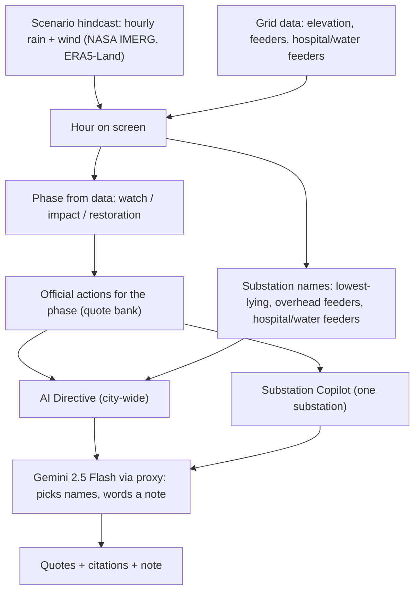

# Disaster Simulation & Gemini Architecture

*Rewritten 2026-09-30 for the final state. Files: `scenarioService.ts`, `geminiSopService.ts`, `geminiSubstationCopilotService.ts`, `geminiClient.ts`, `gemini-proxy/index.js`, `GeminiSopDialog.tsx`, `SubstationHealthCard.tsx`.*

## 1. Overview

The app replays a real rain event hour by hour. At each hour it decides which **official actions** apply and which substations they name, then Gemini adds one short note. If Gemini is unavailable, the same quoted actions appear with rule-based notes. Nothing on screen is invented: see [SOURCES.md](./SOURCES.md) and [05](./05-official-plans-and-how-the-app-uses-them.md).

## 2. The scenarios

| Scenario | File | Steps | Notes |
|---|---|---|---|
| Cyclone Michaung, Dec 2023 | `michaung2023.json` | 144 hourly, T-69h..T+74h | Real hindcast; peak 14.0 mm/h at T-0; total 273 mm |
| 2015 Megaflood | `floods2015.json` | 120 hourly, T-85h..T+34h | Real hindcast; peak 23.4 mm/h; total 372 mm |
| Monsoon Spell, Nov 2020 | `monsoon2020.json` | 144 hourly, T-69h..T+74h | Real hindcast of an ordinary heavy spell; peak 16.8 mm/h; total 198 mm |

Built with `surgegrid-ai-v2/pipeline/07_build_scenario_from_gee.py`: NASA GPM IMERG V07 rain and ERA5-Land wind and pressure, averaged over the Chennai area (lat 12.8-13.25, lng 80.0-80.35). **Wind is an area average, not gusts. No storm surge is modelled** (sea level is held at normal tide). T-0 is the hour of peak rain, not a landfall time. The earlier synthetic "Category-3" file was removed.

## 3. Phase of an event (data only)

- Before T-0: **watch**.
- From T-0 while hourly rain is 0.1 mm or more: **impact**.
- After T-0 once hourly rain is below 0.1 mm: **restoration**.

The 0.1 mm line is a presentation choice, not an official threshold. Wind is shown with its IMD cyclone class (Severe from 88 km/h) but does not drive the phase, because area-mean wind never reaches that class in these scenarios.

## 4. Official actions by phase

`geminiSopService.ts` holds a table from scenario and phase to a list of quote ids in `officialSources.ts`. Cyclone scenarios use the cyclone-alert actions in the watch phase (diesel for 7 days, inventories, ERS towers, expert manpower, plus flood identification and pumps); flood and monsoon scenarios use flood preparation, sandbags and retaining walls. Impact adds switching supply off "if required", pumping out flood water, mobile DG sets and overhead lines kept out of service. Restoration adds recharge only after patrol, restoration priority, mobile substations, an Emergency Operation Centre and generators at sewage pumping stations. Titles for each action are short labels of ours; the quote and citation under each are official.

## 5. Which substations an action names

From our grid data only:
- **Lowest-lying**: substations sorted by elevation; the count at or below Chennai's 2.0 m average (GCC City DMP 2023).
- **Overhead**: substations with overhead or mixed feeders (`config` values `OH` and `Mixed`).
- **Lifeline**: substations with hospital or water feeders (classified by feeder name, our classification).

## 6. Substation Copilot

Flags: low-lying yard (at or below 2.0 m), overhead feeders (count), hospital/water feeders (count and names). Up to four quoted actions are chosen from the flags and the current phase; a substation with no flag gets one baseline action. Gemini may pick feeder names from the lists we send and write one note. The card shows the flag chips, the note, the quoted actions with citations and feeder names, and a "Re-evaluate" button that forces a fresh Gemini call.

## 7. How Gemini is called

- **Browser**: `geminiClient.ts` posts to `/api/gemini` (30 s timeout; pauses for 60 s after three failures). No API key in the app.
- **Proxy**: `gemini-proxy/index.js`, Cloud Function `surgegridGemini` (project `namma-map-407ca`, `asia-south1`). It accepts POST only from allowed site origins, caps the request at 30 KB and the reply at 4,096 tokens, fixes the model to `gemini-2.5-flash`, passes only whitelisted generation settings, rate-limits per IP and runs at most 3 instances. It calls Gemini on Google Cloud's Gemini Enterprise Agent Platform (formerly Vertex AI) with the service account `surgegrid-gemini-proxy`, which holds only the Vertex AI user role.
- **Checks on the reply**: the JSON schema fixes the shape and restricts rule ids to those we sent. Feeder and substation names are filtered to the lists we sent. A note or summary is accepted only if it is at most 240 (or 420) characters and every number in it also appears in the prompt. Quotes and citations never come from Gemini.
- **Request control**: no Gemini call while the timeline plays; a 700 ms pause after the hour stops changing (600 ms for the copilot); results are cached by scenario, hour and target lists; failures are not cached.
- **Fallback**: with no proxy, no network or an invalid reply, the app shows the same quoted actions with rule-based notes and the tag "Official quotes · rule-based".

## 8. Known limits

- The SOP names substations by simple rules (elevation, overhead feeders, lifeline feeders). It does not forecast where water will go.
- Hospital and water feeders are found from feeder names, so some may be missed or mislabelled.
- Whatever Gemini writes in a note is limited to the facts in the prompt, but it is still generated text; the quotes are the authoritative part.
- The rate limit is best-effort per instance.
